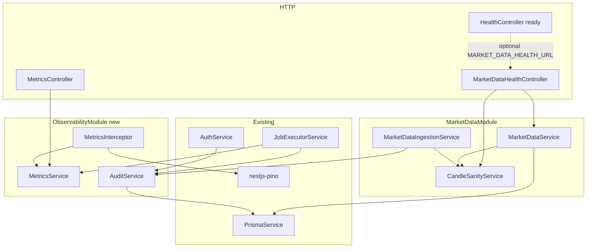

# Sprint 1.4 — Data Health & Observability

**Status:** Plan ready (not started)  
**Roadmap marker:** `START HERE — July 19, 2026`  
**Branch (when implementing):** `feat/sprint-1-4-data-health-observability`  
**PR base:** `main` (after `chore/local-dev-hardening` merges; Sprint 1.3 already on `main`)

**Overview:** Make market-data pipelines verifiable and the API observable. Ship candle sanity checks, a market-data health endpoint with staleness, a lightweight in-process metrics foundation (API + job latency), and durable audit events for critical actions — without Prometheus/Grafana, Terminus, or admin RBAC.

---

## Sprint scope and exit criteria

**Stories**

| ID | Title | Source |
|----|-------|--------|
| #2.6.1 | Market data sanity checks | [MVP_02](../product/stories/BitStockerz_MVP_02_Market_Data_Stories.md) (title only today) |
| #2.6.2 | Market data health endpoint | same + [API_Inventory §2.6](../database/API_Inventory.md) |
| #8.4.2 | Performance metrics | [MVP_08](../product/stories/BitStockerz_MVP_08_Backend_Infrastructure_Stories.md) (title only; wording says “for backtests”) |
| #8.4.3 | Audit logging | same + DDL `audit_events` |

**Exit (from [ROADMAP.md](../product/ROADMAP.md)):** Market data pipelines are observable and verifiable.

**Explicitly out of scope**

| Item | Why deferred |
|------|----------------|
| Prometheus / Grafana / OpenTelemetry exporters | MVP_08: “Full observability stack … out of scope” |
| `@nestjs/terminus` | Custom [`HealthService`](../../apps/api/src/health/health.service.ts) already covers live/ready; do not dual-stack |
| Live market-data vendor | Sprint 7.1 (#2.5.x) |
| Caching (#2.5.1) | Sprint 7.1 |
| Backtest run / result tables & counters | Milestone 3; wire into `MetricsService` later |
| Admin RBAC / roles | MVP_08 out of scope |
| Angular UI | Milestone 5 |
| Audit retention purge cron | Lifecycle policy exists; purge job is maintenance, not this sprint |
| Changing `/health/ready` contract | Keep; optionally document pointing `MARKET_DATA_HEALTH_URL` at the new domain health URL |

---

## Prerequisites (what already shipped)

| Capability | Location | Relevance to 1.4 |
|------------|----------|------------------|
| Equity/crypto candle reads + seed fixtures | `market-data.service.ts`, `seed-candles.ts` | Sanity checks operate on these bar shapes |
| Seed-backed ingestion + jobs lifecycle | `MarketDataIngestionService`, `JobsService`, `JobExecutorService` | Health reads latest timestamps from bar tables / seed; metrics record job duration |
| `/health/live` + `/health/ready` | `health.service.ts` | Ops readiness stays separate from **domain** market-data health |
| `MARKET_DATA_HEALTH_URL` probe | `AppConfigService.dependencies` | External HTTP probe; may later point at `GET /api/market-data/health` |
| Structured Pino + `requestId` + `responseTime` | `pino.config.ts`, nestjs-pino | Metrics extend logs; do not replace request logging |
| `AuthGuard` / session bearer | `auth.guard.ts` | Audit hooks on auth + guarded mutations |
| Prisma optional (`prisma.isEnabled`) | `prisma.service.ts` | Audit + health DB paths need in-memory fallbacks |
| Migration pattern | `apps/api/prisma/migrations/YYYYMMDDHHMMSS_sprint_*` | New `audit_events` migration |
| Coverage gate | `apps/api/package.json` → **90%** global | Prefer tests over new `coveragePathIgnorePatterns` |

**Schema gap:** `AuditEvent` model does not exist yet. [Migrations_Plan.md](../database/Migrations_Plan.md) schedules `V0131__create_audit_events.sql` from [DDL/06_infra.sql](../database/DDL/06_infra.sql).

---

## Draft acceptance criteria (lock before coding)

Stories are title-only today (same gap that hurt Sprint 1.3). Write these into the story files during implementation **before** merging.

### #2.6.1 – Basic sanity checks on imported candles

- A pure function / service method validates a bar (or batch) for:
  - `high >= low`
  - `high >= max(open, close)` and `low <= min(open, close)`
  - `open/high/low/close` finite and `> 0`
  - `volume >= 0` (equity volume is integer/`bigint`; crypto may be decimal)
- Invalid bars produce structured issue objects: `{ symbol, interval, date|timestamp, code, message }` — they do **not** throw by default when scanning batches.
- Ingestion (`MarketDataIngestionService`) runs checks on bars about to be upserted; job `payload` includes `sanity: { checked, invalid, issues[] }` (cap `issues` length, e.g. 50).
- Unit tests cover valid bars, each failure code, and batch aggregation.
- Checks are reusable by the health endpoint (scan sample / latest N bars).

### #2.6.2 – Market data health endpoint

- `GET /api/market-data/health` returns latest data timestamps per series and staleness flags (see API contract).
- Works with Prisma enabled (aggregate `MAX(date|ts)` per table / active symbols summary) **and** seed mode (`prisma.isEnabled === false`) using seed candle max timestamps.
- Includes a rollup `status`: `ok` | `degraded` | `unhealthy` derived from staleness + sanity sample.
- Does **not** break `/health/ready` behavior when `MARKET_DATA_HEALTH_URL` is unset (`not_configured` remains valid).
- E2E covers 200 shape in seed mode; unit tests cover stale vs fresh threshold logic with injected “now”.

### #8.4.2 – Basic performance metrics

> Story title says “for backtests”, but backtesting is Milestone 3. This sprint ships the **metrics foundation** plus instrumentation for what exists today (HTTP + jobs). Backtest-specific counters are typed/stubbed and activated later.

- `MetricsService` tracks in-process:
  - `http_request_duration_ms` (by route group / method) — via Nest interceptor ([NestJS interceptor timing pattern](https://docs.nestjs.com/interceptors))
  - `job_duration_ms` (by `job_type` + terminal status) — from `JobExecutorService`
  - `error_count` (by domain: `auth` | `market_data` | `jobs` | `unknown`) — increment from exception filter or interceptor on failure
- Emit structured log lines for metric observations (Pino fields), reusing request context (`requestId`) where in-request ([nestjs-pino `PinoLogger.assign`](https://github.com/iamolegga/nestjs-pino)).
- `GET /api/metrics` returns a JSON summary snapshot (counters + latency percentiles or avg/max/p95 from a bounded ring buffer). **Not** Prometheus exposition format.
- No new heavy dependencies (`prom-client`, OTel SDK) in this sprint.
- Unit tests for record/snapshot/reset; e2e smoke that `/api/metrics` returns 200.

### #8.4.3 – Minimal audit trail for critical actions

- Prisma model + migration for `audit_events` matching DDL.
- `AuditService.record({ userId?, eventType, payload })`:
  - Persists when Prisma enabled (ensure user row exists when `userId` set — reuse `AuthService.ensureUserPersisted`)
  - In-memory ring buffer when Prisma disabled (cap e.g. 1000)
  - **Never throws to callers** — failures log `warn` and drop (audit must not break auth/jobs)
- Critical events in this sprint (minimum):

  | `event_type` | When |
  |--------------|------|
  | `auth.register` | Dev register / WebAuthn register verify success |
  | `auth.login` | Dev login / WebAuthn login verify / OAuth callback success |
  | `auth.logout` | Logout success |
  | `job.created` | Job created |
  | `job.completed` | Job finished `completed` |
  | `job.failed` | Job finished `failed` or `timed_out` |
  | `market_data.ingestion_requested` | Equity/crypto ingestion endpoint invoked |

- Payload rules: no passwords, tokens, cookies, or raw OAuth codes; prefer ids, emails (already account identifiers), job ids, symbol filters, statuses.
- Unit tests: persist path mocked, in-memory path, failure swallow, redaction of forbidden keys if present.

---

## API contract (canonical)

Global prefix `/api` ([`main.ts`](../../apps/api/src/main.ts)). Snake_case JSON fields to match existing market-data APIs.

### `GET /api/market-data/health` (#2.6.2)

| Concern | Decision (default) |
|---------|-------------------|
| Auth | **Public** (ops-friendly, no PII) — inventory said “admin/internal”; no RBAC exists. See Dev input #1. |
| Side effects | None (read-only aggregates + in-memory sanity sample) |

**Response `200` example:**

```json
{
  "status": "degraded",
  "timestamp": "2026-07-19T19:00:00.000Z",
  "series": [
    {
      "asset_type": "EQUITY",
      "interval": "1d",
      "latest_timestamp": "2026-02-27",
      "age_ms": 1234567890,
      "stale": true,
      "stale_after_ms": 172800000,
      "symbol_count_with_data": 3
    },
    {
      "asset_type": "CRYPTO",
      "interval": "1d",
      "latest_timestamp": "2026-02-03",
      "age_ms": 1234567890,
      "stale": true,
      "stale_after_ms": 129600000,
      "symbol_count_with_data": 2
    },
    {
      "asset_type": "CRYPTO",
      "interval": "1h",
      "latest_timestamp": "2026-01-07T00:00:00.000Z",
      "age_ms": 1234567890,
      "stale": true,
      "stale_after_ms": 7200000,
      "symbol_count_with_data": 2
    }
  ],
  "sanity": {
    "checked": 120,
    "invalid": 0,
    "issues": []
  },
  "source": "seed"
}
```

| Field | Notes |
|-------|--------|
| `status` | `ok` if no series stale and `sanity.invalid === 0`; `degraded` if any stale or invalid > 0; `unhealthy` if **all** configured series have no data |
| `series[].latest_timestamp` | Equity/crypto daily: `YYYY-MM-DD`; hourly: ISO 8601 UTC |
| `series[].stale` | `age_ms > stale_after_ms` (injectable clock for tests) |
| `source` | `database` \| `seed` |

**Default staleness thresholds** (align with [NFR §3 Data Freshness](../product/requirements/Non_Functional_Requirements.md); overridable via config):

| Series | Env / config | Default |
|--------|--------------|---------|
| Equity daily | `MARKET_DATA_STALE_EQUITY_DAILY_MS` | `172800000` (48h) — covers weekends loosely for MVP |
| Crypto daily | `MARKET_DATA_STALE_CRYPTO_DAILY_MS` | `129600000` (36h) |
| Crypto hourly | `MARKET_DATA_STALE_CRYPTO_HOURLY_MS` | `7200000` (2h) |

**Important:** Seed fixtures are anchored at `2026-01-05` ([`seed-candles.ts`](../../apps/api/src/market-data/seed-candles.ts)). In July 2026 they will correctly report `stale: true`. That is expected for seed-mode demos; MySQL after seed import behaves the same until a live provider (7.1) or fresher fixtures land. Document this in manual testing — do **not** fake “fresh” by comparing against max seed date.

**Errors:** none expected for happy path; malformed internal state still returns 200 with `unhealthy` rather than 5xx when possible.

### `GET /api/metrics` (#8.4.2)

| Concern | Decision (default) |
|---------|-------------------|
| Auth | **Public** in development/test; consider AuthGuard later — see Dev input #2 |
| Format | JSON summary, not Prometheus text |

```json
{
  "timestamp": "2026-07-19T19:00:00.000Z",
  "http": {
    "request_count": 42,
    "error_count": 2,
    "duration_ms": { "count": 42, "avg": 12.4, "p95": 45, "max": 120 }
  },
  "jobs": {
    "by_type": {
      "equity_daily_import": {
        "completed": 3,
        "failed": 0,
        "timed_out": 0,
        "duration_ms": { "count": 3, "avg": 80, "p95": 100, "max": 110 }
      }
    }
  },
  "errors_by_domain": {
    "auth": 0,
    "market_data": 1,
    "jobs": 0,
    "unknown": 1
  }
}
```

Bounded in-memory samples (e.g. last 500 durations) to keep RSS stable. Process restart clears metrics (acceptable for MVP).

### Relationship to `/health/ready`

```text
GET /api/health/ready          → process/deps readiness (DB TCP, optional external URL)
GET /api/market-data/health    → domain data freshness + sanity
GET /api/metrics               → in-process performance snapshot
```

Optional ops setup (not required to ship): set  
`MARKET_DATA_HEALTH_URL=http://localhost:4000/api/market-data/health`  
so readiness’s `checks.marketData` probes domain health. Avoid naive recursion in the same readiness call path if you later fold domain checks into `HealthService` — keep them separate for this sprint.

---

## Architecture



### Module layout (proposed)

| New / changed | Path | Role |
|---------------|------|------|
| `CandleSanityService` | `apps/api/src/market-data/sanity/candle-sanity.service.ts` | Pure validation + batch scan |
| `MarketDataHealthController` | `apps/api/src/market-data/market-data-health.controller.ts` | `GET market-data/health` |
| Health helpers on `MarketDataService` | `market-data.service.ts` | `getHealthSnapshot(now)` — aggregates latest timestamps |
| `ObservabilityModule` | `apps/api/src/observability/observability.module.ts` | Exports Metrics + Audit |
| `MetricsService` | `apps/api/src/observability/metrics.service.ts` | Counters + duration samples |
| `MetricsInterceptor` | `apps/api/src/observability/metrics.interceptor.ts` | HTTP timing / errors ([Nest interceptor](https://docs.nestjs.com/interceptors)) |
| `MetricsController` | `apps/api/src/observability/metrics.controller.ts` | `GET metrics` |
| `AuditService` | `apps/api/src/observability/audit.service.ts` | Persist / in-memory audit |
| Prisma `AuditEvent` | `schema.prisma` + migration | DDL-aligned table |
| Config extensions | `app-config.service.ts` | Staleness thresholds |

**Design principles**

1. **Extend, don’t fork:** Keep domain health inside `MarketDataModule`; keep process readiness in existing `HealthService`.
2. **Config via DI only:** New env vars go through `loadAppConfig` / `AppConfigService` (Sprint 0.1 rule — no raw `process.env` in services).
3. **Fail open for audit/metrics side effects:** Never fail a login or job because metrics/audit storage failed.
4. **Inject clock:** `now: () => Date` or pass `Date` into health/staleness for deterministic unit tests.
5. **No Terminus:** Nest docs show custom indicators via Terminus; this repo already has a bespoke readiness implementation — stay consistent.

### Prisma model (target)

Align with [DDL/06_infra.sql](../database/DDL/06_infra.sql) and [Data_Lifecycle](../database/Data_Lifecycle_and_Deletion_Policy.md) (`ON DELETE SET NULL` on user):

```prisma
model AuditEvent {
  id         Int      @id @default(autoincrement()) @db.UnsignedInt
  userId     String?  @map("user_id") @db.Char(36)
  eventType  String   @map("event_type") @db.VarChar(64)
  payloadJson Json    @map("payload_json")
  createdAt  DateTime @map("created_at")

  user User? @relation(fields: [userId], references: [id], onDelete: SetNull)

  @@index([userId, createdAt])
  @@index([eventType, createdAt])
  @@map("audit_events")
}
```

Update `User` with `auditEvents AuditEvent[]`.

**Migration folder name:** `apps/api/prisma/migrations/20260719140000_sprint_1_4_audit_events/`  
(Use `npm --prefix apps/api run db:migrate` locally; `db:deploy` in CI/prod — Prisma Migrate flow per [Prisma docs](https://www.prisma.io/docs/orm/prisma-migrate).)

---

## Implementation plan (ordered)

### 1. Acceptance criteria + config surface

1. Add AC bullets to MVP_02 (#2.6.1–2.6.2) and MVP_08 (#8.4.2–8.4.3).
2. Extend `AppConfig` / `loadAppConfig` with:
   - `marketData.staleEquityDailyMs`
   - `marketData.staleCryptoDailyMs`
   - `marketData.staleCryptoHourlyMs`
   - optional `metrics.enabled` (default `true`)
3. Document env vars in `.env.example` (names only, no secrets).
4. Unit tests for config defaults + invalid integer parsing (fail-fast, existing pattern).

### 2. Candle sanity (#2.6.1)

1. Implement `CandleSanityService` with shared types in `market-data.types.ts`.
2. Issue codes (stable strings): `HIGH_LT_LOW`, `HIGH_LT_BODY`, `LOW_GT_BODY`, `NON_POSITIVE_PRICE`, `NEGATIVE_VOLUME`, `NON_FINITE`.
3. Hook into `MarketDataIngestionService` after resolving bars, before/after upsert; attach summary to returned result (job payload already stores handler result).
4. Unit tests only for pure logic first (fast, high coverage).

### 3. Market data health (#2.6.2)

1. Add `getMarketDataHealth(now = new Date())` on `MarketDataService`:
   - DB: `aggregate({ _max: { date: true } })` / `_max.timestamp` + count distinct symbols with rows (keep queries indexed — existing `(symbol_id, date|ts)` indexes).
   - Seed: compute max from `SEED_*` arrays.
2. Run sanity on a bounded sample (e.g. last 40 bars per series from seed, or `take` recent from DB).
3. Controller thin; register in `MarketDataModule`.
4. Unit + e2e.

### 4. Metrics foundation (#8.4.2)

1. `ObservabilityModule` + `MetricsService` (recordHttp, recordJob, recordError, snapshot, resetForTests).
2. Global `MetricsInterceptor` registered in `AppModule` (or `APP_INTERCEPTOR` provider):
   - Measure duration with `Date.now()` around `next.handle()` (`tap` / `finalize` — Nest interceptor recipe).
   - Classify route into coarse groups (`health`, `auth`, `market-data`, `jobs`, `other`) to avoid unbounded label cardinality.
3. Instrument `JobExecutorService.execute` on terminal states with `durationMs = finishedAt - startedAt`.
4. `GET /api/metrics` controller.
5. Optionally enrich logs via `PinoLogger.assign({ metricsDomain })` only inside request scope; never call `assign` from cron without guard (nestjs-pino throws out of request scope).

### 5. Audit trail (#8.4.3)

1. Schema + migration + `PrismaService` accessor if the codebase uses explicit getters.
2. `AuditService` with fire-and-forget `void this.audit.record(...)` from call sites (or awaited but try/catch inside service).
3. Wire call sites (minimal set above). Prefer hooks at service layer (not only controllers) so scheduler-created jobs also audit.
4. Unit tests with Prisma mock + in-memory mode.

### 6. Tests and gates

```bash
npm --prefix apps/api run build
npm --prefix apps/api run lint
npm --prefix apps/api run test
npm --prefix apps/api run test:cov
npm --prefix apps/api run test:e2e
./scripts/sprint-delivery-verify.sh verify
# Optional MySQL:
KEEP_DATABASE_URL=1 ./scripts/sprint-delivery-verify.sh verify
```

**Coverage policy:** Test new services thoroughly. Do **not** add ignore patterns unless a thin Nest wiring file cannot be covered without brittle e2e — and then pause for Dev input #4 (lesson from Sprint 1.3).

**E2E additions** in `app.e2e-spec.ts` (seed mode via `test/setup-e2e.ts`):

- `GET /api/market-data/health` → 200, has `series`, `sanity`, `source: "seed"`
- `GET /api/metrics` → 200, has `http` / `jobs` keys
- Register → login → logout still works (audit must not break auth)
- Ingestion still returns completed job with `sanity` in payload

### 7. Documentation sync

| File | Update |
|------|--------|
| `docs/product/ROADMAP.md` | Mark 1.4 completed; move `START HERE` to Sprint 2.1 |
| `docs/product/stories/BitStockerz_MVP_02_*.md` | AC + completed status for #2.6.1–2.6.2 |
| `docs/product/stories/BitStockerz_MVP_08_*.md` | AC + completed for #8.4.2–8.4.3; clarify backtest counters deferred |
| `docs/database/API_Inventory.md` | Ship §2.6; add § metrics; status table |
| `docs/product/requirements/Observability.md` | Reflect implemented metrics + audit |
| `docs/database/Migrations_Plan.md` | Note Prisma folder name for 1.4 |
| `docs/manual-testing/manual_testing.md` | **Section 10** health/metrics/audit (+ regression table) |
| `CHANGELOG.md`, `README.md` | Scope notes |
| `.cursor/skills/sprint-delivery/reference.md` | Branch map row for 1.4 |
| `apps/api/prisma/schema.prisma` header comment | Sprint 1.4 note |

---

## Best-practice checklist

- [ ] Config validation fail-fast at boot (`AppConfigService`)
- [ ] RFC 7807 only for true request errors — health/metrics prefer soft `status` fields
- [ ] Redact secrets in audit payloads and keep Pino redaction paths
- [ ] Indexed Prisma aggregates; no full-table scans of all bars for health
- [ ] Cardinality-safe metric labels (route **group**, not raw URLs with ids)
- [ ] Deterministic tests via injectable `now`
- [ ] Seed vs DB parity for health (same response shape)
- [ ] Audit/metrics never break primary flows
- [ ] Conventional Commits: `feat: add data health metrics and audit trail`
- [ ] No Angular / no provider adapters / no Prometheus

---

## Risks and mitigations

| Risk | Mitigation |
|------|------------|
| Seed timestamps always “stale” in 2026+ | Document as expected; thresholds still valuable for MySQL + future live feeds |
| Story #8.4.2 wording vs no backtests | Ship foundation + job/HTTP metrics; explicit deferral in stories + Observability.md |
| Audit FK when user only in-memory | `ensureUserPersisted` before insert (same as jobs) |
| Coverage cliff from new modules | Test services first; avoid ignore-list creep |
| `MARKET_DATA_HEALTH_URL` self-probe latency | Keep optional; readiness timeout already `READINESS_TIMEOUT_MS` (default 1500) |
| Unmerged `chore/local-dev-hardening` | Branch 1.4 from updated `main` after PR #7 merges |

---

## Dev input required

| # | Blocker | Why it blocks | Default if unanswered | Status |
|---|---------|---------------|----------------------|--------|
| 1 | Auth on `GET /market-data/health` | Inventory says admin/internal; no admin role | ⏭ Public endpoint (no PII) | ⏭ stubbed |
| 2 | Auth on `GET /metrics` | Metrics can leak traffic patterns | ⏭ Public in non-production; still no secrets | ⏭ stubbed |
| 3 | Staleness defaults (48h / 36h / 2h) | NFR is qualitative (“once per trading day”, “&lt; 1 hour”) | ⏭ Use table defaults via config | ⏭ stubbed |
| 4 | Coverage excludes for thin Nest files | Sprint 1.3 needed excludes | ⏸ Prefer tests; ask before adding ignores | ⏸ needs input only if gate fails |
| 5 | Audit event catalog beyond minimum | Product may want profile updates, OAuth link, etc. | ⏭ Ship minimum set in AC; extend later | ⏭ stubbed |
| 6 | #8.4.2 backtest-specific metrics | No backtest domain yet | ⏭ Foundation + HTTP/jobs; document Milestone 3 hook | ⏭ stubbed |
| 7 | Base branch | `chore/local-dev-hardening` open | Wait for merge to `main`, then branch | ⏸ until #7 merges |

If implementing before PR #7 merges: stack on `chore/local-dev-hardening` temporarily, then retarget PR base to `main` after merge.

---

## Suggested ticket breakdown

| Ticket | Estimate |
|--------|----------|
| AC in story docs + config env surface | 0.25d |
| Sanity service + ingestion hook + unit tests | 0.75d |
| Market-data health service/controller + e2e | 0.75d |
| MetricsService + interceptor + `/metrics` + job hooks | 0.75d |
| Audit migration + AuditService + auth/jobs hooks | 1.0d |
| Docs + manual Section 10 + verify branch map | 0.5d |

**Total:** ~4 engineering days (fits a 1–2 week sprint with review buffer).

---

## Definition of done

- [ ] Branched from correct base (`main` post-hardening, or stacked as noted)
- [ ] Dev gates resolved or explicitly stubbed above
- [ ] #2.6.1, #2.6.2, #8.4.2, #8.4.3 implemented per AC
- [ ] `audit_events` migration applies cleanly (`db:deploy`)
- [ ] build / lint / test / test:cov (≥90%) / test:e2e pass
- [ ] Docs synced; ROADMAP `START HERE` moved to Sprint 2.1
- [ ] Manual testing Section 10 added (seed stale behavior called out)
- [ ] PR opened: `feat: add data health metrics and audit trail (Sprint 1.4)`

---

## References

- NestJS interceptors (timing): https://docs.nestjs.com/interceptors  
- nestjs-pino `assign` (request-scoped fields): https://github.com/iamolegga/nestjs-pino  
- Prisma Migrate: https://www.prisma.io/docs/orm/prisma-migrate  
- Prior plan style: Sprint 1.2 candles (`.cursor/plans/sprint_1.2_candles_apis_82d95741.plan.md`)  
- Delivery workflow: `.cursor/skills/sprint-delivery/SKILL.md`
