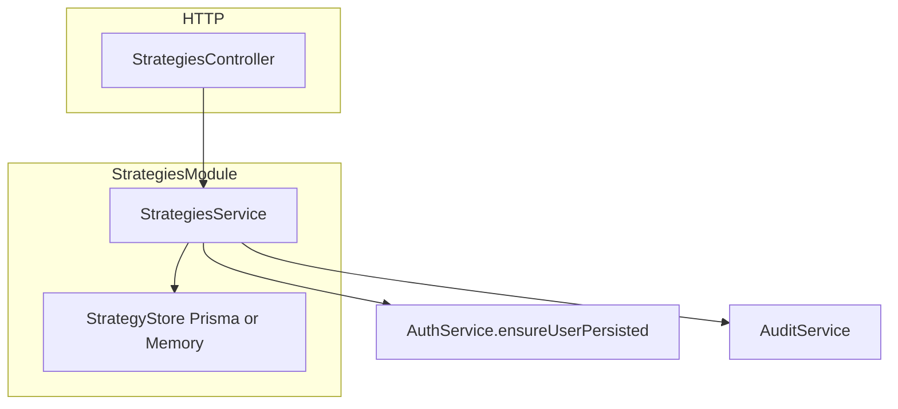

# Sprint 2.1 — Strategy Persistence & Versioning

**Status:** Implemented and locally verified (seed + MySQL, July 26, 2026); included in draft PR #9

**Roadmap marker:** Implementation complete locally; Sprint 2.2 is also complete and `START HERE` is Sprint 2.3

**Branch:** `feat/sprint-2-1-strategy-persistence-versioning`

**PR:** [#9](https://github.com/JustinPaoletta/BitStockerz/pull/9), base `main` (now also includes Sprint 2.2)

**Overview:** Replace the unauthenticated `POST /strategies` stub with durable strategy metadata + immutable version rows. Ship schema/migration, Prisma models, seed/in-memory stores, and a minimal authenticated create/get path that proves versioning — full CRUD and validation land in Sprint 2.3; indicator/rule JSON shape lands in Sprint 2.2.

---

## Sprint scope and exit criteria

**Stories**

| ID | Title | Source |
|----|-------|--------|
| #4.1.1 | Strategy schema (core metadata) | [MVP_04](../product/stories/BitStockerz_MVP_04_Strategy_Lab_Stories.md), [DDL/03](../database/DDL/03_strategy_lab.sql) |
| #4.1.2 | Strategy versioning (MVP-light) | same |

**Exit (from [ROADMAP.md](../product/ROADMAP.md)):** Strategy rows and versions persist (MySQL + seed mode); later sprints can attach definitions and CRUD without reworking schema.

**Explicitly out of scope**

| Item | Why deferred |
|------|----------------|
| Indicator catalog + condition/SL/TP JSON schema | Sprint 2.2 |
| Full CRUD list/update/delete + validate/summary APIs | Sprint 2.3 |
| Backtest engine / pinning runs to versions | Milestone 3 |
| Angular Strategy Lab UI | Milestone 5 |
| OR/nested condition groups, multi-symbol, position sizing | MVP_04 out of scope |
| Admin RBAC | MVP_08 out of scope |

---

## Prerequisites (what already shipped)

| Capability | Location | Relevance |
|------------|----------|-----------|
| Auth bearer + `AuthGuard` | `auth.guard.ts` | All strategy writes/reads are user-scoped |
| `ensureUserPersisted` | `auth.service.ts` | FK to `users` when MySQL enabled |
| Optional Prisma | `prisma.service.ts` | Strategies must work with and without `DATABASE_URL` |
| Dev stub `POST /strategies` | `strategies.controller.ts` | **Replace** — do not leave dual endpoints |
| `CreateStrategyDto` (partial) | `strategies/dto/create-strategy.dto.ts` | Extend; require `definition` object (opaque in 2.1) |
| Audit foundation | `observability/audit.service.ts` | Record `strategy.created` |
| Migration naming | `apps/api/prisma/migrations/YYYYMMDDHHMMSS_sprint_*` | Follow [Migrations_Plan](../database/Migrations_Plan.md) V0200/V0201 |
| Coverage gate | `package.json` → **90%** | Prefer tests over ignore patterns |

**Implemented schema:** `Strategy` / `StrategyVersion` models and the `20260725120000_sprint_2_1_strategies` migration are present in the runnable Prisma schema.

---

## Acceptance criteria (implementation contract)

These criteria are binding for this sprint. Sync them into MVP_04 in the implementation PR before merge.

### #4.1.1 – Strategy schema

- Prisma models match [DDL/03_strategy_lab.sql](../database/DDL/03_strategy_lab.sql):
  - `strategies`: `id` (UUID), `user_id`, `name`, `description?`, `asset_type` (`EQUITY`|`CRYPTO`), `symbol_scope`, `timeframe` (`1d`|`1h`), `is_active`, timestamps
  - Unique `(user_id, name)` across active and inactive rows; soft-delete does not release a name (see JC-1)
- Migration folder `YYYYMMDDHHMMSS_sprint_2_1_strategies` creates both tables in DDL order (JC-2)
- When `prisma.isEnabled === false`, an in-memory store mirrors the same fields and uniqueness rules
- Creating a strategy requires authentication; unauthenticated → `401 UNAUTHORIZED`
- Name uniqueness has DB/seed parity: trim for storage and compare case-insensitively to match the configured `utf8mb4_unicode_ci` collation

### #4.1.2 – Strategy versioning (MVP-light)

- Each create inserts `strategy_versions` row with `version_number = 1` and `definition_json` (JSON object)
- Versions are **append-only** in this sprint (no update/delete of version rows)
- `GET /api/strategies/:id` (auth, owner-only) returns metadata + latest version `{ version_number, definition }`
- Soft-delete / new-version-on-update deferred to Sprint 2.3; this sprint only creates v1
- Unit tests: version_number starts at 1; nested write is transactional (Prisma nested create or `$transaction`)

---

## API contract (canonical)

Global prefix `/api`. Snake_case JSON. Auth: `Authorization: Bearer <token>` unless noted.

### Replace stub: `POST /api/strategies` (#4.1.1 / #4.1.2)

| Concern | Decision |
|---------|----------|
| Auth | **Required** (`AuthGuard`) |
| Side effects | Persist strategy + v1; audit `strategy.created` |

**Request**

```json
{
  "name": "SMA Cross Long",
  "description": "Fast/slow SMA cross",
  "asset_type": "EQUITY",
  "timeframe": "1d",
  "symbol_scope": "SINGLE",
  "definition": {}
}
```

| Field | Rules |
|-------|--------|
| `name` | string, 1–255, trimmed |
| `description` | optional string |
| `asset_type` | `EQUITY` \| `CRYPTO` |
| `timeframe` | `1d` \| `1h` (`1h` only valid when `asset_type=CRYPTO` — see JC-3) |
| `symbol_scope` | default `SINGLE` (only value in MVP) |
| `definition` | non-null, non-array object (required). **Opaque in 2.1** — structural validation is Sprint 2.2/2.3. |

**Response `201`**

```json
{
  "id": "uuid",
  "name": "SMA Cross Long",
  "description": "Fast/slow SMA cross",
  "asset_type": "EQUITY",
  "symbol_scope": "SINGLE",
  "timeframe": "1d",
  "is_active": true,
  "version_number": 1,
  "definition": {},
  "created_at": "2026-07-25T15:00:00.000Z",
  "updated_at": "2026-07-25T15:00:00.000Z"
}
```

**Errors**

| Case | Code | Status |
|------|------|--------|
| Missing/invalid body | `VALIDATION_ERROR` | 400 |
| Duplicate name for user | `CONFLICT` | 409 |
| No bearer | `UNAUTHORIZED` | 401 |

### `GET /api/strategies/:id` (minimal read for verification)

| Concern | Decision |
|---------|----------|
| Auth | Required; must own strategy |
| Soft-deleted | `404 NOT_FOUND` if `is_active=false` or missing |

Same response shape as create (latest version). Cross-user id → `404` (no existence leak).

**Deferred to 2.3:** `GET /strategies` list, `PUT`, `DELETE`, `POST /strategies/validate`.

---

## Architecture



**Files (expected)**

| Path | Role |
|------|------|
| `apps/api/prisma/schema.prisma` | `Strategy`, `StrategyVersion` models |
| `apps/api/prisma/migrations/*_sprint_2_1_strategies/` | SQL from DDL |
| `apps/api/src/strategies/strategies.module.ts` | Wire module; import `AuthModule`, `ObservabilityModule` |
| `apps/api/src/strategies/strategies.service.ts` | Create + getLatest |
| `apps/api/src/strategies/strategies.controller.ts` | Replace stub; `@UseGuards(AuthGuard)` |
| `apps/api/src/strategies/dto/create-strategy.dto.ts` | Harden validation |
| `apps/api/src/strategies/strategy.types.ts` | Shared types |
| `apps/api/src/strategies/*.spec.ts` | Unit coverage |
| `apps/api/test/app.e2e-spec.ts` | Auth create + get |

**Prisma sketch** (align naming with existing `@map` style):

```prisma
model Strategy {
  id          String   @id @db.Char(36)
  userId      String   @map("user_id") @db.Char(36)
  name        String   @db.VarChar(255)
  description String?  @db.Text
  assetType   String   @map("asset_type") @db.VarChar(16)
  symbolScope String   @map("symbol_scope") @db.VarChar(16)
  timeframe   String   @db.VarChar(8)
  isActive    Boolean  @default(true) @map("is_active")
  createdAt   DateTime @map("created_at")
  updatedAt   DateTime @map("updated_at")
  user        User     @relation(...)
  versions    StrategyVersion[]
  @@unique([userId, name])
  @@map("strategies")
}

model StrategyVersion {
  id             Int      @id @default(autoincrement()) @db.UnsignedInt
  strategyId     String   @map("strategy_id") @db.Char(36)
  versionNumber  Int      @map("version_number")
  definitionJson Json     @map("definition_json")
  createdAt      DateTime @map("created_at")
  strategy       Strategy @relation(...)
  @@unique([strategyId, versionNumber])
  @@map("strategy_versions")
}
```

Use Prisma nested writes for create so strategy + v1 commit together ([Prisma nested writes](https://www.prisma.io/docs/orm/prisma-client/queries/relation-queries)).

---

## Implementation plan (ordered)

### 1. AC + schema

1. Add AC to MVP_04 for #4.1.1–#4.1.2.
2. Update Prisma schema + migration; run `db:migrate` locally when MySQL up.
3. Update [Migrations_Plan.md](../database/Migrations_Plan.md) with Prisma folder name.
4. Add `User.strategies` relation.

### 2. Service + store dual-path

1. `StrategiesService.create(userId, dto)` / `getById(userId, id)`.
2. Prisma path: `ensureUserPersisted` → nested create.
3. Memory path: `Map` keyed by id + case-folded uniqueness index `(userId, normalizedName)` across all rows.
4. Generate UUID with existing project pattern (`crypto.randomUUID()`).

### 3. HTTP layer

1. Guard controller; return `201` on create.
2. Remove unauthenticated stub behavior.
3. Map duplicate unique violation → `DomainError(ErrorCode.CONFLICT, ...)`.
4. Validate `:id` as a UUID before service lookup; malformed ids return `400 VALIDATION_ERROR`.

### 4. Audit + metrics domain

1. `audit.record({ eventType: 'strategy.created', userId, payload: { strategy_id, name } })`.
2. Keep metrics-domain expansion out of this sprint; audit coverage is required and metrics can be added with Strategy CRUD in 2.3 if an actual counter is defined.

### 5. Tests + docs

```bash
npm --prefix apps/api run build
npm --prefix apps/api run lint
npm --prefix apps/api run test
npm --prefix apps/api run test:cov
npm --prefix apps/api run test:e2e
./scripts/sprint-delivery-verify.sh verify
```

E2E (seed mode): register → login → `POST /strategies` → `GET /strategies/:id` → assert `version_number === 1`.

Docs: ROADMAP (distinguish local verification from merged delivery and keep `START HERE` accurate), API_Inventory §4.2 partial, manual testing new section, CHANGELOG, reference branch map.

---

## Best-practice checklist

- [x] Feature module encapsulation ([NestJS modules](https://docs.nestjs.com/modules))
- [x] DTO validation via `class-validator` + global `ValidationPipe` ([NestJS pipes](https://docs.nestjs.com/pipes))
- [x] Nested create / `$transaction` for strategy + version atomicity ([Prisma transactions](https://www.prisma.io/docs/orm/prisma-client/queries/transactions))
- [x] Soft-delete readiness via `is_active` (Prisma soft-delete patterns; hard `deletedAt` not in DDL — stick to DDL)
- [x] User tenancy: always filter by `userId` ([Security.md](../product/requirements/Security.md))
- [x] Seed/DB parity for create/get
- [x] RFC 7807 errors only; no stack traces
- [x] Conventional Commit: `feat: add strategy persistence and versioning`

---

## Risks and mitigations

| Risk | Mitigation |
|------|------------|
| Stub consumers break when auth required | Document in CHANGELOG; stub was never shipped scope |
| Unique `(user_id, name)` vs soft-delete reuse | See JC-1 |
| Opaque `definition: {}` allowed forever | 2.2/2.3 validation; 2.1 documents “store only” |
| FK user missing in MySQL | `ensureUserPersisted` before insert |
| Predecessor contract drift after planning | Reverify Sprint 1.4 services and error conventions on current `main` before editing |

---

## Adopted defaults and override triggers

| # | Blocker | Why it blocks | Default if unanswered | Status |
|---|---------|---------------|----------------------|--------|
| 1 | Unique name after soft-delete | DDL unique on `(user_id, name)` with no `deleted_at` | Soft-delete keeps row; name stays reserved (JC-1) | Adopted |
| 2 | Allow empty `definition` in 2.1 | Validation arrives 2.2/2.3 | Require a non-array object; allow `{}` | Adopted |
| 3 | Expose list API early | Nice for manual testing | Only GET-by-id in 2.1 | Adopted |

---

## Judgement calls

### JC-1 — Unique name vs soft-delete

**Decision:** Keep DDL `UNIQUE (user_id, name)`. Soft-delete (2.3) sets `is_active=false` but **does not free the name**. Recreate requires a new name or a future “rename/restore” story.  
**Why:** Matches current DDL; avoiding partial unique indexes on MySQL keeps migrations simple.  
**Discuss before implement if:** Product wants name reuse after delete (would need partial unique index or rename-on-delete).

### JC-2 — One vs two Prisma migration folders

**Decision:** Single migration folder creating both `strategies` and `strategy_versions` (DDL order).  
**Why:** Atomic apply; both required together.  
**Discuss before implement if:** Team wants 1:1 mapping to conceptual `V0200`/`V0201` file names for auditability.

### JC-3 — `1h` timeframe on EQUITY

**Decision:** Reject `asset_type=EQUITY` + `timeframe=1h` with `VALIDATION_ERROR` in DTO/service.  
**Why:** Market data only has equity daily bars.  
**Discuss before implement if:** Product wants to allow storing invalid combos and fail only at backtest time.

### JC-4 — `symbol_scope` values

**Decision:** Only `SINGLE` accepted; default if omitted. Multi-symbol out of MVP.  
**Why:** MVP_04 explicit out of scope.  
**Discuss before implement if:** Schema should omit field until multi-symbol exists (DDL already has it — keep).

### JC-5 — Minimal GET in a “persistence” sprint

**Decision:** Ship authenticated `GET /strategies/:id` in 2.1 for verifyability; list/update/delete wait for 2.3.  
**Why:** Persistence without a read path is untestable in smoke/manual flows.  
**Discuss before implement if:** Prefer zero HTTP beyond replacing POST stub.

---

## Suggested ticket breakdown

| Ticket | Estimate |
|--------|----------|
| AC + Prisma schema/migration | 0.5d |
| StrategiesService create/get + memory store | 1.0d |
| Controller/DTO/auth + conflict mapping | 0.5d |
| Unit + e2e + audit hook | 0.75d |
| Docs + manual section + branch map | 0.5d |

**Total:** ~3.25 eng days.

---

## Definition of done

- [x] Branched from current `main` containing Sprint 1.4
- [x] #4.1.1 / #4.1.2 AC written and implemented
- [x] Migration applies; seed mode works without MySQL
- [x] Stub replaced with authenticated create + get
- [x] build / lint / test / test:cov (≥90%) / test:e2e pass
- [x] Docs synced; ROADMAP marks 2.1–2.2 locally verified/pending merge and moves `START HERE` to 2.3
- [x] One self-contained pre-merge manual checklist with curl examples
- [x] Committed, pushed, and included in draft PR #9

---

## References

- NestJS modules: https://docs.nestjs.com/modules  
- NestJS validation pipes: https://docs.nestjs.com/pipes  
- Prisma nested writes: https://www.prisma.io/docs/orm/prisma-client/queries/relation-queries  
- Prisma transactions: https://www.prisma.io/docs/orm/prisma-client/queries/transactions  
- DDL: `docs/database/DDL/03_strategy_lab.sql`  
- API inventory §4: `docs/database/API_Inventory.md`  
- Delivery skill: `.cursor/skills/sprint-delivery/SKILL.md`  
- Prior plan style: Sprint 1.4 (`git show` / historical `docs/plans/sprint-1-4-*.md`)
