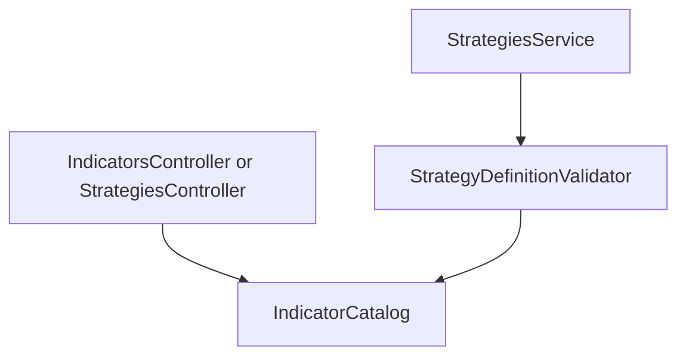

# Sprint 2.2 — Indicators & Rule Schema

**Status:** Plan ready (not started)  
**Roadmap marker:** after Sprint 2.1 completes  
**Branch (when implementing):** `feat/sprint-2-2-indicators-rule-schema`  
**PR base:** `feat/sprint-2-1-strategy-persistence-versioning` (or `main` if 2.1 merged)

**Overview:** Lock the canonical strategy `definition_json` schema (indicators, AND-only entry/exit conditions, stop-loss / take-profit) and ship a public indicator catalog endpoint. No full CRUD yet — validation helpers are built here so Sprint 2.3 can expose them over HTTP. Pure TypeScript types + validators; no new DB tables.

---

## Sprint scope and exit criteria

**Stories**

| ID | Title | Source |
|----|-------|--------|
| #4.2.1 | Indicator catalog | [MVP_04](../product/stories/BitStockerz_MVP_04_Strategy_Lab_Stories.md), [API_Inventory §4.1](../database/API_Inventory.md) |
| #4.3.1 | Condition schema (atomic rule) | MVP_04 |
| #4.3.2 | Entry rules (AND-only) | MVP_04 |
| #4.3.3 | Exit rules (AND-only) | MVP_04 |
| #4.4.1 | Stop loss configuration | MVP_04 |
| #4.4.2 | Take profit configuration | MVP_04 |

**Exit:** A documented, versioned definition schema exists; `GET /strategies/indicators` returns the catalog; a `StrategyDefinitionValidator` (or equivalent) can accept/reject definitions used by create/update in 2.3 and by the backtest engine in Milestone 3.

**Explicitly out of scope**

| Item | Why deferred |
|------|----------------|
| CRUD list/update/delete/validate HTTP | Sprint 2.3 |
| Indicator *computation* on bars | Sprint 3.1 (`#5.2.2`) |
| OR / nested groups | MVP_04 out of scope |
| Position sizing, multi-symbol | MVP_04 out of scope |
| AI explain/red-flag | Milestone 6 |
| Angular builder UI | Milestone 5 |

**Migrations:** None ([Migrations_Plan](../database/Migrations_Plan.md) Sprint 2.2).

---

## Prerequisites

| Capability | Relevance |
|------------|-----------|
| Sprint 2.1 `strategies` + `strategy_versions.definition_json` | Storage target for this schema |
| `CreateStrategyDto.definition` opaque object | Tighten validation to schema |
| Market data timeframes `1d`/`1h` | Constraint alignment |
| NestJS DTO + `DomainError` patterns | Catalog + shared validator errors |

---

## Draft acceptance criteria

### #4.2.1 – Indicator catalog

- `GET /api/strategies/indicators` returns supported indicators for MVP: **SMA**, **EMA**, **RSI**
- Each entry includes: `key`, `display_name`, `description`, `params[]` (`name`, `type`, `min`, `max`, `default`), `outputs` / notes
- Auth: **public** (no PII; helps Angular builder later) — see JC-1
- Catalog is code-defined (const), not DB-backed
- Unit test asserts keys and required param metadata

### #4.3.1 – Condition schema

- Atomic condition shape documented and typed:

```ts
type Operand =
  | { indicator: string }           // references indicators[].id
  | { price: 'open' | 'high' | 'low' | 'close' }
  | { literal: number };

type Condition = {
  left: Operand;
  op:
    | 'gt' | 'gte' | 'lt' | 'lte' | 'eq'
    | 'crosses_above' | 'crosses_below';
  right: Operand;
};
```

- Validator rejects unknown ops, missing operands, non-finite literals
- `crosses_*` requires both sides resolvable as series (indicator or price), not literal-vs-literal — see JC-2

### #4.3.2 / #4.3.3 – Entry / exit AND-only

- Definition includes:

```json
{
  "entry": { "logic": "AND", "conditions": [ /* 1..N */ ] },
  "exit":  { "logic": "AND", "conditions": [ /* 1..N */ ] }
}
```

- `logic` must be `"AND"` only; `"OR"` → validation error
- Entry and exit each require **≥ 1** condition (JC-3)
- Max conditions per group: **10** (JC-4)

### #4.4.1 / #4.4.2 – Stop loss / take profit

```json
{
  "risk": {
    "stop_loss": { "type": "percent", "value": 2.0 },
    "take_profit": { "type": "percent", "value": 4.0 }
  }
}
```

- MVP supports `type: "percent"` only (percent of entry price)
- `value` must be `> 0` and `≤ 50` for SL, `≤ 200` for TP (JC-5)
- Both SL and TP **required** in MVP definitions (JC-6)
- Optional future: `type: "atr"` — not in catalog this sprint

### Cross-cutting definition rules

- Top-level required keys: `indicators`, `entry`, `exit`, `risk`
- `indicators[]`: each `{ id, type, params, source }` where `source` default `close`; `id` unique within definition; `type` ∈ catalog
- SMA/EMA `period` integer 2–200; RSI `period` integer 2–100
- Indicator refs in conditions must exist in `indicators[]`
- `StrategyDefinitionValidator.validate(def) → { is_valid, errors: { path, code, message }[] }`
- Wire validator into `StrategiesService.create` so invalid definitions fail at write time (forward-compat with 2.3)

---

## API contract

### `GET /api/strategies/indicators` (#4.2.1)

**Response `200`**

```json
{
  "indicators": [
    {
      "key": "SMA",
      "display_name": "Simple Moving Average",
      "description": "Arithmetic mean of source over period bars.",
      "params": [
        { "name": "period", "type": "integer", "min": 2, "max": 200, "default": 20 }
      ],
      "sources": ["open", "high", "low", "close"],
      "default_source": "close"
    },
    {
      "key": "EMA",
      "display_name": "Exponential Moving Average",
      "description": "Exponentially weighted moving average of source.",
      "params": [
        { "name": "period", "type": "integer", "min": 2, "max": 200, "default": 20 }
      ],
      "sources": ["open", "high", "low", "close"],
      "default_source": "close"
    },
    {
      "key": "RSI",
      "display_name": "Relative Strength Index",
      "description": "Momentum oscillator 0–100.",
      "params": [
        { "name": "period", "type": "integer", "min": 2, "max": 100, "default": 14 }
      ],
      "sources": ["close"],
      "default_source": "close"
    }
  ]
}
```

### Definition schema (canonical document)

Publish as code comments + short section in API_Inventory §4 and/or `apps/api/src/strategies/definition/README.md` **only if** a tiny in-module doc helps implementers — prefer API_Inventory + story AC to avoid extra markdown sprawl (JC-7).

**Example valid definition**

```json
{
  "indicators": [
    { "id": "sma_fast", "type": "SMA", "params": { "period": 10 }, "source": "close" },
    { "id": "sma_slow", "type": "SMA", "params": { "period": 30 }, "source": "close" },
    { "id": "rsi", "type": "RSI", "params": { "period": 14 }, "source": "close" }
  ],
  "entry": {
    "logic": "AND",
    "conditions": [
      {
        "left": { "indicator": "sma_fast" },
        "op": "crosses_above",
        "right": { "indicator": "sma_slow" }
      },
      {
        "left": { "indicator": "rsi" },
        "op": "lt",
        "right": { "literal": 70 }
      }
    ]
  },
  "exit": {
    "logic": "AND",
    "conditions": [
      {
        "left": { "indicator": "sma_fast" },
        "op": "crosses_below",
        "right": { "indicator": "sma_slow" }
      }
    ]
  },
  "risk": {
    "stop_loss": { "type": "percent", "value": 2 },
    "take_profit": { "type": "percent", "value": 4 }
  }
}
```

### Create path behavior change

`POST /strategies` (from 2.1) begins rejecting invalid definitions with `400 VALIDATION_ERROR` + `fieldErrors` paths like `definition.entry.conditions[0].op`.

---

## Architecture



**Files**

| Path | Role |
|------|------|
| `strategies/definition/strategy-definition.types.ts` | Canonical TS types |
| `strategies/definition/indicator-catalog.ts` | Const catalog |
| `strategies/definition/strategy-definition.validator.ts` | Pure validate() |
| `strategies/definition/strategy-definition.validator.spec.ts` | Exhaustive unit tests |
| `strategies/indicators.controller.ts` **or** route on strategies controller | `GET indicators` |
| Update `create-strategy.dto.ts` | Keep `definition` as object; service runs validator |

Prefer **pure functions** (no Nest DI inside validator) for reuse by backtest engine (3.1) and AI (6.2).

---

## Implementation plan (ordered)

1. Write AC into MVP_04 for #4.2.1–#4.4.2.
2. Add types + catalog + validator with table-driven unit tests (valid, each error code).
3. Expose `GET /strategies/indicators`.
4. Integrate validator into `StrategiesService.create` (and prepare export for 2.3 update/validate).
5. E2E: indicators 200; create with bad definition → 400; create with example → 201.
6. Docs: API_Inventory §4.1 + definition schema notes; manual testing curls; ROADMAP status.

---

## Best-practice checklist

- [ ] Schema-as-code: single source of truth for types + validator
- [ ] Pure validator unit-tested without Nest testing module
- [ ] Stable error `code` strings for field errors (`UNKNOWN_INDICATOR`, `OR_NOT_SUPPORTED`, …)
- [ ] Catalog params drive future Angular forms ([API_Inventory](../database/API_Inventory.md))
- [ ] Do not compute indicators yet — schema only
- [ ] Align ops with what engine can evaluate in 3.1 (no “looks good in JSON” ops)
- [ ] Conventional Commit: `feat: add strategy indicator catalog and definition schema`

**Indicator math library (for later 3.1, decide now):** Prefer implementing SMA/EMA/RSI as small pure functions matching this schema rather than pulling `technicalindicators` unless correctness concerns dominate — see JC-8 (decision recorded for Milestone 3; no dep added in 2.2).

---

## Risks and mitigations

| Risk | Mitigation |
|------|------------|
| Schema churn after strategies saved | Treat definition as versioned with strategy versions; breaking changes require new version_number on update (2.3) |
| Over-flexible ops engine cannot run | Limit ops enum to engine-ready set above |
| Public catalog vs auth inconsistency | JC-1; document |
| Existing `{}` strategies from 2.1 tests | Migration not needed; tests update fixtures; production empty |

---

## Dev input required

| # | Blocker | Why | Default | Status |
|---|---------|-----|---------|--------|
| 1 | Public vs auth catalog | Inventory silent | ⏭ Public | ⏭ stubbed |
| 2 | Require SL/TP always | Product may want optional | ⏭ Required percent both | ⏭ stubbed |
| 3 | Min conditions | Empty entry ambiguous | ⏭ ≥1 each | ⏭ stubbed |

---

## Judgement calls

### JC-1 — Catalog auth

**Decision:** Public `GET /strategies/indicators`.  
**Why:** No user data; simplifies Angular later; matches public symbol search pattern.  
**Discuss if:** Want all `/strategies/*` behind auth for consistency.

### JC-2 — `crosses_above` / `crosses_below` semantics

**Decision:** True on the bar where previous left≤right and current left>right (above), inverse for below. Document for engine; validator only checks operand types.  
**Why:** Standard crossover definition; evaluation is 3.1.  
**Discuss if:** Product wants “while above” continuous true (that would be `gt`, not cross).

### JC-3 — Empty condition groups

**Decision:** Reject empty `conditions` arrays.  
**Why:** Untradeable strategies should fail validation early.  
**Discuss if:** Allow draft strategies with empty rules (would need `status: draft` — out of scope).

### JC-4 — Max 10 conditions

**Decision:** Cap at 10 per entry/exit group.  
**Why:** Guardrail for MVP complexity and AI prompt size later.  
**Discuss if:** Different cap wanted.

### JC-5 — Percent bounds

**Decision:** SL `(0, 50]`, TP `(0, 200]`.  
**Why:** Prevent absurd configs; still allow wide TP experiments.  
**Discuss if:** Tighter product limits.

### JC-6 — SL/TP required

**Decision:** Both required in `risk`.  
**Why:** MVP risk rules stories imply configuration exists; simplifies engine.  
**Discuss if:** Optional SL or TP independently.

### JC-7 — Extra definition README

**Decision:** No new top-level markdown file; document in API_Inventory + story AC + code types.  
**Why:** Avoid doc sprawl per user preference.  
**Discuss if:** Team wants `docs/product/Strategy_Definition.md`.

### JC-8 — Indicator library for 3.1 (record now)

**Decision (advisory for 3.1):** Implement pure SMA/EMA/RSI in-repo; do not add `technicalindicators` in 2.2.  
**Why:** Tiny surface, full test control, no dep drift.  
**Discuss if:** Prefer battle-tested library ([technicalindicators](https://github.com/anandanand84/technicalindicators)).

### JC-9 — Schema version field

**Decision:** Omit `schema_version` on definition for MVP; imply v1 by code.  
**Why:** YAGNI until breaking change.  
**Discuss if:** Want explicit `schema_version: 1` from day one.

---

## Suggested ticket breakdown

| Ticket | Estimate |
|--------|----------|
| Types + catalog + AC docs | 0.5d |
| Validator + exhaustive unit tests | 1.25d |
| GET indicators + wire create validation | 0.5d |
| E2E + API inventory + manual section | 0.5d |

**Total:** ~2.75 eng days.

---

## Definition of done

- [ ] Branched from 2.1
- [ ] Catalog endpoint live; definition validator integrated on create
- [ ] AC written for all six stories
- [ ] Gates green (build/lint/test/cov/e2e)
- [ ] Docs + ROADMAP → START HERE Sprint 2.3
- [ ] PR opened

---

## References

- API Inventory §4.1–4.3: `docs/database/API_Inventory.md`  
- NestJS DTOs/pipes: https://docs.nestjs.com/pipes  
- MVP Strategy Lab: `docs/product/stories/BitStockerz_MVP_04_Strategy_Lab_Stories.md`  
- technicalindicators (deferred option): https://github.com/anandanand84/technicalindicators  
- Sprint 2.1 plan: `docs/plans/sprint-2-1-strategy-persistence-versioning.md`
