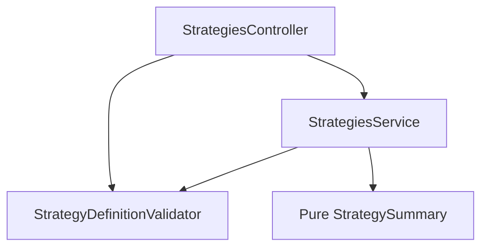

# Sprint 2.3 — Strategy CRUD & Validation

**Status:** Implemented locally and verified (July 28, 2026); unmerged in draft PR #9
**Roadmap marker:** Completed locally; Sprint 3.1 is also complete and `START HERE` is Sprint 3.2
**Branch:** `feat/sprint-2-1-strategy-persistence-versioning` (stacked PR #9)
**PR base:** `main`

**Overview:** Complete the Strategy Lab HTTP surface: list, get, update (new version), soft-delete, validate endpoint, and human-readable summary. Exit criterion: users can create and manage valid strategies ready for backtesting (Milestone 3).

---

## Sprint scope and exit criteria

**Stories**

| ID | Title | Source |
|----|-------|--------|
| #4.5.1 | Create strategy | [MVP_04](../product/stories/BitStockerz_MVP_04_Strategy_Lab_Stories.md) — refine AC (create already partially in 2.1) |
| #4.5.2 | Update strategy (new version) | MVP_04 + [API_Inventory §4.2](../database/API_Inventory.md) |
| #4.5.3 | List user strategies | same |
| #4.5.4 | Get strategy details | same (extend 2.1 get) |
| #4.5.5 | Delete strategy (soft delete) | same |
| #4.6.1 | Strategy validation endpoint | same |
| #4.6.2 | Human-readable strategy summary | same |

**Exit (ROADMAP):** Users can create and manage valid strategies.

**Explicitly out of scope**

| Item | Why deferred |
|------|----------------|
| Backtest run / pin version | Milestone 3 |
| Angular editor | Milestone 5 |
| AI explain / red flags | Milestone 6 |
| Hard delete / GDPR purge beyond lifecycle policy | Lifecycle doc; not this sprint |
| OR logic / optimization | MVP out of scope |

**Migrations:** None required; optional index already on `user_id`.

---

## Prerequisites

| Capability | From |
|------------|------|
| Persist + version rows | Sprint 2.1 |
| Definition schema + validator + indicator catalog | Sprint 2.2 |
| AuthGuard + ensureUserPersisted + AuditService | Prior sprints |

---

## Acceptance criteria (implementation contract)

### #4.5.1 – Create strategy

- Authenticated `POST /api/strategies` creates metadata + version 1 with **valid** definition (validator from 2.2)
- Duplicate active name → `409 CONFLICT`
- Response includes `version_number`, `definition`, `summary` (JC-1: include summary on write responses)

### #4.5.2 – Update strategy (new version)

- `PUT /api/strategies/:id` (owner only):
  - Updates mutable metadata: `name?`, `description?`, `asset_type?`, `timeframe?` (with 2.1 constraints). `description: null` clears it; omission leaves it unchanged.
  - If `definition` present → append new `strategy_versions` row with `version_number = max+1`
  - If only metadata changes → **no** new version (JC-2)
- Reject an empty update body with `400 VALIDATION_ERROR`
- A present valid `definition` creates a version even when byte-for-byte/equivalent to the latest definition; clients omit the field for metadata-only updates
- Cannot update soft-deleted strategies → `404`
- Name conflict with another strategy → `409`
- Invalid definition → `400 STRATEGY_VALIDATION_ERROR`
- Response returns latest version payload

### #4.5.3 – List strategies

- `GET /api/strategies` returns current user’s **active** strategies
- Default sort: `updated_at DESC, id ASC` (stable tie-breaker)
- Query: `limit?` default 50 max 100; `offset?` default 0, min 0, max 10,000 (JC-3: offset pagination MVP)
- Response: `{ "items": [...], "limit": 50, "offset": 0, "has_more": false }`; compute `has_more` by fetching `limit + 1`, not a required count query
- Items: `{ id, name, asset_type, timeframe, version_number, created_at, updated_at, is_active }` — no full definition in list

### #4.5.4 – Get strategy details

- `GET /api/strategies/:id` returns metadata + latest definition + `version_number` + `summary`
- Optional query `version?` to fetch a historical version (JC-4: **include** — cheap and helps backtest debugging)
- Historical response returns current strategy metadata plus the requested `version_number`, `version_created_at`, definition, summary, and `is_latest`; a missing version returns `404 STRATEGY_VERSION_NOT_FOUND`

### #4.5.5 – Soft delete

- `DELETE /api/strategies/:id` sets `is_active=false` and returns `204` with no response body (JC-5).
- Idempotent: second delete → `404`
- List/get hide soft-deleted
- Name remains reserved (per Sprint 2.1 JC-1)

### #4.6.1 – Validation endpoint

- `POST /api/strategies/validate`
- Body: `{ "definition": { ... } }` **or** `{ "strategy_id": "..." }` (owner)
- Response:

```json
{
  "is_valid": false,
  "errors": [
    { "path": "entry.conditions[0].op", "code": "UNKNOWN_OPERATOR", "message": "..." }
  ],
  "summary": null
}
```

- When valid: `is_valid: true`, `errors: []`, `summary` string present
- Does not persist
- `strategy_id` validates the latest version of an active owned strategy; missing, inactive, or cross-user ids return `404 STRATEGY_NOT_FOUND`

### #4.6.2 – Human-readable summary

- Deterministic template (no AI): e.g.  
  `"Buy when SMA(10) crosses above SMA(30) AND RSI(14) < 70. Exit when SMA(10) crosses below SMA(30). Stop loss 2%. Take profit 4%."`
- Pure function `summarizeStrategyDefinition(def): string`
- Unit tests for fixture definitions
- Exposed on get/create/update/validate(valid)

**Audit events:** `strategy.created` (exists), add `strategy.updated`, `strategy.deleted`.

---

## API contract (canonical)

All routes authenticated except `GET /strategies/indicators` (2.2).

| Method | Path | Notes |
|--------|------|-------|
| POST | `/strategies` | create |
| GET | `/strategies` | list |
| GET | `/strategies/:id` | details; `?version=` |
| PUT | `/strategies/:id` | metadata ± new version |
| DELETE | `/strategies/:id` | soft delete → 204 |
| POST | `/strategies/validate` | dry-run validation |
| GET | `/strategies/indicators` | unchanged (2.2) |

**Route ordering:** Register `GET indicators` and `POST validate` **before** `GET :id` to avoid param capture.

**Error codes:** Add and use `STRATEGY_NOT_FOUND`, `STRATEGY_VERSION_NOT_FOUND`, and `STRATEGY_VALIDATION_ERROR` in this sprint. Keep generic `CONFLICT` for duplicate names and `UNAUTHORIZED` for a missing session. These names are canonical for downstream backtest/AI plans (JC-6).

---

## Architecture



**Files**

| Path | Role |
|------|------|
| `strategies.controller.ts` | Full route set |
| `strategies.service.ts` | list/update/softDelete |
| `dto/update-strategy.dto.ts` | Partial metadata + optional definition |
| `dto/validate-strategy.dto.ts` | definition XOR strategy_id |
| `definition/strategy-summary.ts` | Pure summarizer |
| specs + e2e expansions | Coverage |

Use Prisma `$transaction` when updating metadata + inserting version ([Prisma transactions](https://www.prisma.io/docs/orm/prisma-client/queries/transactions)).

---

## Implementation plan (ordered)

1. AC into MVP_04 for #4.5.x / #4.6.x.
2. Summary pure function + unit tests.
3. List + delete + update service methods (memory + Prisma). Serialize version allocation by locking the strategy row inside the transaction (or use a serializable transaction with bounded retry on Prisma `P2034`); do not rely on an unprotected `max + 1`.
4. Validate endpoint (reuse validator + summary).
5. Controller routes + DTO; fix route order.
6. Audit hooks; e2e happy/error paths.
7. Docs at Sprint 2.3 completion: API_Inventory §4, manual section, roadmap
   exit, then-current marker advanced to Sprint 3.1, and CHANGELOG. The plan
   header carries the current marker.

Gates:

```bash
npm --prefix apps/api run build && npm --prefix apps/api run lint
npm --prefix apps/api run test && npm --prefix apps/api run test:cov
npm --prefix apps/api run test:e2e
./scripts/sprint-delivery-verify.sh verify
```

---

## Best-practice checklist

- [x] Owner checks on every id-based route (404 not 403 for cross-user)
- [x] Append-only versions for definition changes
- [x] Soft delete via `is_active` matching DDL
- [x] Deterministic summary (no LLM)
- [x] Validate endpoint side-effect free
- [x] class-validator DTOs ([NestJS pipes](https://docs.nestjs.com/pipes))
- [x] Conventional Commit: `feat: complete strategy crud and validation`

---

## Risks and mitigations

| Risk | Mitigation |
|------|------------|
| `validate` vs `:id` routing clash | Declare static paths first |
| Large definitions | Rely on body parser defaults; optional max depth in validator |
| Concurrent updates race on version_number | Transaction + unique `(strategy_id, version_number)`; retry once on conflict |
| Summary drift from validator | Summarizer assumes valid def; validate first |

---

## Adopted defaults and override triggers

| # | Blocker | Why | Default | Status |
|---|---------|-----|---------|--------|
| 1 | PUT partial vs full body | Locks update DTO and version behavior | Partial PATCH-like PUT; empty body invalid | Adopted |
| 2 | Historical version query | Not in inventory | Support `?version=` | Adopted |
| 3 | Delete response 204 vs body | Style | 204 | Adopted |

---

## Judgement calls

### JC-1 — Summary on write responses

**Decision:** Include `summary` on create/update/get/validate(valid).  
**Why:** One round-trip for UI; cheap to compute.  
**Discuss if:** Prefer summary-only via validate endpoint.

### JC-2 — Metadata-only update versions

**Decision:** New version **only** when `definition` is present in PUT body.  
**Why:** Avoid version spam on renames; backtests pin definition versions.  
**Discuss if:** Every PUT should bump version for audit simplicity.

### JC-3 — Pagination

**Decision:** `limit` + `offset` (not cursor).  
**Why:** Small per-user cardinality in MVP.  
**Discuss if:** Cursor pagination preferred for consistency with future lists.

### JC-4 — Historical version fetch

**Decision:** Support `GET /strategies/:id?version=N`.  
**Why:** Supports reproducibility story `#5.6.1` debugging before backtests ship.  
**Discuss if:** Defer until Milestone 3.

### JC-5 — DELETE status

**Decision:** `204 No Content`.  
**Why:** Standard for successful delete without body.  
**Discuss if:** Prefer `200` + entity for client convenience.

### JC-6 — Strategy-specific ErrorCode enum values

**Decision:** Add `STRATEGY_NOT_FOUND`, `STRATEGY_VERSION_NOT_FOUND`, and `STRATEGY_VALIDATION_ERROR` now; Sprint 4.3 adds the exhaustive catalog test but does not rename them.
**Why:** Backtest persistence and AI ownership checks depend on stable strategy codes before Sprint 4.3.
**Discuss if:** The product intentionally wants only generic resource codes across every domain; change all downstream plans together.

### JC-7 — Validate XOR body

**Decision:** Exactly one of `definition` or `strategy_id` required; both/neither → validation error.  
**Why:** Clear API.  
**Discuss if:** Allow both with definition winning.

---

## Suggested ticket breakdown

| Ticket | Estimate |
|--------|----------|
| Summary + validate endpoint | 0.75d |
| List + soft delete | 0.5d |
| Update + version bump + races | 1.0d |
| E2E matrix + docs | 0.75d |

**Total:** ~3 eng days.

---

## Definition of done

- [x] All #4.5.x and #4.6.x AC implemented
- [x] Historical completion record: ROADMAP Milestone 2 exit was satisfied and
  its marker advanced to Sprint 3.1; the current marker is maintained above.
- [x] API_Inventory §4 marked implemented
- [x] Gates green; automated curl smoke covers full CRUD + validate and the
      canonical manual checklist is merge-ready
- [x] PR #9 open with Sprint 2.3 stacked

---

## References

- NestJS controllers/guards: https://docs.nestjs.com/guards  
- Prisma transactions: https://www.prisma.io/docs/orm/prisma-client/queries/transactions  
- API Inventory §4: `docs/database/API_Inventory.md`  
- Plans: `sprint-2-1-*.md`, `sprint-2-2-*.md`  
- Security tenancy: `docs/product/requirements/Security.md`
