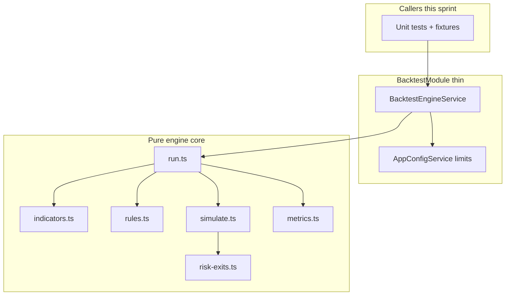

# Sprint 3.1 — Backtest Engine Core

**Status:** Plan ready (not started)  
**Roadmap marker:** Milestone 3 / Sprint 3.1 (after Milestone 2 Strategy Lab exit)  
**Branch:** `feat/sprint-3-1-backtest-engine-core`  
**PR base:** `feat/sprint-2-3-strategy-crud-validation` (or `main` once 2.3 is merged)

**Overview:** Ship a pure, in-process backtest engine that evaluates a Milestone 2 strategy definition against a bar series: indicators → rule evaluation → long-only trade simulation with SL/TP, plus hard wall-clock and bar-count guardrails. No HTTP routes and no persistence tables in this sprint — callers are unit tests and a thin Nest injectable used by Sprint 3.2/3.3. Target NFR: 1 year of daily bars for one symbol completes in under 2 seconds.

---

## Sprint scope and exit criteria

**Stories**

| ID | Title | Source |
|----|-------|--------|
| #5.2.1 | Engine interface | [MVP_05](../product/stories/BitStockerz_MVP_05_Backtesting_Stories.md) |
| #5.2.2 | Indicator computation layer | same |
| #5.2.3 | Rule evaluation | same |
| #5.2.4 | Trade simulation logic | same |
| #5.2.5 | Stop loss / take profit handling | same |
| #8.2.1 | Execution sandbox boundaries | [MVP_08](../product/stories/BitStockerz_MVP_08_Backend_Infrastructure_Stories.md) |
| #8.2.2 | Runtime & memory limits per backtest | same |

**Exit (from [ROADMAP.md](../product/ROADMAP.md)):** Deterministic engine can run a pinned strategy definition on in-memory bars and return trades, equity curve, and summary metrics without DB or HTTP.

**Explicitly out of scope**

| Item | Why deferred |
|------|----------------|
| `backtest_runs` / results / trades / equity tables | Sprint 3.2 ([Migrations_Plan](../database/Migrations_Plan.md)) |
| `POST/GET /backtests` | Sprint 3.3 ([API_Inventory §5](../database/API_Inventory.md)) |
| Angular UI / charts | Sprint 3.4 |
| BullMQ / Redis / async job queue | Jobs remain sync `JobExecutorService` (Sprint 1.3) |
| Short selling, multi-symbol, position sizing models | MVP_05: single symbol, long-only |
| OR / nested rule groups | Strategy Lab MVP: AND-only |
| Live vendor data | Sprint 7.1 |
| Security isolation (VM/container sandbox) | Soft sandbox only — see JC-1 |

---

## Prerequisites (what already shipped)

| Capability | Location | Relevance to 3.1 |
|------------|----------|------------------|
| Candle shapes (OHLCV) + seed fixtures | `apps/api/src/market-data/` (`seed-candles.ts`, types) | Engine input bars; unit tests use seed without DB |
| Job executor sync + timeout pattern | `JobExecutorService`, `JOB_TIMEOUT_MS` | Mirror AbortSignal / wall-clock pattern for engine host |
| DomainError + ErrorCode + RFC 7807 | `apps/api/src/common/errors/` | Add `BACKTEST_*` codes (thrown by engine; HTTP maps in 3.3) |
| Strategy definition JSON (Milestone 2) | `strategy_versions.definition_json` + `StrategyDefinitionValidator` / DTOs from 2.2/2.3 | Engine consumes the same schema (`literal` operands, required percent SL/TP) |
| Indicators catalog SMA/EMA/RSI | Sprint 2.2 stories | Engine must compute the same set |
| Config via `AppConfigService` | `apps/api/src/config/` | `BACKTEST_TIMEOUT_MS`, `BACKTEST_MAX_BARS` |
| Coverage gate **90%** | `apps/api/package.json` | Pure modules are easy to unit-test to the gate |
| Prisma optional | `prisma.isEnabled` | Unused this sprint; keep engine DB-free |

**Schema:** No migrations ([Migrations_Plan — Sprint 3.1](../database/Migrations_Plan.md)).

---

## Draft acceptance criteria (lock before coding)

Stories are title-only today. Write these into [MVP_05](../product/stories/BitStockerz_MVP_05_Backtesting_Stories.md) / [MVP_08](../product/stories/BitStockerz_MVP_08_Backend_Infrastructure_Stories.md) **before** merging.

### #5.2.1 – Engine interface

- Export a single entrypoint: `BacktestEngine.run(input: BacktestEngineInput): BacktestEngineOutput` (sync pure function **or** injectable service method that delegates to pure core — no Nest HTTP).
- `BacktestEngineInput` includes at minimum:
  - `definition` — Milestone 2 strategy definition JSON
  - `bars: Array<{ ts: Date; open; high; low; close; volume }>` chronological ascending
  - `initialEquity: number` (> 0)
  - `symbolId?: number` (pass-through onto trades; optional in 3.1 tests)
  - `signal?: AbortSignal` for cooperative cancel/timeout
  - `limits?: { maxBars?: number; timeoutMs?: number }`
- `BacktestEngineOutput` includes:
  - `trades[]` — closed trades only (entry/exit time & price, side=`long`, qty, pnl_abs, pnl_pct)
  - `equityCurve[]` — `{ ts, equity }` one point per bar (or per closed bar after mark-to-market)
  - `metrics` — `finalEquity`, `totalReturnPct`, `maxDrawdownPct`, `winRatePct`, `numTrades`, `avgWinPct`, `avgLossPct`, `sharpeRatio: number | null`
  - `diagnostics` — `{ barsProcessed, durationMs, indicatorsComputed, signalsFired }`
- Engine is deterministic given the same bars + definition (no wall-clock in metrics math except `diagnostics.durationMs`).
- Unit tests cover empty bars, single bar (no trade), and a golden fixture (SMA cross) with frozen expected trades/metrics.

### #5.2.2 – Indicator computation layer

- Support indicator types from Strategy Lab: `SMA`, `EMA`, `RSI` with `params.period` and `source` ∈ `open|high|low|close|volume` (default `close`).
- Pure module: `computeIndicators(definition.indicators, bars) → Record<indicatorId, Array<number | null>>` aligned 1:1 with bar index; warmup bars are `null`.
- Invalid period (`<= 0`, non-integer) or unknown type → throw `DomainError(ErrorCode.BACKTEST_INVALID_DEFINITION)` (or `STRATEGY_VALIDATION_ERROR` if already defined in M2 — prefer one code; see JC-4).
- Unit tests: SMA period 3 on known series; EMA seed behavior documented; RSI bounds `[0,100]` after warmup.

### #5.2.3 – Rule evaluation

- Evaluate entry/exit groups with `logic: "AND"` only; each condition compares left/right operands:
  - `{ indicator: id }` → series value at bar `i`
  - `{ price: "close"|"open"|... }` → bar field
  - `{ literal: number }` (canonical name from Sprint 2.2 — do **not** invent `constant`)
- Operators (MVP minimum): `gt`, `gte`, `lt`, `lte`, `eq`, `crosses_above`, `crosses_below`.
- Cross operators require previous bar values; if either side was `null` at `i-1` or `i`, condition is false.
- Missing indicator id → `BACKTEST_INVALID_DEFINITION`.
- Pure: `evaluateRules(entry|exit, ctx) → boolean` per bar; unit-tested independently of simulation.

### #5.2.4 – Trade simulation logic

- Long-only; at most **one** open position.
- Entry: when flat and entry rules true on bar close → open at **close** of signal bar (see JC-5).
- Exit: when in position and exit rules true on bar close → close at **close**.
- Position size MVP: invest **100% of current equity** (qty = equity / entryPrice); no partial fills, no fees/slippage (document; fees deferred).
- Flat mark-to-market: equity curve uses cash; in-position equity = cash residual (0) + qty * bar.close.
- Open position still open at last bar → force-close at last bar close (include in trades + metrics).
- Side field always `"long"` (DDL `side VARCHAR(8)`).

### #5.2.5 – Stop loss / take profit handling

- Read `definition.risk.stop_loss` / `take_profit` with `type: "percent"` and `value` (> 0).
- While in position, after bar is available, check **intrabar** SL/TP using high/low:
  - SL: if `low <= entry * (1 - slPct/100)` → exit at stop price
  - TP: if `high >= entry * (1 + tpPct/100)` → exit at take price
- Same-bar priority when both touch: **stop loss first** (conservative; JC-6).
- SL/TP checked **before** signal exits on that bar; if SL/TP fires, skip rule exit.
- Sprint 2.2 requires both SL and TP on persisted definitions; engine still skips a check if a field is absent (defensive for fixtures / older rows).

### #8.2.1 – Execution sandbox boundaries

- Engine core has **no** access to Prisma, HTTP, filesystem, or `process.env` (pure inputs only).
- Nest `BacktestEngineService` is a thin adapter: validates limits from config, builds `AbortSignal`, calls pure `run`.
- Document in module README comment: this is a **logical** sandbox, not OS-level isolation.
- Forbidden: `eval`, dynamic `Function`, loading user JS. Definitions are data-only JSON.

### #8.2.2 – Runtime & memory limits per backtest

- Enforce `maxBars` (default from config, e.g. `10_000`) before run; exceed → `BACKTEST_BAR_LIMIT_EXCEEDED`.
- Enforce wall-clock via `AbortSignal` + periodic checks every N bars (e.g. 64); abort → `BACKTEST_TIMEOUT`.
- Default timeout from `BACKTEST_TIMEOUT_MS` (default `2000` to match NFR, or `5000` with headroom — JC-7).
- No BullMQ. Optional `worker_threads` **not** required for 3.1 exit (JC-1); if added, must use `resourceLimits.maxOldGenerationSizeMb` and still treat as soft sandbox.

---

## API contract (canonical)

**No new HTTP routes in Sprint 3.1.**

Engine is invoked only from:

1. Unit/integration tests under `apps/api/src/backtest/engine/**/*.spec.ts`
2. Future `BacktestsService` / job handler (Sprints 3.2–3.3)

### Error codes to add (catalog only; HTTP mapping in 3.3)

| Code | HTTP (later) | When |
|------|--------------|------|
| `BACKTEST_INVALID_DEFINITION` | 400 | Unknown indicator/op, bad risk params |
| `BACKTEST_INSUFFICIENT_BARS` | 400 | Bars length 0 or < max indicator period |
| `BACKTEST_BAR_LIMIT_EXCEEDED` | 400 | `bars.length > maxBars` |
| `BACKTEST_TIMEOUT` | 504 or 400 | AbortSignal fired / wall clock |
| `BACKTEST_INTERNAL_ERROR` | 500 | Unexpected engine failure |

Also ensure Milestone 2 `STRATEGY_*` codes remain the source of truth for CRUD validation; engine assumes a previously validated definition but still fails closed on structural issues.

### Programmatic contract (TypeScript shapes)

```ts
// apps/api/src/backtest/engine/backtest-engine.types.ts
export interface BacktestEngineInput {
  definition: StrategyDefinition; // from strategies domain
  bars: EngineBar[];
  initialEquity: number;
  symbolId?: number;
  signal?: AbortSignal;
  limits?: { maxBars?: number; timeoutMs?: number };
}

export interface BacktestEngineOutput {
  trades: EngineTrade[];
  equityCurve: EngineEquityPoint[];
  metrics: EngineMetrics;
  diagnostics: EngineDiagnostics;
}
```

---

## Architecture



### Module / file layout

| Path | Role |
|------|------|
| `apps/api/src/backtest/backtest.module.ts` | Nest module; exports `BacktestEngineService` |
| `apps/api/src/backtest/engine/backtest-engine.service.ts` | DI adapter + limits + AbortSignal |
| `apps/api/src/backtest/engine/backtest-engine.types.ts` | Input/output types |
| `apps/api/src/backtest/engine/run.ts` | Orchestrates bar loop |
| `apps/api/src/backtest/engine/indicators.ts` | SMA/EMA/RSI pure |
| `apps/api/src/backtest/engine/rules.ts` | Condition / AND group eval |
| `apps/api/src/backtest/engine/simulate.ts` | Position state machine |
| `apps/api/src/backtest/engine/risk-exits.ts` | SL/TP intrabar |
| `apps/api/src/backtest/engine/metrics.ts` | Return, MDD, win rate, optional Sharpe |
| `apps/api/src/backtest/engine/fixtures/` | Golden bar series + definitions |
| `apps/api/src/backtest/engine/*.spec.ts` | Unit tests (no DB) |
| `apps/api/src/common/errors/error-codes.enum.ts` | Add `BACKTEST_*` |
| `apps/api/src/common/errors/error-catalog.ts` | Titles/details for new codes |
| `apps/api/src/config/app-config.service.ts` | `backtest.timeoutMs`, `backtest.maxBars` |
| `apps/api/src/app.module.ts` | Import `BacktestModule` |

**Design principles**

1. **Pure core, thin Nest shell** — maximize unit-test coverage without TestModule bootstraps.
2. **Definition is data** — never execute user code.
3. **Fail closed** on bad definition / limits; do not silently skip unknown ops.
4. **Cooperative cancel** — check `signal.aborted` in the bar loop; do not busy-spin.
5. **Config via DI only** — no raw `process.env` in engine files.

---

## Implementation plan (ordered)

### 1. AC + error codes + config

1. Paste AC into MVP_05 (#5.2.1–5.2.5) and MVP_08 (#8.2.1–8.2.2).
2. Add `BACKTEST_*` to `ErrorCode` + `ERROR_CATALOG`.
3. Extend `AppConfig` with `backtest.timeoutMs` (default `5000`), `backtest.maxBars` (default `10000`); document in `.env.example`.
4. Config unit tests for defaults and invalid ints (fail-fast).

### 2. Fixtures (#5.2.1 foundation)

1. Add `fixtures/sma-cross.definition.json` matching Milestone 2 shape (fast/slow SMA, percent SL/TP).
2. Add `fixtures/sma-cross.bars.json` (~80–120 synthetic daily bars with a known cross).
3. Add expected `fixtures/sma-cross.expected.json` (trades + metrics) generated once and locked.

### 3. Indicators (#5.2.2) — JC-2: pure implementations

1. Implement SMA / EMA / RSI in `indicators.ts` (no `technicalindicators` dep unless JC reversed).
2. Document EMA seeding (SMA of first `period` closes, then recursive) in a short code comment.
3. Unit tests with hand-computed vectors.

### 4. Rules (#5.2.3)

1. Implement operand resolution + operators including crosses.
2. Tests for AND short-circuit, null warmup, unknown op → DomainError.

### 5. Simulation + SL/TP (#5.2.4, #5.2.5)

1. Bar loop in `run.ts`: indicators once → for each bar: SL/TP → exit rules → entry rules → mark equity.
2. Force-close at end.
3. Metrics: max drawdown from equity peaks; win rate on closed trades; Sharpe optional (null if `< 2` returns or zero variance) — JC-8.

### 6. Sandbox limits (#8.2.1, #8.2.2)

1. `BacktestEngineService.run` applies config limits, creates `AbortSignal.timeout(timeoutMs)` (Node 18+) or manual timer.
2. Reject oversized bars before compute.
3. Unit test: abort mid-run throws `BACKTEST_TIMEOUT`; oversized throws `BACKTEST_BAR_LIMIT_EXCEEDED`.

### 7. Module wire + gates

```bash
npm --prefix apps/api run build
npm --prefix apps/api run lint
npm --prefix apps/api run test
npm --prefix apps/api run test:cov
```

No e2e HTTP required this sprint. Optionally add a tiny Nest testing-module smoke that resolves `BacktestEngineService`.

### 8. Documentation sync

| File | Update |
|------|--------|
| `docs/product/ROADMAP.md` | Mark 3.1 in progress / completed when done; keep `START HERE` accurate |
| `docs/product/stories/BitStockerz_MVP_05_*.md` | AC for #5.2.x |
| `docs/product/stories/BitStockerz_MVP_08_*.md` | AC for #8.2.x |
| `docs/database/Migrations_Plan.md` | Confirm “no tables” note for 3.1 |
| `docs/manual-testing/manual_testing.md` | Note: engine verified via unit fixtures (no UI yet) |
| `CHANGELOG.md` | Engine-core note |
| `.cursor/skills/sprint-delivery/reference.md` | Branch map row |

---

## Best-practice checklist

- [ ] Pure functions for indicators / rules / sim / metrics (unit-testable without Nest)
- [ ] No user-code execution; definition JSON only ([Node security guidance](https://nodejs.org/en/learn/getting-started/security-best-practices))
- [ ] Cooperative `AbortSignal` timeout ([AbortSignal.timeout](https://nodejs.org/docs/latest/api/globals.html#abortsignaltimeoutmilliseconds))
- [ ] Config fail-fast via `AppConfigService`
- [ ] RFC 7807 codes registered even before HTTP surface
- [ ] Golden fixtures for regression (no DB)
- [ ] NFR path: microbench or timed unit test for ~252 daily bars &lt; 2s
- [ ] Conventional Commits (`feat: add backtest engine core`)
- [ ] Coverage ≥ 90% on new engine files
- [ ] No BullMQ / no Prisma models / no Angular

---

## Risks and mitigations

| Risk | Mitigation |
|------|------------|
| Event-loop blocking on large bar sets | Bar-count cap + timeout; revisit `worker_threads` in 3.3 (JC-1) |
| Indicator math drift vs Strategy Lab docs | Shared type + fixture tests; prefer pure impl owned by us (JC-2) |
| Ambiguous cross / SL same-bar semantics | Lock JC-5 / JC-6 in this plan; encode in fixture expectations |
| Strategy definition schema still evolving in M2 | Depend on 2.3 merge; pin fixture to committed `StrategyDefinitionValidator` + types |
| Sharpe unstable on short samples | Return `null` when undefined (JC-8) |
| Coverage gate from Nest wiring file | Keep `BacktestEngineService` thin; test pure `run.ts` heavily |

---

## Dev input required

| # | Blocker | Why it blocks | Default if unanswered | Status |
|---|---------|---------------|----------------------|--------|
| 1 | Sandbox: in-process vs `worker_threads` | Affects package surface + complexity | ⏭ In-process + AbortSignal for 3.1 | ⏭ stubbed |
| 2 | Indicator library vs pure math | Dep drift vs correctness | ⏭ Pure SMA/EMA/RSI in-repo | ⏭ stubbed |
| 3 | Fill price: close vs next open | Changes all trade PnL | ⏭ Signal-bar **close** | ⏭ stubbed |
| 4 | Default `BACKTEST_TIMEOUT_MS` | NFR is 2s compute; HTTP overhead later | ⏭ `5000` ms engine host default | ⏭ stubbed |
| 5 | Fees / slippage | Changes metrics | ⏭ Zero fees MVP | ⏭ stubbed |
| 6 | Position sizing | All-in vs fixed qty | ⏭ 100% equity long | ⏭ stubbed |

---

## Judgement calls

### JC-1 — Soft sandbox: in-process first

**Decision:** Run the engine in-process with hard wall-clock timeout + bar-count limits. Do **not** introduce BullMQ. Defer `worker_threads` + `resourceLimits.maxOldGenerationSizeMb` unless profiling shows event-loop blocking.  
**Why:** Fastest path to correct, testable core; Node worker_threads are soft isolation only ([worker_threads](https://nodejs.org/docs/latest/api/worker_threads.html)), not a security boundary.  
**Discuss before implement if:** Multi-tenant untrusted definitions become a hard security requirement in MVP, or CI shows p95 API latency regressions from sync runs.

### JC-2 — Indicators: pure implementations

**Decision:** Implement SMA/EMA/RSI as small pure functions; do **not** add `technicalindicators` in 3.1.  
**Why:** Avoid dep drift vs Strategy Lab formulas; keep bundle small and tests deterministic.  
**Discuss before implement if:** Product insists on matching a third-party reference library bit-for-bit.

### JC-3 — Nest module exists without HTTP

**Decision:** Create `BacktestModule` + `BacktestEngineService` in 3.1 even with zero controllers.  
**Why:** Gives 3.2/3.3 a stable injection point; keeps pure core importable.  
**Discuss before implement if:** Team prefers `src/backtest/engine` as a plain TS folder imported later (acceptable alternative).

### JC-4 — Engine vs strategy error codes

**Decision:** Engine throws `BACKTEST_INVALID_DEFINITION` for structural issues at run time; Strategy CRUD keeps `STRATEGY_*` (added in M2 / #8.3.2).  
**Why:** Separates “saved strategy invalid” from “run payload/engine invariant broken”.  
**Discuss before implement if:** #8.3.2 already standardized a single shared code — then reuse it.

### JC-5 — Entry/exit fill at signal-bar close

**Decision:** Fill at the close of the bar where the signal is true (not next open).  
**Why:** Simplest MVP; matches many retail backtest toys; next-open realism can wait.  
**Discuss before implement if:** Trading realism is prioritized over simplicity for demo metrics.

### JC-6 — Same-bar SL vs TP priority

**Decision:** If both stop and take are touched in one bar, exit at **stop loss**.  
**Why:** Conservative performance reporting; avoids optimistic double-touch ambiguity.  
**Discuss before implement if:** Product prefers TP-first or bar mid-price heuristics.

### JC-7 — Timeout 5s; Sharpe nullable

**Decision:** Default `BACKTEST_TIMEOUT_MS=5000` (NFR &lt;2s is compute target; CI hard-fail only above timeout). Sharpe = simple per-bar returns (rf=0), else `null` if &lt;2 returns / zero stdev (DDL-nullable).  
**Why:** CI variance vs product NFR; MVP.md marks Sharpe optional.  
**Discuss before implement if:** Hard 2s CI gate or annualized asset-specific Sharpe is required now.

---

## Suggested ticket breakdown

| Ticket | Estimate |
|--------|----------|
| AC in stories + error codes + config | 0.25d |
| Fixtures + engine types + `run` skeleton | 0.5d |
| Indicators + unit vectors | 0.75d |
| Rules + cross operators | 0.75d |
| Simulation + SL/TP + metrics | 1.25d |
| Limits / AbortSignal + Nest service module | 0.5d |
| Docs + branch map + CHANGELOG | 0.25d |

**Total:** ~4 engineering days.

---

## Definition of done

- [ ] Branched from Sprint 2.3 (or `main` post-merge)
- [ ] Dev gates resolved or stubbed above
- [ ] #5.2.1–#5.2.5 and #8.2.1–#8.2.2 implemented per AC
- [ ] No Prisma migrations in this sprint
- [ ] Golden fixture tests green; timeout/bar-limit tests green
- [ ] build / lint / test / test:cov (≥90%) pass
- [ ] Docs synced; ROADMAP/stories updated
- [ ] PR opened against correct base

---

## References

- Node.js `worker_threads` + `resourceLimits`: https://nodejs.org/docs/latest/api/worker_threads.html  
- `AbortSignal.timeout`: https://nodejs.org/docs/latest/api/globals.html#abortsignaltimeoutmilliseconds  
- NestJS providers / modules: https://docs.nestjs.com/modules  
- Domain errors pattern (repo): `apps/api/src/common/errors/`  
- DDL (future persistence): [DDL/04_backtesting.sql](../database/DDL/04_backtesting.sql)  
- API inventory (future HTTP): [API_Inventory §5](../database/API_Inventory.md)  
- NFR performance: [Non_Functional_Requirements.md](../product/requirements/Non_Functional_Requirements.md)  
- Prior plan style: [sprint-1-4-data-health-observability.md](./sprint-1-4-data-health-observability.md) (git history if working tree empty)  
- Delivery workflow: `.cursor/skills/sprint-delivery/SKILL.md`
