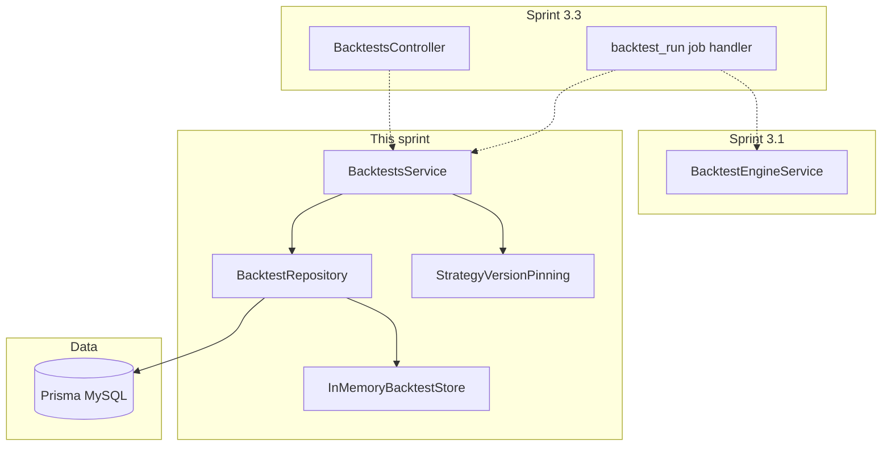

# Sprint 3.2 — Backtest Persistence

**Status:** Implemented and locally verified (seed + MySQL, July 28, 2026); included in draft PR #9

**Roadmap marker:** Implementation complete locally; Sprints 3.3–3.4 are also complete and `START HERE` is Sprint 4.1

**Branch:** `feat/sprint-2-1-strategy-persistence-versioning` (stacked at the owner's request)

**PR:** [#9](https://github.com/JustinPaoletta/BitStockerz/pull/9), base `main` (combined Sprints 2.1–3.4)

**Overview:** Persist backtest runs, summary results, trades, and equity points per [DDL/04_backtesting.sql](../database/DDL/04_backtesting.sql), including a soft-pin to `strategy_versions.id` for reproducibility. Wire a repository/service layer that works with Prisma when `DATABASE_URL` is set and an in-memory store when it is not — mirroring jobs/auth patterns. No public HTTP API yet (Sprint 3.3); expose internal `BacktestsService` methods that 3.3 controllers and the job handler will call.

---

## Sprint scope and exit criteria

**Stories**

| ID | Title | Source |
|----|-------|--------|
| #5.1.1 | Backtest run schema | [MVP_05](../product/stories/BitStockerz_MVP_05_Backtesting_Stories.md) + [DDL/04](../database/DDL/04_backtesting.sql) |
| #5.1.2 | Backtest result storage | same |
| #5.1.3 | Trades & equity curve storage | same |
| #5.6.1 | Strategy version pinning | same + [DDL/03](../database/DDL/03_strategy_lab.sql) |

**Exit:** A completed engine output can be written and read back as a run + result + trades + equity curve, with `strategy_version_id` immutably stored on the run. Seed/in-memory mode supports the same service API without MySQL.

**Explicitly out of scope**

| Item | Why deferred |
|------|----------------|
| `POST/GET /backtests` HTTP | Sprint 3.3 |
| Bar-count / rate-limit HTTP enforcement | Sprint 3.3 (#5.5.x) |
| Angular UI | Sprint 3.4 |
| Changing engine fill/SL semantics | Locked in 3.1 JCs |
| Admin purge jobs for old runs | Lifecycle policy; maintenance later |
| Async queue (BullMQ) | Sync jobs remain |

---

## Prerequisites (what already shipped)

| Capability | Location | Relevance to 3.2 |
|------------|----------|------------------|
| Engine `BacktestEngineOutput` | Sprint 3.1 `apps/api/src/backtest/engine/` | Persist shape maps 1:1 to DDL |
| `strategies` + `strategy_versions` | Milestone 2 Prisma models | FK targets; pin latest or explicit version |
| `jobs` table + `JobRecord` | Sprint 1.3 | Optional `job_id` on run; FK via separate migration |
| `symbols` | Sprint 1.1 | `symbol_id` FK on runs/trades |
| Prisma optional + in-memory patterns | `PrismaService`, jobs/auth stores | Dual-path repository |
| Audit foundation | Sprint 1.4 `AuditService` | Optional `backtest.persisted` later; not required |
| Migration naming | `apps/api/prisma/migrations/YYYYMMDDHHMMSS_sprint_*` | Match conceptual V0300–V0330 |

**Schema (this sprint):** Create four tables + deferred jobs FK per [Migrations_Plan — Sprint 3.2](../database/Migrations_Plan.md).

---

## Acceptance criteria (implementation contract)

### #5.1.1 – Backtest run schema

- Prisma models + migration(s) match DDL columns for `backtest_runs`:
  - `id` CHAR(36), `user_id`, `strategy_id`, `strategy_version_id`, `symbol_id`, `timeframe`, `start_date`, `end_date`, `initial_equity`, `status`, `job_id` (nullable), `error_message`, `created_at`, `updated_at`, `started_at`, `finished_at`
- Status enum (app-level strings): `pending` | `running` | `completed` | `failed` | `timed_out` (align with jobs; JC-2).
- Indexes: `(user_id, created_at)`, `(strategy_id)`, `(symbol_id)` as in DDL.
- FKs to `users`, `strategies`, `strategy_versions`, `symbols` with `ON DELETE RESTRICT`.
- `job_id` column present from first migration **nullable without FK**, then `V0330`-equivalent migration adds FK to `jobs(id)` `ON DELETE SET NULL` ([Migrations_Plan](../database/Migrations_Plan.md)).
- In-memory store mirrors fields when `prisma.isEnabled === false`.
- Active, strategy-asset-compatible `symbol_id` and optional owner-scoped
  `job_id` are validated before creation in both database modes; stale
  references return stable not-found domain errors instead of raw FK failures.
- `initial_equity` must already fit its two-decimal storage scale; sub-cent
  inputs are rejected rather than silently changing the engine's capital base.
- Every owner-scoped read/write re-runs auth persistence attachment in MySQL so
  post-restart same-email identity remapping keeps historical runs visible.
- Unit tests: create run row / in-memory record; reject missing required fields at service layer.

### #5.1.2 – Backtest result storage

- Table/model `backtest_results` with columns per DDL: `final_equity`, `total_return_pct`, `max_drawdown_pct`, `win_rate_pct`, `num_trades`, `avg_win_pct`, `avg_loss_pct`, `sharpe_ratio` (nullable).
- Unique constraint on `backtest_run_id` (one result per run).
- `ON DELETE CASCADE` from run.
- Service method creates one result only as part of `completeRun`; it never upserts or updates a completed result (failed runs store `error_message` on run, no result row — JC-3).
- Decimal serialization: persist with Prisma `Decimal`; the API layer in 3.3 returns decimal-backed fields as strings per the repository-wide contract.
- Validate the engine-supplied metrics exactly against the raw trades/equity
  curve before rounding, then recompute the stored summary from the fixed-scale
  persisted rows. This catches sub-storage-step engine regressions while
  keeping result metrics consistent with detail rows at decimal boundaries.

### #5.1.3 – Trades & equity curve storage

- `backtest_trades`: `entry_time`, `exit_time`, `side`, prices, `quantity`, `pnl_abs`, `pnl_pct`, `symbol_id`, FK cascade from run.
- `backtest_equity_points`: `(ts, equity)` per point; index `(backtest_run_id, ts)`.
- Bulk insert helpers: `saveTrades(runId, trades[])`, `saveEquityCurve(runId, points[])`.
- For large curves, batch inserts (e.g. 500 rows) to avoid giant single statements.
- Read APIs (service-level): `getTrades(runId)`, `getEquityCurve(runId)` ordered by time ascending.
- In-memory mode stores arrays on the run aggregate object.
- Tests: round-trip engine fixture output → persist → read equality (timestamps ISO-stable).

### #5.6.1 – Strategy version pinning

- Every run **must** set `strategy_version_id` at creation time (NOT NULL).
- Pinning rule (JC-4): when creating a run from `strategy_id` only, resolve **latest** `version_number` for that strategy and store that version’s id + copy nothing else (definition is joined via FK).
- The owner-scoped version read is the create operation's pin linearization
  point. A strategy update that overlaps the remaining symbol/job validation
  may create a newer version without mutating the already selected immutable
  pin; a later, non-overlapping create resolves that newer version.
- Optional explicit `strategy_version_id` in internal create input (3.3 may expose later); if provided, must belong to `strategy_id`.
- Strategy versions intentionally pin the immutable definition only. A
  latest-version run must match the strategy's current timeframe. An internal
  explicit historical-version run uses and persists its caller-supplied valid
  timeframe, allowing replay after current metadata changes; symbol asset type
  compatibility and available equity/crypto timeframe constraints still apply.
- Re-running the same strategy after a new version does **not** mutate prior runs (immutability).
- Attempt to delete/soft-delete a strategy that has runs: existing M2 soft-delete (`is_active`) remains; hard delete blocked by FK RESTRICT.
- Unit test: two versions → run pins v1 when requested; default pins v2 (latest).

---

## API contract (canonical)

**No new HTTP routes in Sprint 3.2.**

### Internal service contract (used by 3.3)

```ts
// apps/api/src/backtest/backtests.service.ts
createRun(input: CreateBacktestRunInput): Promise<BacktestRunRecord>
markRunning(runId: string, userId: string, jobId?: string): Promise<void>
completeRun(runId: string, userId: string, output: BacktestEngineOutput): Promise<void>
failRun(runId: string, userId: string, error: { code: string; message: string }): Promise<void>
getRun(runId: string, userId: string): Promise<BacktestRunDetail | null>
listRuns(userId: string, filters: ListBacktestFilters): Promise<BacktestRunSummary[]>
```

`CreateBacktestRunInput` includes `userId`. Job handlers carry both `backtest_run_id` and `user_id` from the already-authorized run context; there is no public/system overload that mutates a run by id alone.

`completeRun` is transactional when Prisma enabled and copy-on-write atomic in memory:

1. Compare-and-set run from `running` → `completed`, set `finished_at`
2. Insert `backtest_results`
3. Insert trades + equity points

On failure mid-persist, the transaction rolls back to `running`; a separate best-effort `failRun` transition stores a bounded public message (max 2,000 characters, no stack/SQL/definition) and `finished_at`. Log if that second transition fails. Never leave an orphan result without trades/equity.

Completion rejects output whose first/last equity points disagree with the
run/result, whose trade P&L disagrees with price/quantity, or whose supplied
summary metrics differ at all from the raw trades/equity curve. It then derives
the stored summary from the rounded rows that will actually be returned.

Allowed transitions are `pending → running → completed|failed|timed_out`. Terminal states are immutable; repeat or out-of-order transitions throw `BACKTEST_INVALID_STATE`.

### Errors (service throws DomainError)

| Code | When |
|------|------|
| `BACKTEST_NOT_FOUND` | Unknown id / wrong user |
| `BACKTEST_INVALID_STATE` | complete/fail on non-runnable status |
| `STRATEGY_NOT_FOUND` | Pin resolution failed |
| `STRATEGY_VERSION_NOT_FOUND` | Explicit version mismatch |
| `INTERNAL_ERROR` | Unexpected DB errors |

Add any missing codes to `error-codes.enum.ts` + catalog.

---

## Architecture



### Module / file layout

| Path | Role |
|------|------|
| `apps/api/prisma/schema.prisma` | `BacktestRun`, `BacktestResult`, `BacktestTrade`, `BacktestEquityPoint` |
| `apps/api/prisma/migrations/20260728213000_sprint_3_2_backtest_tables/` | One migration creates runs, results, trades, and equity points in FK-safe order (conceptual V0300–V0303) |
| `apps/api/prisma/migrations/20260728213100_sprint_3_2_backtest_runs_job_fk/` | V0330 jobs FK |
| `apps/api/src/backtest/backtests.service.ts` | Orchestration |
| `apps/api/src/backtest/backtests.repository.ts` | Prisma + memory |
| `apps/api/src/backtest/backtests.types.ts` | Records / filters |
| `apps/api/src/backtest/strategy-version-pinning.ts` | Resolve version id |
| `apps/api/src/backtest/backtests.service.spec.ts` | Persist round-trip |
| `apps/api/src/backtest/backtest.module.ts` | Wire providers; import Strategies/Prisma |

### Prisma models (target)

Align with [DDL/04_backtesting.sql](../database/DDL/04_backtesting.sql) and [Data_Lifecycle](../database/Data_Lifecycle_and_Deletion_Policy.md) (runs immutable; dependents CASCADE):

```prisma
model BacktestRun {
  id                String    @id @db.Char(36)
  userId            String    @map("user_id") @db.Char(36)
  strategyId        String    @map("strategy_id") @db.Char(36)
  strategyVersionId Int       @map("strategy_version_id") @db.UnsignedInt
  symbolId          Int       @map("symbol_id") @db.UnsignedInt
  timeframe         String    @db.VarChar(8)
  startDate         DateTime  @map("start_date")
  endDate           DateTime  @map("end_date")
  initialEquity     Decimal   @map("initial_equity") @db.Decimal(18, 2)
  status            String    @db.VarChar(16)
  jobId             String?   @map("job_id") @db.Char(36)
  errorMessage      String?   @map("error_message") @db.Text
  createdAt         DateTime  @map("created_at")
  updatedAt         DateTime  @map("updated_at")
  startedAt         DateTime? @map("started_at")
  finishedAt        DateTime? @map("finished_at")

  result       BacktestResult?
  trades       BacktestTrade[]
  equityPoints BacktestEquityPoint[]

  @@index([userId, createdAt], map: "idx_backtests_user_created")
  @@index([strategyId], map: "idx_backtests_strategy")
  @@index([symbolId], map: "idx_backtests_symbol")
  @@map("backtest_runs")
}
// BacktestResult / BacktestTrade / BacktestEquityPoint — mirror DDL 1:1
```

**Design principles**

1. **Immutability:** no update of trades/results after `completed`; only status/error transitions on the run.
2. **Dual store parity:** same service methods for seed/CI without MySQL.
3. **Transactions** for complete path when Prisma enabled.
4. **Pin at create**, never re-resolve version at read time for metrics replay.

---

## Implementation plan (ordered)

### 1. AC + schema

1. Write AC into MVP_05 (#5.1.1–5.1.3, #5.6.1).
2. Decide single vs split Prisma migrations (JC-1 default: **one** migration folder creating all four tables, second folder for jobs FK — fewer deploy steps while matching conceptual V0300–V0330 in comments).
3. Apply both committed migrations with `npm --prefix apps/api run db:deploy`; document their exact folder names in Migrations_Plan.

### 2. Repository + in-memory (#5.1.1–5.1.3)

1. Implement `BacktestsRepository` with `createRun`, owner-scoped compare-and-set status transitions, transactional result/trade/equity inserts, owner detail reads, and filtered lists.
2. In-memory map keyed by run id with owner filtering; complete uses a copy-on-write aggregate swap so injected failures cannot leave partial arrays.
3. Map engine trades → DDL rows (`side: "long"`).

### 3. Version pinning (#5.6.1)

1. `resolveStrategyVersion(strategyId, userId, explicitVersionId?)` using Strategies domain / Prisma.
2. Ensure user owns strategy (forbid pinning another user’s strategy).
3. Store both `strategy_id` and `strategy_version_id` on create.

### 4. BacktestsService orchestration

1. `createRun` → pending + pinned version.
2. Integration-style tests call the 3.1 engine with fixture bars, then pass
   its output to `completeRun`; production bar loading/job orchestration stays
   in Sprint 3.3.
3. Do **not** register job type yet if it forces HTTP — optional internal hook only (JC-5).

### 5. Tests

- Repository unit tests with Prisma mock + memory mode.
- Integration-style service test: engine fixture → persist → read.
- Pinning tests across two versions.
- Transaction failure path (mock mid-insert throw → no partial result).

### 6. Gates + docs

```bash
npm --prefix apps/api run build
npm --prefix apps/api run lint
npm --prefix apps/api run test
npm --prefix apps/api run test:cov
KEEP_DATABASE_URL=1 ./scripts/sprint-delivery-verify.sh verify
```

| File | Update |
|------|--------|
| `docs/database/Migrations_Plan.md` | Prisma folder names ↔ V0300–V0330 |
| `docs/database/API_Inventory.md` | Note persistence ready; HTTP still planned |
| `docs/product/ROADMAP.md` / MVP_05 stories | Status + AC |
| `docs/database/Data_Lifecycle_and_Deletion_Policy.md` | Confirm CASCADE matches implementation |
| `CHANGELOG.md`, sprint-delivery `reference.md` | Branch map |

---

## Best-practice checklist

- [x] DDL-faithful Prisma models ([Prisma Migrate](https://www.prisma.io/docs/orm/prisma-migrate))
- [x] Transactional `completeRun` ([interactive transactions](https://www.prisma.io/docs/orm/prisma-client/queries/transactions))
- [x] FK to `jobs` added in dedicated migration after column exists
- [x] In-memory parity when `DATABASE_URL` unset
- [x] Strategy version soft-pin immutable on run
- [x] No HTTP controllers this sprint
- [x] DomainError codes for not-found / invalid state
- [x] Conventional Commits (`feat: persist backtest runs and results`)
- [x] Coverage ≥ 90% on new persistence files
- [x] Lifecycle: runs immutable; dependents CASCADE

---

## Risks and mitigations

| Risk | Mitigation |
|------|------------|
| Equity curve row explosion (hourly multi-year) | Batch inserts; bar limits enforced in 3.3; consider downsampling later (out of scope) |
| Migration order vs `jobs` FK | Follow Migrations_Plan: tables first, `V0330` FK second |
| Decimal precision drift | Reject sub-cent initial capital, round engine output half-up with Prisma Decimal, recompute stored summaries from rounded detail rows, and compare fixed-scale strings |
| Strategy module read API unavailable | 2.3 must export the owner-scoped strategy/version reader; do not bypass ownership with direct Prisma in backtests |
| Partial writes without transactions | Require `$transaction` when Prisma enabled |

---

## Adopted defaults and override triggers

| # | Blocker | Why it blocks | Default if unanswered | Status |
|---|---------|---------------|----------------------|--------|
| 1 | One vs many migration folders | Deploy noise vs conceptual V030x | One tables migration + one FK migration | Adopted |
| 2 | Persist results on `failed`? | Schema allows no result | No result row on failure | Adopted |
| 3 | Default pin = latest version | Reproducibility UX | Latest `version_number` | Adopted |
| 4 | Equity point per bar vs trade-only | Storage size | Per bar (engine output) | Adopted |
| 5 | Register `backtest_run` job type now? | Couples to 3.3 | Defer job type to 3.3 | Adopted |

---

## Judgement calls

### JC-1 — Migration packaging

**Decision:** Ship **two** Prisma migration folders: (A) create all four backtest tables, (B) add `fk_backtest_runs_job`. Comment headers reference conceptual `V0300`–`V0303` / `V0330`.  
**Why:** Matches deploy practicality while staying traceable to Migrations_Plan.  
**Discuss before implement if:** DBA process requires one file per V030x exactly.

### JC-2 — Run status vocabulary

**Decision:** Reuse job-like statuses: `pending` | `running` | `completed` | `failed` | `timed_out`.  
**Why:** One mental model with `JobExecutorService`; simplifies 3.3 sync execution.  
**Discuss before implement if:** Product wants distinct UI statuses (e.g. `queued`).

### JC-3 — Failed runs have no result row

**Decision:** On engine/persist failure, set `status=failed|timed_out`, `error_message`, and skip `backtest_results` / trades / equity.  
**Why:** Avoids fake zero metrics; list UI can show error state.  
**Discuss before implement if:** Analytics wants empty metrics rows for all terminal states.

### JC-4 — Soft-pin = store `strategy_version_id` only

**Decision:** Do not snapshot `definition_json` onto the run; rely on FK to immutable `strategy_versions`.  
**Why:** DDL has no definition column on `backtest_runs`; versions are append-only.  
**Discuss before implement if:** Compliance requires a frozen JSON blob denormalized on the run.

### JC-5 — No job type registration in 3.2

**Decision:** Persistence service is callable from tests; `JobType` union gains `backtest_run` in Sprint 3.3 with the HTTP API.  
**Why:** Keeps this sprint focused on schema + repository; avoids half-wired handlers.  
**Discuss before implement if:** Team wants end-to-end job rows before HTTP for ops demos.

### JC-6 — Ownership checks at service layer

**Decision:** All reads/writes require `userId` and filter by it (even without HTTP).  
**Why:** Prevents accidental cross-user leaks when 3.3 lands.  
**Discuss before implement if:** Internal admin tooling needs cross-user access (out of MVP).

---

## Suggested ticket breakdown

| Ticket | Estimate |
|--------|----------|
| AC + Prisma schema + migrations | 1.0d |
| Repository Prisma path + memory store | 1.0d |
| Version pinning + ownership | 0.5d |
| `BacktestsService` complete/fail transactions | 0.75d |
| Tests + docs + Migrations_Plan sync | 0.75d |

**Total:** ~4 engineering days.

---

## Definition of done

- [x] Stacked on the owner-selected combined Sprints 2.1–3.1 branch
- [x] Adopted persistence defaults and state-transition contract implemented as written
- [x] #5.1.1–#5.1.3 and #5.6.1 implemented per AC
- [x] Migrations apply cleanly with `db:deploy`
- [x] In-memory and Prisma paths covered by tests
- [x] build / lint / test / test:cov (≥90%) pass
- [x] Docs + branch map updated
- [x] Included in draft PR #9 against `main`

---

## References

- Prisma Migrate: https://www.prisma.io/docs/orm/prisma-migrate  
- Prisma transactions: https://www.prisma.io/docs/orm/prisma-client/queries/transactions  
- DDL: [docs/database/DDL/04_backtesting.sql](../database/DDL/04_backtesting.sql)  
- Strategy versions DDL: [docs/database/DDL/03_strategy_lab.sql](../database/DDL/03_strategy_lab.sql)  
- Migrations plan: [docs/database/Migrations_Plan.md](../database/Migrations_Plan.md)  
- Lifecycle: [docs/database/Data_Lifecycle_and_Deletion_Policy.md](../database/Data_Lifecycle_and_Deletion_Policy.md)  
- Prior plan: [sprint-3-1-backtest-engine-core.md](./sprint-3-1-backtest-engine-core.md)  
- Delivery workflow: `.cursor/skills/sprint-delivery/SKILL.md`
