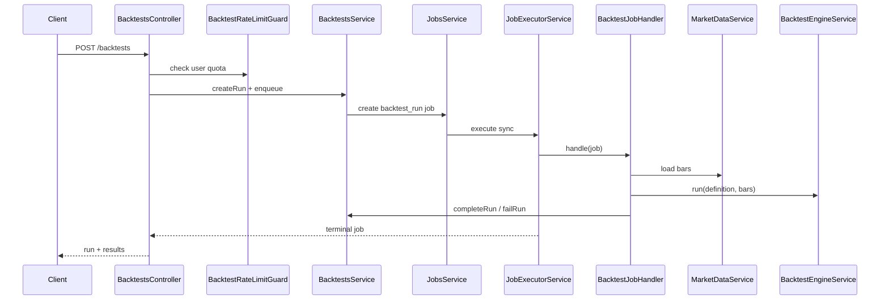

# Sprint 3.3 — Backtest Execution & Limits

**Status:** Plan ready (not started)  
**Roadmap marker:** Milestone 3 / Sprint 3.3  
**Branch:** `feat/sprint-3-3-backtest-execution-limits`  
**PR base:** `feat/sprint-3-2-backtest-persistence`

**Overview:** Expose authenticated HTTP APIs to run, list, and inspect backtests per [API_Inventory §5](../database/API_Inventory.md), executing synchronously through the existing jobs infrastructure (`backtest_run` job type + `JobExecutorService`). Enforce bar-count limits, wall-clock timeout, per-user rate limits, and structured diagnostics/logging. No new tables; verify the required predecessor index. After this sprint the API alone can demo Strategy → Backtest → Results (JSON).

---

## Sprint scope and exit criteria

**Stories**

| ID | Title | Source |
|----|-------|--------|
| #5.3.1 | Run backtest API | [MVP_05](../product/stories/BitStockerz_MVP_05_Backtesting_Stories.md) + [API_Inventory §5.1](../database/API_Inventory.md) |
| #5.3.2 | List backtest runs | same |
| #5.3.3 | Backtest details API | same |
| #5.5.1 | Bar count limits | same |
| #5.5.2 | Logging & diagnostics | same + [Observability](../product/requirements/Observability.md) |

**Exit:** Authenticated user can `POST /api/backtests`, receive completed run + metrics in one response (MVP sync), list their runs, and fetch full detail including trades + equity curve. Over-limit requests return RFC 7807 errors.

**Explicitly out of scope**

| Item | Why deferred |
|------|----------------|
| New persistence tables | Done in 3.2 |
| Angular charts/tables | Sprint 3.4 |
| BullMQ / async workers | Sync executor only |
| Multi-strategy / portfolio backtests | MVP single strategy + symbol |
| Admin cross-user listing | No RBAC |
| AI explain endpoints | Milestone 6 |
| Prometheus exporters | Sprint 1.4 decision stands |

---

## Prerequisites (what already shipped)

| Capability | Location | Relevance to 3.3 |
|------------|----------|------------------|
| Engine + limits primitives | Sprint 3.1 | Handler calls `BacktestEngineService` |
| Runs/results/trades/equity + pinning | Sprint 3.2 `BacktestsService` | Persist around execution |
| Jobs sync executor | `JobExecutorService`, `JobsService` | Create job, run inline, link `job_id` |
| Market data candle reads | `MarketDataService` | Load bars for symbol/timeframe/range |
| `AuthGuard` bearer session | `auth.guard.ts` | All backtest routes authenticated |
| Auth rate-limit guard pattern | `auth-rate-limit.guard.ts` | Clone for backtests ([Security.md](../product/requirements/Security.md)) |
| Metrics + audit | Sprint 1.4 | Record `backtest_*` metrics + audit events |
| Error catalog | `common/errors` | Map `BACKTEST_*` to RFC 7807 |
| Strategies CRUD | Milestone 2 | Resolve strategy ownership + definition |

**Schema:** No new tables. Verify the 3.2 migration already created `idx_backtests_user_created`; a missing index is a 3.2 defect, not optional 3.3 scope.

---

## Acceptance criteria (implementation contract)

### #5.3.1 – Run backtest API

- `POST /api/backtests` (AuthGuard) body:
  - `strategy_id` (uuid, required)
  - `symbol` (ticker string, required — resolved to `symbol_id`)
  - `timeframe` (`1d` \| `1h`, required; must be compatible with symbol asset type — JC-3)
  - `start_date`, `end_date` (ISO date/datetime, required, `start < end`)
  - `initial_equity?` (number, default `10000`, `> 0`)
  - `strategy_version_id?` (optional pin; default latest — 3.2 rules)
- The requested symbol asset type must match the strategy’s `asset_type`, and requested `timeframe` must equal the pinned strategy’s timeframe; mismatches return `400 VALIDATION_ERROR`.
- Date-only values are normalized in UTC (`start_date` to start-of-day, `end_date` to end-of-day); explicit timestamps retain their instant. The range is inclusive.
- Behavior:
  1. Validate DTO → resolve strategy (owned by user) → pin version → resolve symbol
  2. Create `backtest_runs` row `pending`
  3. Create job `job_type: backtest_run` with payload referencing `backtest_run_id`
  4. `JobExecutorService` runs handler **synchronously** before HTTP returns (same as market-data jobs) and supplies a cooperative abort/deadline context
  5. Handler: mark running, load bars, enforce bar limits, run engine, `completeRun` or `failRun`
  6. Response **200** with run metadata + result summary (not full equity curve — JC-4)
- Rate limited per user (see #5.5 / Security).
- Audit: `backtest.requested` + rely on existing `job.created` / `job.completed` / `job.failed`.
- Metrics: extend `MetricsService` with `backtest_duration_ms` / counts by terminal status (activates Sprint 1.4 stub).

### #5.3.2 – List backtest runs

- `GET /api/backtests` (AuthGuard)
- Query: `strategy_id?`, `symbol?` (ticker), `status?`, `limit?` (default 50, max 100)
- Also accepts `offset?` (default 0, min 0, max 10,000)
- Returns only current user’s runs, ordered `created_at DESC, id ASC`
- Response: `{ items, limit, offset, has_more }`, using a `limit + 1` query for `has_more`
- Item shape: id, strategy_id, strategy_name, strategy_version_id, symbol, timeframe, date range, status, initial_equity, created_at, finished_at, summary metrics if completed (`total_return_pct`, `max_drawdown_pct`, `num_trades`)
- Does not include trades or full equity curve

### #5.3.3 – Backtest details API

- `GET /api/backtests/:id` (AuthGuard)
- 404 `BACKTEST_NOT_FOUND` if missing or not owned
- Response includes:
  - `run` metadata (all run fields + resolved `symbol` string)
  - `results` (null if not completed)
  - `trades[]` ordered by `entry_time`
  - `equity_curve[]` as `{ timestamp, equity }`
- Trade pagination is always explicit: `trades_limit` default 500/max 1000 and `trades_offset` default 0/max 100,000. Response includes `trades_page: { limit, offset, has_more }`; order is `entry_time ASC, id ASC`.

### #5.5.1 – Bar count limits

- Before engine run, count loaded bars; if `bars.length > BACKTEST_MAX_BARS` → fail run with `BACKTEST_BAR_LIMIT_EXCEEDED` (HTTP **400** on POST).
- Also enforce the engine’s `BACKTEST_MAX_SERIES_CELLS`; map `BACKTEST_RESOURCE_LIMIT_EXCEEDED` to HTTP 400.
- Reject date ranges that necessarily exceed the limit before loading: hourly uses inclusive UTC hours; daily uses inclusive calendar days as a conservative upper bound. The pre-check may reject impossible-over-limit ranges but must never approve by itself; actual loaded bar count remains authoritative (JC-6).
- Defaults: `BACKTEST_MAX_BARS=10000` (≈1.1y hourly); daily 1y ≈ 252–365 ≪ limit.
- Config via `AppConfigService` only; document in `.env.example`.
- Unit tests for reject path; e2e boots with a tiny test-only max and proves the HTTP mapping.

### #5.5.2 – Logging & diagnostics

- Structured Pino logs on run start/end with fields: `backtestRunId`, `jobId`, `userId`, `strategyId`, `symbol`, `timeframe`, `bars`, `durationMs`, `status`, `requestId`.
- Persist bounded engine `diagnostics` into job `payload`; never place bars, definitions, trades, or equity points in job JSON.
- Do not log full equity curves or entire definition JSON at info level (debug only, truncated).
- Metrics snapshot includes backtest domain counters.
- Failed DTO/ownership/symbol/strategy-timeframe validation returns before creating a run. Execution failures after a valid run is created persist the terminal run and return the mapped RFC 7807 error (JC-6).

---

## API contract (canonical)

Global prefix `/api`. Snake_case JSON. Auth: `Authorization: Bearer <session>` on all routes.

### `POST /api/backtests` (#5.3.1)

**Request**

```json
{
  "strategy_id": "550e8400-e29b-41d4-a716-446655440000",
  "symbol": "AAPL",
  "timeframe": "1d",
  "start_date": "2025-01-01",
  "end_date": "2025-12-31",
  "initial_equity": 10000
}
```

**Response `200`:** `{ run, results }` where `run` includes ids, symbol, timeframe, dates, decimal-string `initial_equity`, `status`, `job_id`, timestamps, and `diagnostics: { bars_processed, duration_ms, indicators_computed, signals_fired }`; decimal-backed result fields are strings and `num_trades` is an integer. Full example: [API_Inventory §5](../database/API_Inventory.md) + e2e fixtures.

| Error | Code | HTTP |
|-------|------|------|
| Bad body | `VALIDATION_ERROR` | 400 |
| Strategy missing / not owned | `STRATEGY_NOT_FOUND` | 404 |
| Symbol unknown | `NOT_FOUND` | 404 |
| No bars in range | `BACKTEST_INSUFFICIENT_BARS` | 400 |
| Bar limit | `BACKTEST_BAR_LIMIT_EXCEEDED` | 400 |
| Series-cell/resource limit | `BACKTEST_RESOURCE_LIMIT_EXCEEDED` | 400 |
| Engine timeout | `BACKTEST_TIMEOUT` | 504 (JC-6) |
| Rate limited | `RATE_LIMITED` | 429 |
| Unauthorized | `UNAUTHORIZED` | 401 |

### `GET /api/backtests` (#5.3.2)

`{ items: BacktestListItem[], limit, offset, has_more }` — list item = run summary fields + `strategy_name` + optional `total_return_pct` / `max_drawdown_pct` / `num_trades` when completed. No trades/curve.

### `GET /api/backtests/:id` (#5.3.3)

`{ run, results, trades, trades_page, equity_curve: [{ timestamp, equity }] }` — `results` null if not completed; equity values are decimal strings; trade pagination is always applied as described above.

### Rate limit (planned Security.md)

| Env | Default |
|-----|---------|
| `BACKTEST_RATE_LIMIT_WINDOW_MS` | `60000` |
| `BACKTEST_RATE_LIMIT_MAX_REQUESTS` | `10` |

Apply to `POST /backtests` only (reads unlimited for MVP). Reuse sliding-window pattern from `AuthRateLimitGuard`.

### Job type addition

```ts
// jobs.types.ts
export type JobType =
  | 'equity_daily_import'
  | 'crypto_import'
  | 'market_data_scheduled'
  | 'backtest_run';
```

Payload minimum: `{ backtest_run_id, user_id, strategy_id, symbol, timeframe, start_date, end_date, duration_ms?, diagnostics?, error_code? }`. Payloads never contain bar arrays or definitions.

### Job timeout/cancellation hardening

The current executor’s `Promise.race`-style timer does not cancel a handler. Extend the handler contract in this sprint:

```ts
type JobExecutionContext = {
  signal: AbortSignal;
  deadlineAtMs: number; // monotonic clock domain
};

type JobHandler = (
  job: JobRecord,
  context: JobExecutionContext,
) => Promise<JobPayload>;
```

- `JobExecutorService` aborts the controller on timeout and passes the signal/deadline to handlers; existing handlers may ignore the second argument until migrated.
- The backtest handler checks abort after every awaited boundary, passes it to the engine, and checks once more immediately before `completeRun`.
- On a caught `DomainError`, the executor persists its stable code in bounded job payload metadata and a sanitized public message, then returns the terminal job.
- The controller inspects terminal status/code: completed → 200; known validation/limit/timeout failures → their documented RFC 7807 response; unexpected failure → `INTERNAL_ERROR` 500.
- A timed-out/failed handler must not later commit a completed run. Unit-test with a deferred market-data promise that resolves after abort.

---

## Architecture



### Module / file layout

| Path | Role |
|------|------|
| `apps/api/src/backtest/backtests.controller.ts` | POST/GET routes |
| `apps/api/src/backtest/dto/create-backtest.dto.ts` | class-validator DTO |
| `apps/api/src/backtest/dto/list-backtests-query.dto.ts` | query DTO |
| `apps/api/src/backtest/backtest-rate-limit.guard.ts` | per-user POST limit |
| `apps/api/src/backtest/backtest-job.handler.ts` | Registered job handler |
| `apps/api/src/backtest/backtests.service.ts` | Extend with HTTP orchestration |
| `apps/api/src/jobs/jobs.types.ts` | Add `backtest_run` |
| `apps/api/src/jobs/job-handlers.service.ts` | Register handler |
| `apps/api/src/observability/metrics.service.ts` | Backtest counters |
| `apps/api/src/observability/audit.service.ts` | `backtest.requested` |
| `apps/api/src/common/errors/*` | Ensure all `BACKTEST_*` mapped |
| `apps/api/test/app.e2e-spec.ts` | E2E happy path + 400/401/429 |

**Design principles**

1. **Controller thin** — validation + auth; service owns workflow.
2. **Jobs remain the execution boundary** — even though sync, status/audit/metrics stay consistent.
3. **Fail with DomainError** — never leak stack traces.
4. **Seed mode** — e2e runs without MySQL using seed candles + in-memory backtests store.

---

## Implementation plan (ordered)

### 1. AC + config + error catalog

1. Lock AC in MVP_05; update API_Inventory §5 status to Implemented (when done).
2. Config: `backtest.maxBars`, `backtest.timeoutMs`, rate-limit window/max.
3. Lock HTTP mapping for `BACKTEST_TIMEOUT` to 504 (JC-6).

### 2. Job handler (#5.3.1 core)

1. Add `backtest_run` to `JobType`.
2. Harden `JobExecutorService` with `JobExecutionContext`, abort propagation, stable error-code metadata, and late-completion protection.
3. Implement handler: load run → load strategy version definition → load bars from `MarketDataService` for range → enforce limits → engine → abort check → persist.
4. Unit test handler with mocked MD + engine, including abort while awaiting bars and timeout during synchronous engine work.

### 3. HTTP APIs (#5.3.1–5.3.3)

1. DTOs + `BacktestsController`.
2. Wire AuthGuard; rate-limit guard on POST.
3. List/detail serializers (snake_case).
4. E2E: register → create strategy (M2) → seed symbol bars → POST backtest → GET list → GET detail.

### 4. Limits + logging (#5.5.1–5.5.2)

1. Bar limit before engine; timeout via engine signal (3.1).
2. Pino fields + job payload diagnostics.
3. Metrics + audit hooks.
4. Manual testing section for backtest API.

### 5. Optional hardening (JC-1 follow-up)

- If sync runs block event loop in profiling, add `worker_threads` host behind config `BACKTEST_USE_WORKER_THREADS=false` default off.
- Still no BullMQ.

### 6. Gates

```bash
npm --prefix apps/api run build
npm --prefix apps/api run lint
npm --prefix apps/api run test
npm --prefix apps/api run test:cov
npm --prefix apps/api run test:e2e
./scripts/smoke-test-api.sh   # extend with backtest calls if script supports auth flow
```

| File | Update |
|------|--------|
| `docs/database/API_Inventory.md` | §5 request/response finalized |
| `docs/product/requirements/Security.md` | Mark backtest rate limit implemented |
| `docs/manual-testing/manual_testing.md` | Section for backtest API |
| `docs/product/ROADMAP.md` / stories | Status |
| `CHANGELOG.md`, branch map | |

---

## Best-practice checklist

- [ ] RFC 7807 via DomainError for all failure modes
- [ ] Auth on every backtest route
- [ ] Per-user POST rate limit ([Security.md](../product/requirements/Security.md))
- [ ] Sync job execution consistent with Sprint 1.3
- [ ] Config-only limits (no magic numbers in handler)
- [ ] Structured logs with `requestId` ([nestjs-pino](https://github.com/iamolegga/nestjs-pino))
- [ ] Metrics cardinality-safe (`backtest` domain, not per-symbol labels)
- [ ] E2E seed-mode path without MySQL
- [ ] Conventional Commits (`feat: add backtest run list and detail apis`)
- [ ] Coverage ≥ 90%; no casual ignore patterns

---

## Risks and mitigations

| Risk | Mitigation |
|------|------------|
| Sync backtest blocks API | Timeout + max bars; optional worker_threads (JC-1); keep NFR fixture fast |
| Hourly multi-year requests | Pre-check + `BACKTEST_MAX_BARS` |
| Strategy/candle mismatch (equity vs crypto timeframe) | Validate timeframe vs symbol asset_type (JC-3) |
| Large detail payloads | Soft cap / pagination on trades (JC-5) |
| Rate-limit false positives in e2e | Higher limits in test env / reset helper |
| Missing bars for symbol/range | Clear `BACKTEST_INSUFFICIENT_BARS` |

---

## Adopted defaults and override triggers

| # | Blocker | Why it blocks | Default if unanswered | Status |
|---|---------|---------------|----------------------|--------|
| 1 | worker_threads in 3.3? | Scope creep vs latency | Stay in-process; flag for later | Adopted |
| 2 | POST response includes equity? | Payload size | Summary only; detail has curve | Adopted |
| 3 | HTTP status for timeout | 400 vs 504 | **504** `BACKTEST_TIMEOUT` | Adopted |
| 4 | Default initial equity | Product UX | `10000` | Adopted |
| 5 | Rate limit 10/min | Security vs demo friction | 10 / 60s | Adopted |
| 6 | Create run row on DTO failure? | Orphan pending rows | No row until validation passes | Adopted |

---

## Judgement calls

### JC-1 — Keep in-process execution (reaffirm 3.1)

**Decision:** Execute engine inside the job handler on the API thread; do not add BullMQ. Add `worker_threads` only if profiling proves event-loop risk.  
**Why:** Consistent with Sprint 1.3 jobs; simpler ops for MVP. Soft sandbox only even with workers ([worker_threads](https://nodejs.org/docs/latest/api/worker_threads.html)).  
**Discuss before implement if:** Staging shows multi-second event-loop delays under concurrent POSTs.

### JC-2 — Synchronous HTTP = wait for job terminal state

**Decision:** `POST /backtests` returns only after job `completed|failed|timed_out`, matching inventory “Synchronously executes job (MVP)”.  
**Why:** Simplest client; UI can poll later if async is introduced.  
**Discuss before implement if:** Product wants immediate `202` + polling in MVP.

### JC-3 — Timeframe vs asset type

**Decision:** Equity symbols accept `1d` only; crypto accepts `1d` and `1h`. Mismatch → `VALIDATION_ERROR`.  
**Why:** Matches market-data series actually stored.  
**Discuss before implement if:** Equity intraday is added before Milestone 7.

### JC-4 — POST omits full equity curve

**Decision:** POST returns `run` + `results` only; clients use GET detail for trades/curve.  
**Why:** Keeps run latency/payload small; inventory allows summary on create.  
**Discuss before implement if:** Mobile client needs one-shot full payload.

### JC-5 — Trades pagination soft cap

**Decision:** Detail always applies `trades_limit` (default 500, max 1000) + `trades_offset` and returns `trades_page.has_more`. Equity curve remains full for MVP because the bar/resource limits cap its size.
**Why:** Avoid response-shape changes at an arbitrary trade count and prevent silent truncation.
**Discuss before implement if:** Downsampled equity endpoints are preferred now.

### JC-6 — Pre-check, no junk rows, 504 timeout, POST-only rate limit

**Decision:** (a) Reject obvious oversize date spans before MD load when `(end-start)/barDuration > maxBars`. (b) Persist run only after auth + DTO + strategy/symbol resolution. (c) Map `BACKTEST_TIMEOUT` → HTTP **504**. (d) Rate-limit **POST** only.  
**Why:** Fail fast, clean DB, distinct timeout semantics, matches Security.md “execution” limit.  
**Discuss before implement if:** Trading-day counting is preferred, attempts must be run-rows, proxies mishandle 504, or GET scraping needs limits.

---

## Suggested ticket breakdown

| Ticket | Estimate |
|--------|----------|
| Config + error mapping + job type | 0.5d |
| Backtest job handler + unit tests | 1.0d |
| POST/GET controllers + DTOs + rate limit | 1.25d |
| Logging/metrics/audit + diagnostics | 0.5d |
| E2E + manual testing + API inventory | 0.75d |

**Total:** ~4 engineering days.

---

## Definition of done

- [ ] Branched from Sprint 3.2
- [ ] #5.3.1–#5.3.3 and #5.5.1–#5.5.2 done per AC
- [ ] No new tables; the required Sprint 3.2 `idx_backtests_user_created` index is verified
- [ ] E2E covers POST success, list, detail, 401, bar-limit 400, rate-limit 429
- [ ] build / lint / test / test:cov (≥90%) / test:e2e pass
- [ ] Security.md + API_Inventory + manual testing updated
- [ ] PR opened against Sprint 3.2 base

---

## References

- NestJS controllers / validation pipes: https://docs.nestjs.com/controllers  
- NestJS guards: https://docs.nestjs.com/guards  
- Node `worker_threads`: https://nodejs.org/docs/latest/api/worker_threads.html  
- RFC 7807: https://www.rfc-editor.org/rfc/rfc7807  
- API inventory §5: [docs/database/API_Inventory.md](../database/API_Inventory.md)  
- Security (backtest rate limit planned): [docs/product/requirements/Security.md](../product/requirements/Security.md)  
- NFR &lt; 2s: [Non_Functional_Requirements.md](../product/requirements/Non_Functional_Requirements.md)  
- Prior plans: [sprint-3-1](./sprint-3-1-backtest-engine-core.md), [sprint-3-2](./sprint-3-2-backtest-persistence.md)  
- Delivery workflow: `.cursor/skills/sprint-delivery/SKILL.md`
