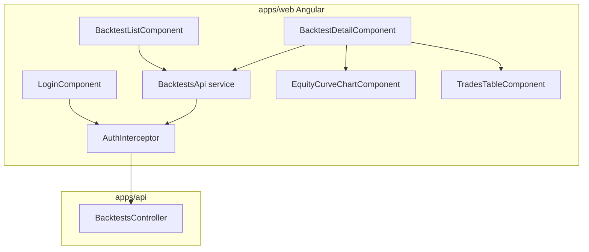

# Sprint 3.4 — Backtest UI

**Status:** Implemented and locally verified July 28, 2026; unmerged in draft PR #9
**Roadmap marker:** Milestone 3 / Sprint 3.4 (ROADMAP exit: Strategy → Backtest → Results fully demoable)  
**Branch:** `feat/sprint-2-1-strategy-persistence-versioning` (combined PR #9)
**PR base:** `main`

**Overview:** Deliver the backtest results visualization surface — equity curve chart and trades table — against the Sprint 3.3 APIs. This sprint pulls forward the minimal Angular application shell needed for the feature; Sprint 5.1 extends that same app. The checked-in API fixture supports offline UI work but is not a substitute for shipping #5.4.1/#5.4.2.

---

## Sprint scope and exit criteria

**Stories**

| ID | Title | Source |
|----|-------|--------|
| #5.4.1 | Equity curve chart | [MVP_05](../product/stories/BitStockerz_MVP_05_Backtesting_Stories.md) + [UX_Flows](../product/UX_Flows.md) |
| #5.4.2 | Trades table | same |

**Exit (from [ROADMAP.md](../product/ROADMAP.md)):** Strategy → Backtest → Results is demoable in the Angular app, consuming `GET /api/backtests/:id`.

**Explicitly out of scope**

| Item | Why deferred |
|------|----------------|
| Full dashboard widgets (#7.x) | Milestone 5 |
| Strategy builder UI polish | Milestone 2/5 boundaries |
| AI explain-backtest panel | Sprint 6.3 |
| Chart entry/exit markers v2 beyond MVP | Nice-to-have; markers optional if cheap (JC-4) |
| React / Chart.js | Angular + TradingView Lightweight Charts only |
| Schema / API changes | No migrations; use 3.3 contracts |
| Paper trading screens | Milestone 4 |

---

## Prerequisites (what already shipped)

| Capability | Location | Relevance to 3.4 |
|------------|----------|------------------|
| `GET /api/backtests/:id` with `equity_curve` + `trades` | Sprint 3.3 | Sole data source for UI |
| `POST /api/backtests` + list | Sprint 3.3 | Run + navigate to detail |
| Auth session bearer | API AuthGuard | Web must attach token |
| Strategy CRUD APIs | Milestone 2 | Pre-filled run form needs `strategy_id` |
| Market data symbols | Sprint 1.x | Symbol picker / validation |
| UX flow “Strategy → Backtest” | [UX_Flows.md](../product/UX_Flows.md) | Navigation expectations |
| Angular target | ROADMAP Milestone 5 note | Frontend is Angular, not React |

**Schema:** No changes ([Migrations_Plan — Sprint 3.4](../database/Migrations_Plan.md)).

**Required prerequisite slice (JC-1):** Minimal `apps/web` Angular scaffold (routing, API base URL, auth interceptor, layout shell) extracted from Sprint 5.1 — see [sprint-5-1-shell-navigation.md](./sprint-5-1-shell-navigation.md). Sprint 3.4 creates it if missing; Sprint 5.1 extends it.

---

## Acceptance criteria (implementation contract)

### Prerequisite slice – Minimal Angular shell (from 5.1)

Ship **only** what charts need (do not implement full Milestone 5 dashboard):

- `apps/web` Angular app (current stable Angular via `ng new` / workspace convention matching monorepo — JC-2).
- Environments: `apiBaseUrl` → `http://localhost:4000/api`.
- Auth: store the bearer in `sessionStorage` key `bs.access_token`, attach it with an `Authorization` interceptor, and provide a demo login route using existing API dev register/login. Sprint 5.1 extends this exact storage contract.
- Router outlets: `/login`, `/backtests`, `/backtests/new`, `/backtests/:id`, plus a labelled `/strategies` placeholder owned by Sprint 5.3.
- Shared `ApiClient` / `BacktestsApi` service returning typed snake_case models.
- README: npm start command for web on port 4200 + local proxy and production CORS notes (JC-3).

### #5.4.1 – Equity curve chart

- Detail page loads `GET /api/backtests/:id` and renders `equity_curve` as a time-series chart using **TradingView Lightweight Charts** ([library](https://www.tradingview.com/lightweight-charts/)).
- Chart shows equity vs time; empty/failed run states show an inline message (no chart crash).
- Loading and error (404/401) states are handled.
- Responsive: readable on desktop and mobile width (chart container `width: 100%`, resize handler).
- Summary metrics row above chart: total return, max drawdown, win rate, trade count, optional Sharpe (from `results`).
- Unit/component test: component maps API points → chart series data (pure mapper tested without canvas where possible).

### #5.4.2 – Trades table

- Below the chart, a table of `trades[]` columns: entry time, exit time, side, entry price, exit price, quantity, pnl abs, pnl %.
- Sort default: `entry_time` ascending (API order).
- PnL styling: distinct positive/negative classes (no emoji).
- Empty trades → “No trades” message.
- Table requests `trades_limit=500&trades_offset=0`; when `trades_page.has_more`, “Load more” requests the next page and appends it without duplicates (JC-5).
- Accessibility: real `<table>` (or Angular CDK table) with column headers.

### Cross-cutting demo path

- From a backtest list page (minimal): show recent runs → navigate to detail.
- Required thin “Run backtest” form: strategy id, symbol, timeframe, dates, initial equity → POST → navigate to detail (unblocks ROADMAP exit without waiting for full Strategy Lab UI).
- Manual testing script documents the click-path.

### API-ready fixtures (always ship)

Add `docs/manual-testing/fixtures/backtest-detail.example.json`, a frozen example of `GET /backtests/:id` for offline UI work and contract tests. A test validates the fixture against the client mapper so it cannot silently drift.

---

## API contract (canonical)

**No new HTTP routes.** Consume Sprint 3.3:

| Method | Path | UI usage |
|--------|------|----------|
| `POST` | `/api/backtests` | Required run form |
| `GET` | `/api/backtests` | List page |
| `GET` | `/api/backtests/:id` | Detail chart + table |

Contract stability requirements for UI:

- `equity_curve[].timestamp` ISO-8601 UTC; `equity` decimal string
- `trades[]` field names snake_case as inventory
- all decimal-backed prices, quantities, P&L, and metrics arrive as strings; client mappers parse finite display/chart numbers at the boundary and retain the raw string where precision matters
- `results` null when `status !== completed`

If any rename is required, fix in 3.3 follow-up **before** UI merge — do not fork field names in the client.

OpenAPI was not a Sprint 3.4 blocker (JC-6). A later cross-cutting PR #9
follow-up added generated OpenAPI JSON/YAML and Swagger UI after the UI contract
was implemented. The generated document is now the machine-readable contract
for shipped routes; the inventory retains design rationale and planned routes,
and the checked-in example remains a client-mapper fixture.

---

## Architecture



### Module / file layout (recommended)

| Path | Role |
|------|------|
| `apps/web/` | Angular workspace app (scaffold) |
| `apps/web/src/app/core/api-base.config.ts` | API base URL |
| `apps/web/src/app/core/auth/` | Token storage + interceptor + login |
| `apps/web/src/app/features/backtests/backtests.routes.ts` | Feature routes |
| `apps/web/src/app/features/backtests/backtests-api.service.ts` | HTTP client |
| `apps/web/src/app/features/backtests/pages/backtest-list.page.ts` | List |
| `apps/web/src/app/features/backtests/pages/backtest-detail.page.ts` | Detail shell + metrics |
| `apps/web/src/app/features/backtests/components/equity-curve-chart.component.ts` | Lightweight Charts wrapper |
| `apps/web/src/app/features/backtests/components/trades-table.component.ts` | Table |
| `apps/web/src/app/features/backtests/models/backtest.models.ts` | TS interfaces matching API |
| `docs/manual-testing/fixtures/backtest-detail.example.json` | Frozen contract |
| `apps/api` CORS config | Allow web origin in dev (if not already) |

**Design principles**

1. **Feature module isolation** — backtests UI does not require full dashboard widgets.
2. **Presentational chart/table** — inputs are plain arrays; page owns fetching.
3. **Finance-native chart** — Lightweight Charts over Chart.js/generic charts.
4. **No cards-for-decoration** — follow existing product simplicity; one detail composition.

---

## Implementation plan (ordered)

### 1. Contract verification (day 0)

1. Confirm the Sprint 3.3 detail fixture includes decimal strings, `trades_page`, full equity curve, and terminal/empty states.
2. Create or extend the Angular scaffold in this branch before feature components. Do not open a separate optional decision track.

### 2. Scaffold `apps/web` (prerequisite)

1. Generate Angular app under `apps/web` using npm and commit its exact Angular/tooling versions and lockfile.
2. Add proxy or CORS for `localhost:4000`.
3. Auth login uses existing dev `POST /api/auth/login`; WebAuthn UI is outside this prerequisite slice (JC-7).
4. Smoke: logged-in call to `GET /api/health/live`.

### 3. Backtests API client + fixtures

1. Type models from 3.3 response.
2. Commit example JSON fixture.
3. List + detail services with error mapping.

### 4. Equity curve (#5.4.1)

1. Add dependency `lightweight-charts`.
2. Wrapper component: create chart on init, map daily timestamps to `BusinessDay` and intraday timestamps to UTC seconds, reject invalid/non-finite points, set data, and remove chart/resize observers on destroy.
3. Metrics summary header.
4. Handle failed runs (`results === null`).

### 5. Trades table (#5.4.2)

1. Table component with formatting (dates locale-aware, numbers fixed decimals).
2. Wire into detail page below chart.
3. Load-more using the required `trades_page.has_more` pagination metadata.

### 6. Minimal list + run form (demo glue)

1. List recent backtests.
2. Simple reactive form on `/backtests/new` (accepts optional `strategy_id` query param) → POST → navigate to `:id`.
3. Manual testing section with screenshots optional.

### 7. Quality gates

```bash
# API still green
npm --prefix apps/api run test:cov

# Web
npm --prefix apps/web run build
npm --prefix apps/web run test -- --watch=false
npm --prefix apps/web run lint
```

| File | Update |
|------|--------|
| `docs/product/ROADMAP.md` | Mark 3.4; record that the thin shell was pulled forward from 5.1 |
| `docs/product/stories/BitStockerz_MVP_05_*.md` | AC + completion |
| `docs/product/UX_Flows.md` | Confirm demo path |
| `docs/manual-testing/manual_testing.md` | UI section |
| Root `README.md` | How to run API + web |
| Sprint 5.1 plan/stories later | Deduplicate shell work already done |
| `CHANGELOG.md`, branch map | |

---

## Best-practice checklist

- [x] Soft-dep on minimal Angular shell decided and documented (JC-1)
- [x] TradingView Lightweight Charts for equity ([docs](https://www.tradingview.com/lightweight-charts/))
- [x] No Chart.js / no React
- [x] Auth token on all backtest API calls
- [x] Pure mappers unit-tested (timestamp → chart time)
- [x] Failed/empty states without console errors
- [x] CORS/proxy documented for local demo
- [x] Contract fixture checked in
- [x] Conventional Commit included in combined PR #9
- [x] ROADMAP 5.1 shell stories adjusted to avoid double scaffold

---

## Risks and mitigations

| Risk | Mitigation |
|------|------------|
| ROADMAP orders UI before Angular scaffold | JC-1 makes the pull-forward scaffold a required predecessor task |
| CORS blocks browser calls | Dev CORS allowlist or Angular proxy.conf |
| Lightweight Charts time scale vs ISO strings | Normalize to UTCSeconds / `YYYY-MM-DD` for daily |
| Large equity arrays stall UI | Already capped by bar limits; virtualize table if needed |
| Auth story incomplete for web | Dev login shortcut for Milestone 3 demo |
| Duplicating 5.1 work | Track shell completion; 5.1 starts from existing `apps/web` |

---

## Adopted defaults and override triggers

| # | Blocker | Why it blocks | Default if unanswered | Status |
|---|---------|---------------|----------------------|--------|
| 1 | Pull Angular shell into 3.4? | `apps/web` is required for the UI stories | **Yes** — minimal shell prerequisite | Adopted |
| 2 | Package manager for web | Repository currently uses npm lockfiles | npm with `apps/web/package-lock.json` | Adopted |
| 3 | CORS vs proxy | Local DX | Angular `proxy.conf.json` to `:4000`; production uses explicit CORS | Adopted |
| 4 | Entry/exit markers on chart | Scope | Optional if &lt; 0.5d; otherwise skip | Optional, non-blocking |
| 5 | Dev login vs WebAuthn-only | Demo friction | Dev email/password login for UI sprint | Adopted |
| 6 | OpenAPI generation | Extra deps | Example JSON + inventory only | Adopted |

---

## Judgement calls

### JC-1 — Angular scaffold ownership (REQUIRED)

**Decision:** Sprint 3.4 **pulls forward** a minimal `apps/web` scaffold (prerequisite slice of Sprint 5.1) so #5.4.1/#5.4.2 can ship real UI. Sprint 5.1 then extends shell/nav/dashboard rather than greenfield scaffolding.  
**Why:** ROADMAP Milestone 3 exit requires a demoable Strategy → Backtest → Results path; waiting until 5.1 breaks that exit.  
**Override trigger:** Only an explicit roadmap/release-scope change that moves #5.4.x out of Milestone 3; absent that approved change, implement the scaffold here.

### JC-2 — Angular standalone + modern defaults

**Decision:** Scaffold with current Angular standalone components / application builder; no NgModules unless team standard says otherwise.  
**Why:** Matches modern Angular defaults; less boilerplate for a thin feature.  
**Discuss before implement if:** Existing internal template mandates NgModule structure.

### JC-3 — Dev proxy over API CORS expansion

**Decision:** Prefer `apps/web/proxy.conf.json` forwarding `/api` → `http://localhost:4000`; only add Nest CORS if proxy is insufficient for e2e tooling.  
**Why:** Avoid widening API CORS in production accidentally.  
**Discuss before implement if:** Preview deployments need cross-origin API early.

### JC-4 — Chart library = Lightweight Charts; markers optional

**Decision:** Use TradingView Lightweight Charts for the equity series. Entry/exit markers are **optional** stretch if trade times map cleanly; not required for DoD.  
**Why:** Finance-native performance/UX; markers are polish.  
**Discuss before implement if:** Design requires candles+overlays in MVP (out of scope — equity only).

### JC-5 — Honor 3.3 trade pagination

**Decision:** Implement “Load more” exclusively from Sprint 3.3’s canonical `trades_page.has_more`; advance `trades_offset` by the number of items already loaded and de-duplicate by trade id.
**Why:** Prevents silent truncation.  
**Discuss before implement if:** Product guarantees trades always &lt; 1000 for MVP demos.

### JC-6 — Swagger was not a Sprint 3.4 requirement

**Decision:** Do not block 3.4 on `@nestjs/swagger`; use inventory + checked-in fixture JSON.  
**Why:** Inventory is already canonical; Swagger is orthogonal.  
**Discuss before implement if:** Client generation is mandated org-wide.

**Post-sprint implementation note:** Generated OpenAPI 3.0 JSON/YAML and an
interactive Swagger UI subsequently shipped as an orthogonal PR #9 follow-up.
This does not change the original sequencing decision or Sprint 3.4 scope.

### JC-7 — Dev login for Milestone 3 demo

**Decision:** Web login page calls existing dev `POST /api/auth/login` (or register+login). WebAuthn-only UX can wait for Milestone 5 polish.  
**Why:** Unblocks demo without passkey hardware in every environment.  
**Discuss before implement if:** Dev auth endpoints are disabled in the target demo env.

### JC-8 — Scope of “run form”

**Decision:** Include a **minimal** run form on `/backtests` (ids + dates) sufficient for demo; do not build full Strategy Lab UI.  
**Why:** ROADMAP exit needs an operable path without Milestone 5 strategy screens.  
**Discuss before implement if:** Strategy Lab UI already provides “Run backtest” navigation by then — then skip duplicate form.

---

## Suggested ticket breakdown

| Ticket | Estimate |
|--------|----------|
| Scaffold ownership + ROADMAP sync | 0.1d |
| Angular shell scaffold + auth + proxy | 1.0–1.5d |
| Backtests API client + fixture JSON | 0.5d |
| Equity curve component + metrics | 1.0d |
| Trades table + pagination UX | 0.75d |
| List + minimal run form + manual docs | 0.75d |

**Total:** ~4–5 engineering days (shell-heavy); ~2 days if shell already exists.

---

## Definition of done

- [x] Minimal Angular shell exists in `apps/web` and is documented as owned by 3.4
- [x] #5.4.1 and #5.4.2 implemented per AC
- [x] No DB migrations
- [x] Demo path: login → run/list → detail with chart + table
- [x] `apps/web` build/lint/unit gates pass; API tests remain green
- [x] Desktop and 390px mobile browser flows pass without console errors
- [x] Manual testing section + fixture JSON committed
- [x] Sprint 5.1 shell work de-duplicated in docs
- [x] Added to combined draft PR #9 against `main`

**Implementation record:** The scaffold pins Angular CLI/build 21.2.19 and
Angular 21.2.x. Angular 22.0.8 was evaluated but requires Node 24.15 or newer,
while this repository intentionally pins Node 24.11.1; Angular 21 is therefore
the newest compatible supported line for this PR. Lightweight Charts 5.2 is
used through its current `addSeries(LineSeries, …)` API. The trades table's
minimum-width rules are scoped beneath `.table-wrap` so they cannot resize the
chart library's internal layout table; this was reverified at 390 × 844 on
August 1, 2026.

---

## References

- TradingView Lightweight Charts: https://www.tradingview.com/lightweight-charts/  
- Lightweight Charts docs / npm: https://tradingview.github.io/lightweight-charts/  
- Angular HTTP client: https://angular.dev/guide/http  
- Angular router: https://angular.dev/guide/routing  
- API inventory §5: [docs/database/API_Inventory.md](../database/API_Inventory.md)  
- UX flows: [docs/product/UX_Flows.md](../product/UX_Flows.md)  
- ROADMAP Milestone 5 shell note: [docs/product/ROADMAP.md](../product/ROADMAP.md)  
- Prior plans: [sprint-3-3-backtest-execution-limits.md](./sprint-3-3-backtest-execution-limits.md)  
- Delivery workflow: `.cursor/skills/sprint-delivery/SKILL.md`
