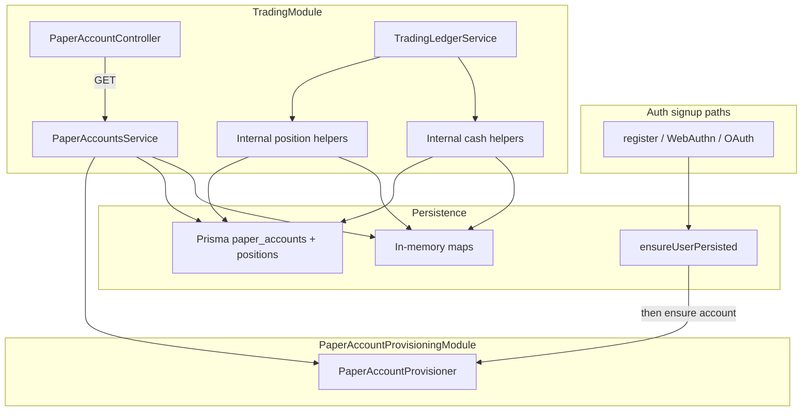

# Sprint 4.1 — Accounts & Positions

**Status:** Completed (verified August 2, 2026)
**Roadmap marker:** Milestone 4 – Paper Trading (first sprint); depends on Milestone 3 exit  
**Branch:** `codex/sprint-4-paper-trading` (combined Milestone 4 delivery)
**PR base:** `main`

**Overview:** Persist a single paper trading account per user ($100,000 USD default), create it on every signup path, expose `GET /paper-account`, and ship positions + cash-balance domain logic (called by order fills in 4.2). Seed mode gets in-memory mirrors so e2e/smoke work without MySQL.

---

## Sprint scope and exit criteria

**Stories**

| ID | Title | Source |
|----|-------|--------|
| #1.3.1 | Default paper account on first signup | [MVP_01](../product/stories/BitStockerz_MVP_01_User_Account_Stories.md) |
| #3.1.1 | Paper trading account | [MVP_03](../product/stories/BitStockerz_MVP_03_Paper_Trading_Stories.md) |
| #3.3.2 | Positions table & logic | same |
| #3.3.3 | Cash balance updates | same |

**Exit:** Every authenticated user has exactly one active paper account with $100k starting cash; positions/cash helpers are unit-tested and ready for market fills. No order placement yet.

**Explicitly out of scope**

| Item | Why deferred |
|------|----------------|
| `POST /trading/orders`, executions | Sprint 4.2 |
| Positions / portfolio / order history GET APIs | Sprint 4.3 (service helpers may exist) |
| Reset / soft-delete paper account UX | Deferred per MVP_01 note (JC-5) |
| Short selling / margin | Long-only MVP (JC-6) |
| Configurable starting balance per user | MVP.md lists “configurable”; ship fixed $100k (JC-7) |
| Angular UI | Milestone 5 |
| Live vendor fills / partial fills / limit orders | Out of MVP paper engine |

---

## Prerequisites

| Capability | Location | Relevance |
|------------|----------|-----------|
| Auth register / WebAuthn / OAuth / login | `auth.service.ts`, `auth.controller.ts` | Hook paper-account bootstrap after successful user creation |
| `AuthService.ensureUserPersisted` | `auth.service.ts` | MySQL FK for `paper_accounts.user_id` (same pattern as jobs/audit) |
| `AuthGuard` bearer sessions | `auth.guard.ts` | Guard `GET /paper-account` |
| Prisma optional (`prisma.isEnabled`) | `prisma.service.ts` | DB vs seed-mode dual path |
| Symbols + candles | `market-data` module | Mark-to-market helpers may resolve latest close; fills use this in 4.2 |
| Migration naming | `apps/api/prisma/migrations/YYYYMMDDHHMMSS_sprint_*` | Two migrations from [Migrations_Plan](../database/Migrations_Plan.md) §4.1 |
| DDL source of truth | [DDL/02_trading.sql](../database/DDL/02_trading.sql) | `paper_accounts`, `positions` |
| Coverage gate | `apps/api/package.json` → **90%** | Prefer tests over ignore patterns |
| Conceptual Prisma models | `docs/database/schema.prisma` | Copy into `apps/api/prisma/schema.prisma` (not present yet) |

---

## Acceptance criteria (implementation contract)

These criteria are binding for this sprint. Sync them into MVP_01 and MVP_03 in the implementation PR before merge.

### #1.3.1 – Default paper account on first signup

- On **first successful signup** for a new user, create exactly one paper account:
  - Paths: `register` (dev), WebAuthn register verify, Google OAuth callback, Apple OAuth callback (any path that creates a new `usersById` record).
- Defaults: `name = "Paper Account"`, `base_currency = "USD"`, `starting_balance = 100000.00`, `cash_balance = 100000.00`, `is_active = true`.
- Balances are `DECIMAL(18,2)` (Prisma `Decimal` / string serialization) — **never** JS float arithmetic for money.
- Idempotent: second call for same user does **not** create a second account (`uq_paper_account_user`).
- When Prisma enabled: call `ensureUserPersisted(userId)` then insert `paper_accounts` in the same request (sync, awaited — JC-4).
- When Prisma disabled: store account in an in-memory map keyed by `userId`.
- Login / re-register after API restart with same email: after `ensureUserPersisted` remaps MySQL user id, paper account remains attached (remap must update `paper_accounts.user_id` or account is re-associated — extend remap helper).
- Unit tests cover each signup path (mock) + duplicate prevention + seed mode.

### #3.1.1 – Paper trading account

- Prisma model + migration `*_sprint_4_1_paper_accounts` matching DDL (`paper_accounts`).
- `GET /api/paper-account` (AuthGuard): returns the caller’s account.
- Missing account for an authenticated user auto-creates defaults (lazy heal for users created before this sprint; JC-8).
- Response snake_case JSON (see API contract).
- Seed mode returns in-memory account with same shape; `id` may be a synthetic integer sequence.

### #3.3.2 – Positions table & logic

- Prisma model + migration `*_sprint_4_1_positions` matching DDL (`positions`).
- Domain service methods (no public fill API yet):
- `applyBuy(accountId, symbolId, qty, price)` → increase qty; weighted `avg_cost`.
- `applySell(accountId, symbolId, qty, price)` → decrease qty; reject if qty > position (long-only).
  - Zero quantity → delete row so 4.3 “non-zero positions” is natural (JC-9).
- Unique `(paper_account_id, symbol_id)`.
- Unit tests: open, add, reduce, close, insufficient quantity, decimal qty (prep for JC-3 in 4.2).
- Weighted average cost rounds once to 8 decimal places with `ROUND_HALF_UP`; partial sells leave `avg_cost` unchanged.

### #3.3.3 – Cash balance updates

- `debitCash(accountId, amount)` / `creditCash(accountId, amount)` with Prisma `Decimal` math.
- BUY/SELL cash notional = `qty * price` rounded once to 2 decimal places with `ROUND_HALF_UP`; never round operands first.
- Reject debit when `cash_balance < amount` with `DomainError(ErrorCode.TRADING_INSUFFICIENT_CASH)`; Sprint 4.3 extends exhaustive catalog tests but does not rename it.
- Never allow negative cash.
- Unit tests: exact boundary (cash == notional), overspend, credit after sell.
- Add a transaction-scoped `TradingLedgerService.applyFill(...)` that applies cash + position to a caller-supplied Prisma transaction client (or in-memory copy-on-write draft). This is the only method Sprint 4.2 may use; lower-level cash/position mutations remain internal so a caller cannot update one without the other.
- Add canonical `TRADING_INSUFFICIENT_CASH`, `TRADING_INSUFFICIENT_POSITION`, and `TRADING_ACCOUNT_INACTIVE` codes now; Sprint 4.3 completed catalog coverage without renaming them.

---

## API contract

Global prefix `/api`. Snake_case JSON. Auth: `Authorization: Bearer <session>`.

### `GET /api/paper-account` (#1.3.1 / #3.1.1)

| Concern | Decision |
|---------|----------|
| Auth | **Required** (`AuthGuard`) |
| Side effects | Lazy-create if missing (JC-8) |

**Response `200`:**

```json
{
  "id": 1,
  "base_currency": "USD",
  "starting_balance": "100000.00",
  "cash_balance": "100000.00",
  "created_at": "2026-07-25T15:00:00.000Z"
}
```

| Field | Notes |
|-------|--------|
| `starting_balance` / `cash_balance` | Strings with exactly 2 decimal places; update any inventory example that still shows JSON numbers (JC-10). |
| `name` / `is_active` | Omitted from public response for MVP (internal columns remain). |

**Errors**

| Status | Code | When |
|--------|------|------|
| 401 | `UNAUTHORIZED` | Missing/invalid session |

### Seed mode behavior

| Mode | Behavior |
|------|----------|
| No `DATABASE_URL` | In-memory `Map<userId, PaperAccount>` + `Map` of positions; same API shape |
| With MySQL | Prisma persist; signup/remap keeps one account per user |
| E2E (`setup-e2e.ts`) | Always seed mode — assert register → `GET /paper-account` → $100k |

No public positions/cash mutation endpoints in this sprint.

---

## Architecture



**Concrete files (create/touch)**

| Path | Action |
|------|--------|
| `apps/api/prisma/schema.prisma` | Add `PaperAccount`, `Position`; User relation |
| `apps/api/prisma/migrations/*_sprint_4_1_paper_accounts/` | `paper_accounts` |
| `apps/api/prisma/migrations/*_sprint_4_1_positions/` | `positions` |
| `apps/api/src/trading/trading.module.ts` | New module |
| `apps/api/src/trading/paper-account-provisioning.module.ts` | Imports Prisma only; exports cycle-free provisioner to Auth and Trading |
| `apps/api/src/trading/paper-account-provisioner.service.ts` | Idempotent create/get by user id; no Auth dependency |
| `apps/api/src/trading/paper-accounts.service.ts` | Create/get/lazy-heal account reads |
| `apps/api/src/trading/paper-accounts.controller.ts` | `GET paper-account` |
| `apps/api/src/trading/positions.service.ts` | Internal transaction-scoped applyBuy/applySell primitives |
| `apps/api/src/trading/trading-ledger.service.ts` | Public atomic `applyFill` boundary used by Sprint 4.2 |
| `apps/api/src/trading/*.spec.ts` | Unit tests |
| `apps/api/src/auth/auth.service.ts` | Call `ensurePaperAccount` on new-user paths; extend remap for `paper_accounts.user_id` |
| `apps/api/src/auth/auth.module.ts` | Import `PaperAccountProvisioningModule`; do not import `TradingModule` |
| `apps/api/src/app.module.ts` | Import `TradingModule` |
| `apps/api/test/app.e2e-spec.ts` | Register → GET paper-account |
| `scripts/smoke-test-api.sh` | Optional authenticated paper-account check |

Avoid circular DI by construction: `PaperAccountProvisioningModule` imports only Prisma/config and is imported by both Auth and Trading. Auth calls `ensureUserPersisted` first, then the provisioner. Trading may import Auth for `AuthGuard`, but the provisioning module never imports Auth and Auth never imports the full Trading module. Do not use `forwardRef` for this new dependency.

---

## Implementation plan (ordered)

### 1. AC + schema

1. Add AC bullets to MVP_01 (#1.3.1) and MVP_03 (#3.1.1, #3.3.2, #3.3.3).
2. Add Prisma models from DDL / `docs/database/schema.prisma`.
3. Generate migrations (two folders per Migrations_Plan: paper_accounts then positions).
4. Wire Prisma client accessors if the codebase uses explicit getters on `PrismaService`.

### 2. PaperAccountsService (#3.1.1 / #1.3.1)

1. `PaperAccountProvisioner.ensureForUser(userId)` — idempotent create with $100k defaults; caller guarantees the user FK exists.
2. `PaperAccountsService.getForUser(userId)` delegates missing-account healing to the provisioner and is used by controller.
3. Seed-mode store + integer id sequence.
4. Unit tests with Prisma mock + seed path.

### 3. Auth hooks (#1.3.1)

1. After every **new** user creation, `await paperAccounts.ensureForUser(user.id)`.
2. Extend `remapPersistedUserIdentity` to update `paper_accounts.user_id` (and later orders/executions/positions in 4.2 — for 4.1 only paper + positions).
3. Auth unit tests: register creates account; duplicate signup paths don’t double-create.

### 4. Positions + cash (#3.3.2 / #3.3.3)

1. Implement DECIMAL-safe helpers with Prisma `Decimal`; do not add a second decimal library unless Prisma Decimal proves insufficient.
2. Implement transaction-scoped cash/position primitives plus `TradingLedgerService.applyFill`; standalone calls open a transaction, while Sprint 4.2 can pass its existing transaction context.
3. Export methods for 4.2 order executor; no HTTP yet.
4. Heavy unit coverage (avg cost math, close-out, insufficient cash/qty).

### 5. HTTP + e2e

1. `PaperAccountsController` + AuthGuard.
2. E2E: register → GET `/api/paper-account` → balances.
3. Smoke script line for paper-account when bearer available.

### 6. Docs sync

| File | Update |
|------|--------|
| `docs/product/ROADMAP.md` | Mark 4.1 in progress / complete when done |
| `docs/product/stories/BitStockerz_MVP_01_*.md` | AC + status for #1.3.1 |
| `docs/product/stories/BitStockerz_MVP_03_*.md` | AC for #3.1.1, #3.3.2, #3.3.3 |
| `docs/database/API_Inventory.md` | Mark `GET /paper-account` implemented |
| `docs/database/Migrations_Plan.md` | Prisma folder names for V0400/V0401 |
| `docs/manual-testing/manual_testing.md` | Section: paper account bootstrap |
| `CHANGELOG.md`, `README.md` | Brief scope note |
| `.cursor/skills/sprint-delivery/reference.md` | Branch map row |

### 7. Gates

```bash
npm --prefix apps/api run build
npm --prefix apps/api run lint
npm --prefix apps/api run test
npm --prefix apps/api run test:cov
npm --prefix apps/api run test:e2e
./scripts/sprint-delivery-verify.sh verify
KEEP_DATABASE_URL=1 ./scripts/sprint-delivery-verify.sh verify
```

---

## Best-practice checklist

- [x] DECIMAL money math only — no `number` accumulation for cash/avg_cost ([Prisma Decimal](https://www.prisma.io/docs/orm/prisma-client/special-fields-and-types/working-with-decimal))
- [x] `ensureUserPersisted` before MySQL FK insert (jobs/audit pattern)
- [x] Idempotent account create (`UNIQUE user_id`)
- [x] Remap path keeps paper account across in-memory auth restart
- [x] Seed vs DB response parity for `GET /paper-account`
- [x] RFC 7807 via `DomainError` + `ErrorCode` ([error filter](../../apps/api/src/common/errors/http-exception.filter.ts))
- [x] AuthGuard on paper-account ([NestJS guards](https://docs.nestjs.com/guards))
- [x] Transactions for multi-row cash+position updates
- [x] Coverage ≥90%; no new ignore patterns without explicit review
- [x] Conventional Commits; combined Milestone 4 PR onto `main`

---

## Risks and mitigations

| Risk | Mitigation |
|------|------------|
| Auth ↔ Trading circular dependency | Use the cycle-free `PaperAccountProvisioningModule` described above; do not add `forwardRef` |
| Remap drops paper account | Extend `remapPersistedUserIdentity` in same PR as hooks |
| Float money bugs | String/Decimal serialization in API; unit tests on cents |
| Users created before sprint have no account | Lazy-create on GET (JC-8) |
| Positions logic unused until 4.2 | Still ship + unit test; 4.2 only wires executor |
| Two migrations ordering | paper_accounts before positions (FK) |

---

## Adopted defaults and external prerequisites

| # | Blocker | Why | Default | Status |
|---|---------|-----|---------|--------|
| 1 | PR base after Milestone 3 | Stack target resolved | Combined Milestone 4 branch from merged `main` | Resolved |
| 2 | Balance JSON as string vs number | Clients / inventory ambiguity | Strings with 2dp | Adopted |
| 3 | Lazy-create on GET vs 404 | Pre-sprint users | Lazy-create $100k | Adopted |
| 4 | Auth↔Trading DI approach | Circular module risk | Shared cycle-free `PaperAccountProvisioningModule` | Adopted |
| 5 | Coverage excludes for thin controllers | Gate risk | Add tests; no new coverage ignores without explicit review | Adopted |

---

## Judgement calls

### JC-4 — Sync paper account on signup
- **Decision:** Create the paper account **synchronously** through the awaited
  AuthService provisioner immediately after every successful new-user
  controller path, not a background job.
- **Why:** Story #1.3.1 requires account ready immediately; matches “start trading immediately.”
- **Discuss before implement if:** Product wants eventual consistency or signup latency budget &lt; DB RTT.

### JC-5 — Soft delete / reset deferred
- **Decision:** Do **not** ship reset or user-facing soft-delete in Milestone 4. Keep `is_active` column for lifecycle policy; all MVP accounts stay active.
- **Why:** Explicitly deferred in MVP_01; lifecycle doc allows soft disable later.
- **Discuss before implement if:** Demo needs “reset to $100k” button for testers.

### JC-6 — Long-only positions
- **Decision:** Short selling **out of scope**. SELL may only reduce an existing long; cannot open negative quantity.
- **Why:** Paper MVP implies long-only; simplifies cash/P&amp;L.
- **Discuss before implement if:** Product wants short for crypto MVP demos.

### JC-7 — Fixed vs configurable starting balance
- **Decision:** Fixed **$100,000.00 USD** for all new accounts. Env override optional (`PAPER_STARTING_BALANCE`) for local demos only — not per-user API.
- **Why:** Story #1.3.1 locks $100k; “configurable” in MVP.md is future.
- **Discuss before implement if:** Multi-currency or admin-set balances are required before UI.

### JC-8 — Lazy-create on GET
- **Decision:** `GET /paper-account` auto-creates defaults if missing.
- **Why:** Heals users from before 4.1 without migration backfill script.
- **Discuss before implement if:** Prefer strict 404 to detect bootstrap bugs.

### JC-9 — Zero-quantity positions
- **Decision:** Delete position row when quantity hits zero.
- **Why:** Aligns with inventory “non-zero positions” for 4.3.
- **Discuss before implement if:** Audit wants position tombstones.

### JC-10 — DECIMAL JSON encoding
- **Decision:** Serialize monetary fields as **strings** (`"100000.00"`).
- **Why:** Avoid JSON number precision issues; matches careful DECIMAL handling.
- **Discuss before implement if:** Frontend already assumes numbers everywhere.

---

## Suggested ticket breakdown

| Ticket | Estimate |
|--------|----------|
| AC in stories + Prisma models + 2 migrations | 0.5d |
| PaperAccountsService + seed store + unit tests | 0.75d |
| Auth signup hooks + remap extension + tests | 0.75d |
| TradingLedgerService + internal position/cash helpers + transaction tests | 1.0d |
| `GET /paper-account` + e2e + smoke | 0.5d |
| Docs + manual section + ROADMAP | 0.5d |

**Total:** ~4 engineering days.

---

## Definition of done

- [x] Branched from agreed `main` base; combined Milestone 4 review branch prepared
- [x] Migrations apply (`db:deploy`); seed mode still boots without DB
- [x] #1.3.1, #3.1.1, #3.3.2, #3.3.3 meet AC
- [x] Signup paths create exactly one $100k account
- [x] `GET /api/paper-account` auth-guarded, snake_case, e2e green
- [x] Position/cash helpers unit-tested (≥90% coverage gate)
- [x] Remap keeps paper account across auth restart (MySQL)
- [x] Docs / inventory / manual testing updated
- [x] Adopted defaults followed; combined-delivery branch override recorded above

---

## References

- DDL: [docs/database/DDL/02_trading.sql](../database/DDL/02_trading.sql)
- Migrations plan §4.1: [Migrations_Plan.md](../database/Migrations_Plan.md)
- API inventory §1.2: [API_Inventory.md](../database/API_Inventory.md)
- Stories: [MVP_01](../product/stories/BitStockerz_MVP_01_User_Account_Stories.md), [MVP_03](../product/stories/BitStockerz_MVP_03_Paper_Trading_Stories.md)
- Roadmap Milestone 4: [ROADMAP.md](../product/ROADMAP.md)
- Lifecycle (`is_active`): [Data_Lifecycle_and_Deletion_Policy.md](../database/Data_Lifecycle_and_Deletion_Policy.md)
- Prisma Decimal: https://www.prisma.io/docs/orm/prisma-client/special-fields-and-types/working-with-decimal
- NestJS modules / guards: https://docs.nestjs.com/modules · https://docs.nestjs.com/guards
- Delivery: `.cursor/skills/sprint-delivery/SKILL.md`
