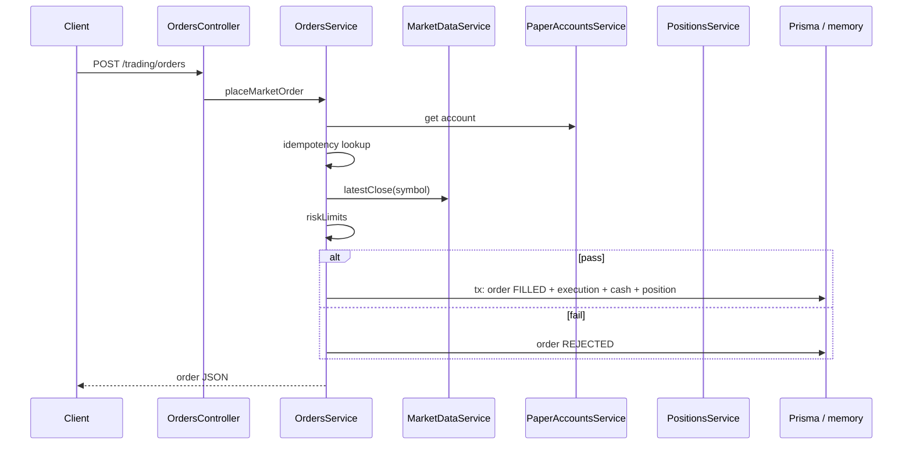

# Sprint 4.2 — Orders & Executions

**Status:** Plan ready  
**Roadmap marker:** Milestone 4 – Paper Trading (orders engine)  
**Branch:** `feat/sprint-4-2-orders-executions`  
**PR base:** `feat/sprint-4-1-accounts-positions`

**Overview:** Add `orders` + `executions` tables and a single write path — `POST /trading/orders` — that validates risk limits, fills market orders at the latest market-data close, updates cash/positions atomically, and supports idempotent `client_order_id`. Long-only, fractional qty allowed, seed + MySQL parity.

---

## Sprint scope and exit criteria

**Stories**

| ID | Title | Source |
|----|-------|--------|
| #3.2.1 | Order schema | [MVP_03](../product/stories/BitStockerz_MVP_03_Paper_Trading_Stories.md) |
| #3.2.2 | Place market order | same + [API_Inventory §3.1](../database/API_Inventory.md) |
| #3.3.1 | Execution records | same |
| #3.6.1 | Risk limits | same |
| #3.6.2 | Idempotent order submission | same |

**Exit:** Authenticated user can place market BUY/SELL that fills instantly (or rejects with reason), leaves an execution, and mutates cash + positions correctly. Replaying the same `client_order_id` returns the original order.

**Explicitly out of scope**

| Item | Why deferred |
|------|----------------|
| Limit / stop / cancel / partial fills | MVP market-only |
| GET list APIs (orders, executions, positions, portfolio) | Sprint 4.3 |
| Short selling / margin | JC-6 from 4.1 |
| Live broker / vendor execution | Simulated fill only |
| Soft reset account | JC-5 deferred |
| Angular trade ticket | Milestone 5 |
| Full `TRADING_*` / `STRATEGY_*` / `BACKTEST_*` catalog | Consolidate in 4.3 (#8.3.2); may add provisional trading codes here |

---

## Prerequisites

| Capability | Location | Relevance |
|------------|----------|-----------|
| Paper account + cash/position helpers | Sprint 4.1 `TradingModule` | Mutated inside fill transaction |
| `ensureUserPersisted` | `auth.service.ts` | FK safety if any user-scoped writes |
| Symbols lookup | `MarketDataService` / symbols | Resolve ticker → `symbol_id` + asset type |
| Candles (seed + DB) | `market-data.service.ts`, `seed-candles.ts` | Latest close for fill price (JC-1) |
| AuthGuard | `auth.guard.ts` | Guard POST |
| DDL orders/executions | [DDL/02_trading.sql](../database/DDL/02_trading.sql) | Schema source |
| Migrations plan §4.2 | [Migrations_Plan.md](../database/Migrations_Plan.md) | V0402 orders, V0403 executions |
| RFC 7807 | `DomainError`, `ErrorCode` | Rejects & validation |
| Coverage 90% | `package.json` | Order path is critical path |

---

## Draft acceptance criteria (lock before coding)

### #3.2.1 – Order schema

- Prisma models + migrations for `orders` and `executions` matching DDL.
- Columns used: `id` (UUID), `paper_account_id`, `symbol_id`, `side` (`BUY`|`SELL`), `quantity` `DECIMAL(18,8)`, `order_type` (`MARKET` only), `status` (`PENDING`|`FILLED`|`REJECTED`|`CANCELLED`), `avg_fill_price`, `reject_reason`, `client_order_id`, `requested_at`, `filled_at`.
- Unique `(paper_account_id, client_order_id)` — MySQL allows multiple NULLs; application treats missing `client_order_id` as non-idempotent.
- Seed mode: in-memory order/execution stores keyed by account.

### #3.2.2 – Place market order

- `POST /api/trading/orders` (AuthGuard).
- Body: `symbol`, `side`, `quantity`, `client_order_id?`.
- Resolve symbol (active only); unknown/inactive → `NOT_FOUND` or `VALIDATION_ERROR`.
- **Market only** — ignore/forbid other types; always `order_type = MARKET`.
- Fill price = latest close per JC-1 (see Judgement calls).
- Happy path (single transaction when Prisma on):
  1. Insert order `PENDING` (or skip persist-until-terminal — **default: write FILLED/REJECTED terminal row**; PENDING only if price lookup async — MVP is sync so terminal in one shot) (JC-11).
  2. Risk checks (#3.6.1).
  3. Cash/position apply (4.1 helpers).
  4. Insert execution (#3.3.1).
  5. Set order `FILLED`, `avg_fill_price`, `filled_at`.
- On reject: order row `REJECTED` + `reject_reason` (still persisted for history) **or** no row + Problem Details — **default: persist REJECTED** so 4.3 history shows attempts (JC-12).
- Response includes order object (API contract). Audit event `trading.order_placed` (or `trading.order_filled` / `trading.order_rejected`) — fire-and-forget via `AuditService`.

### #3.3.1 – Execution records

- One execution per filled market order (full fill).
- Fields: UUID `id`, `order_id`, `paper_account_id`, `symbol_id`, `side`, `quantity`, `price`, `executed_at`.
- Notional for API later = `quantity * price` (computed, not stored).
- Unit tests: execution created iff FILLED; none on REJECTED.

### #3.6.1 – Risk limits

Configurable defaults (env / `AppConfig`):

| Limit | Env | Default | Behavior |
|-------|-----|---------|----------|
| Max order notional | `TRADING_MAX_ORDER_NOTIONAL` | `25000` | Reject if `qty * price > max` |
| Max position % of equity | `TRADING_MAX_POSITION_PCT` | `25` | Reject BUY if resulting position market value &gt; pct of (cash + positions MTM) |
| Min cash remaining | `TRADING_MIN_CASH_REMAINING` | `0` | Reject BUY if `cash - notional < min` |

- SELL checks: sufficient position qty; no short (JC-6).
- Quantity &gt; 0; max 8 decimal places; both equity and crypto allow fractional (JC-3).
- Missing price data → reject `NO_MARKET_PRICE` (provisional trading code).

### #3.6.2 – Idempotent order submission

- When `client_order_id` present: lookup by `(paper_account_id, client_order_id)`.
- If exists: return **200** with original order (same body as create) — **do not** re-fill or mutate cash.
- If concurrent inserts race: unique constraint → load winner and return (same as jobs unique handling).
- Missing `client_order_id`: always new order.
- E2E: POST twice with same id → identical `id` / balances unchanged on second call.

---

## API contract

### `POST /api/trading/orders` (#3.2.2)

| Concern | Decision |
|---------|----------|
| Auth | Required |
| Content-Type | `application/json` |

**Request:**

```json
{
  "symbol": "AAPL",
  "side": "BUY",
  "quantity": "10.5",
  "client_order_id": "ui-2026-07-25-001"
}
```

**Response `200` (filled):**

```json
{
  "order": {
    "id": "a1b2c3d4-e5f6-7890-abcd-ef1234567890",
    "symbol": "AAPL",
    "side": "BUY",
    "quantity": "10.50000000",
    "status": "FILLED",
    "avg_fill_price": "198.45000000",
    "requested_at": "2026-07-25T15:10:00.000Z",
    "filled_at": "2026-07-25T15:10:00.000Z",
    "client_order_id": "ui-2026-07-25-001"
  }
}
```

**Response `200` (rejected — JC-12):**

```json
{
  "order": {
    "id": "…",
    "symbol": "AAPL",
    "side": "BUY",
    "quantity": "1000000",
    "status": "REJECTED",
    "reject_reason": "MAX_ORDER_NOTIONAL",
    "requested_at": "2026-07-25T15:10:00.000Z",
    "client_order_id": "ui-big-order"
  }
}
```

Alternative (if Dev prefers HTTP errors for rejects): `422`/`400` Problem Details with `code: TRADING_RISK_LIMIT` and still persist REJECTED — pick one; **default HTTP 200 with status REJECTED** for trade UX simplicity (JC-12). Validation errors (bad side, qty ≤ 0) stay `400 VALIDATION_ERROR` without order row.

**Provisional error codes** (add to enum if used as HTTP errors; finalize catalog in 4.3):

| Code | HTTP | When |
|------|------|------|
| `VALIDATION_ERROR` | 400 | Bad DTO |
| `UNAUTHORIZED` | 401 | No session |
| `NOT_FOUND` | 404 | Unknown symbol / no paper account |
| `TRADING_NO_MARKET_PRICE` | 422 | No candle close |
| `TRADING_INSUFFICIENT_CASH` | 422 | Optional if not using REJECTED body |
| `TRADING_INSUFFICIENT_POSITION` | 422 | Sell too much |
| `TRADING_RISK_LIMIT` | 422 | Notional / position % / min cash |

### Seed mode behavior

| Step | Seed | MySQL |
|------|------|-------|
| Price | Latest close from seed candle arrays | Latest close from bar tables |
| Order/exec persist | In-memory maps | Prisma transaction |
| Idempotency | Map key `(accountId, clientOrderId)` | Unique index |
| Symbols | Seed symbols | `symbols` table |

---

## Architecture



**Concrete files**

| Path | Action |
|------|--------|
| `apps/api/prisma/schema.prisma` | `Order`, `Execution` models + relations |
| `apps/api/prisma/migrations/*_sprint_4_2_orders/` | `orders` |
| `apps/api/prisma/migrations/*_sprint_4_2_executions/` | `executions` |
| `apps/api/src/trading/orders.controller.ts` | POST |
| `apps/api/src/trading/orders.service.ts` | Place + idempotency |
| `apps/api/src/trading/order-risk.service.ts` | Limits |
| `apps/api/src/trading/dto/place-order.dto.ts` | Validation |
| `apps/api/src/trading/fill-price.service.ts` | JC-1 latest close |
| `apps/api/src/market-data/market-data.service.ts` | Add `getLatestClose(symbol)` helper if missing |
| `apps/api/src/config/app-config.service.ts` | Trading risk env |
| `apps/api/.env.example` | Document risk env names |
| `apps/api/src/auth/auth.service.ts` | Remap must reassign orders/executions `paper_account` ownership via account.user_id only (orders FK account, not user) |
| `apps/api/src/common/errors/error-codes.enum.ts` | Provisional `TRADING_*` if needed |
| `apps/api/test/app.e2e-spec.ts` | Buy → reject → idempotent replay |

---

## Implementation plan (ordered)

### 1. Schema + config

1. Prisma models + migrations (orders then executions).
2. Risk config keys + defaults + unit tests for parsing.
3. AC bullets into MVP_03.

### 2. Fill price helper (JC-1)

1. `getLatestClose(symbol): { price, asOf, interval }`.
2. Equity → equity daily close; crypto → crypto **daily** close by default; if symbol only has hourly series in seed, fall back to latest hourly close.
3. Unit tests with injected candle fixtures / mocked MarketDataService.

### 3. Risk service (#3.6.1)

1. Pure functions where possible for coverage.
2. Cases: max notional, max position %, min cash, insufficient position, qty validation.

### 4. OrdersService (#3.2.2 / #3.3.1 / #3.6.2)

1. Idempotency short-circuit.
2. Transactional fill path calling 4.1 cash/position helpers.
3. REJECTED persistence (JC-12).
4. Audit hooks (non-throwing).
5. Unit tests: buy, sell, reject, idempotent, race unique constraint.

### 5. Controller + e2e + smoke

1. DTO validation (class-validator): side enum, quantity decimal string/number, client_order_id max 64.
2. E2E seed mode: register → buy AAPL → GET paper-account cash decreased → replay client_order_id.
3. Extend smoke script with authenticated order if feasible.

### 6. Docs

| File | Update |
|------|--------|
| `API_Inventory.md` | Mark POST `/trading/orders` implemented |
| `Migrations_Plan.md` | Prisma folder names |
| `manual_testing.md` | Place order + reject + idempotency |
| `ROADMAP.md` / MVP_03 / CHANGELOG | Status |

### 7. Gates

Same verify script as 4.1; MySQL path must prove unique idempotency index.

---

## Best-practice checklist

- [ ] Single DB transaction for fill side effects ([Prisma interactive transactions](https://www.prisma.io/docs/orm/prisma-client/queries/transactions))
- [ ] Idempotency via unique `(paper_account_id, client_order_id)` ([API Inventory §3](../database/API_Inventory.md))
- [ ] DECIMAL qty/price; no float notional
- [ ] Latest close only from market-data module (no hard-coded prices)
- [ ] Risk limits env-configurable with safe defaults
- [ ] AuthGuard + ownership via caller’s paper account only
- [ ] Audit never breaks order path
- [ ] Seed/DB parity for fill price + balances
- [ ] Coverage ≥90% on risk + orders services
- [ ] Conventional Commits; PR onto 4.1 branch

---

## Risks and mitigations

| Risk | Mitigation |
|------|------------|
| Stale / missing candles → bad fills | Reject with `NO_MARKET_PRICE`; document seed roll-forward |
| Double-spend on concurrent BUY | Transaction + row lock / serializable on account; unique client id |
| Avg-cost bugs on partial sells | Reuse 4.1 unit-tested helpers; add integration cases |
| Position % needs MTM of all positions | Batch latest closes; cap symbol set; fail closed if any price missing for held symbols |
| REJECTED vs HTTP error UX confusion | Document JC-12; OpenAPI/inventory note |
| Provisional error codes diverge from 4.3 | List codes in plan; 4.3 consolidates catalog |

---

## Dev input required

| # | Blocker | Why | Default | Status |
|---|---------|-----|---------|--------|
| 1 | Fill interval for crypto (daily vs hourly) | Strategy timeframe unused until Milestone 3/5 | ⏭ Daily close; hourly fallback | ⏭ |
| 2 | Reject as 200+REJECTED vs 422 Problem Details | Client contract | ⏭ 200 + `status: REJECTED` | ⏭ |
| 3 | Risk default numbers ($25k / 25% / $0) | Product appetite | ⏭ Table defaults | ⏭ |
| 4 | Fractional equity shares | Broker realism vs demo UX | ⏭ Allow decimals both | ⏭ |
| 5 | Persist REJECTED rows | History noise | ⏭ Persist | ⏭ |

---

## Judgement calls

### JC-1 — Fill price source
- **Decision:** Use **last available close** for the symbol’s primary MVP series: equity → **equity daily**; crypto → **crypto daily**; if daily missing but hourly exists → **latest hourly close**. Do **not** use open/high/low or VWAP.
- **Why:** Inventory says “latest price from Market Data”; daily is the common MVP bar; hourly fallback keeps crypto demos working.
- **Discuss before implement if:** Product wants strategy timeframe-aware fills (needs strategy context on the order) or bid/ask simulation.

### JC-2 — Risk limit defaults
- **Decision:** `max_order_notional = 25000`, `max_position_pct = 25`, `min_cash_remaining = 0` (USD).
- **Why:** Guardrails without blocking $100k paper demos (can buy ~4 full-sized tickets before %/notional bind).
- **Discuss before implement if:** Stricter retail-like limits or looser “unlimited paper” for backtest parity.

### JC-3 — Fractional quantity
- **Decision:** Allow **decimal quantity** for **both** equity and crypto (`DECIMAL(18,8)`, qty &gt; 0).
- **Why:** Crypto requires fractions; equity fractions simplify demos and match schema; no lot-size table in MVP.
- **Discuss before implement if:** Equities must be whole shares only for “realism.”

### JC-6 — Long-only (confirm)
- **Decision:** Reaffirm 4.1 — SELL cannot exceed position; no short open.
- **Why:** Paper MVP scope.
- **Discuss before implement if:** Shorts required.

### JC-11 — Sync terminal status
- **Decision:** No durable `PENDING` for market orders; write `FILLED` or `REJECTED` in one request.
- **Why:** Fill is synchronous against local candles.
- **Discuss before implement if:** Async job-based execution is desired (would use jobs module).

### JC-12 — Reject representation
- **Decision:** Persist `REJECTED` order; return HTTP **200** with `order.status = REJECTED` and `reject_reason` machine code. DTO/validation failures remain 400 without row.
- **Why:** Trade ticket UX + history; idempotent retries of a rejected client_order_id return the same reject.
- **Discuss before implement if:** Clients require RFC 7807 for all risk rejects.

---

## Suggested ticket breakdown

| Ticket | Estimate |
|--------|----------|
| Migrations + Prisma models + risk config | 0.5d |
| `getLatestClose` + unit tests | 0.5d |
| Risk service + tests | 0.75d |
| OrdersService fill/idempotency/transaction + tests | 1.5d |
| Controller DTO + e2e + smoke | 0.75d |
| Audit + docs + inventory | 0.5d |

**Total:** ~4.5 engineering days.

---

## Definition of done

- [ ] PR stacked on 4.1; migrations deploy cleanly
- [ ] #3.2.1–3.2.2, #3.3.1, #3.6.1–3.6.2 meet AC
- [ ] Market BUY/SELL updates cash, positions, executions correctly
- [ ] Risk limits enforced with documented defaults
- [ ] Idempotent `client_order_id` proven in unit + e2e
- [ ] Seed and MySQL paths both work
- [ ] build / lint / test / test:cov (≥90%) / test:e2e / verify script green
- [ ] Docs + manual testing updated
- [ ] JC-1/2/3/12 defaults followed or overridden in Dev input

---

## References

- DDL: [docs/database/DDL/02_trading.sql](../database/DDL/02_trading.sql)
- API inventory §3: [API_Inventory.md](../database/API_Inventory.md)
- Migrations §4.2: [Migrations_Plan.md](../database/Migrations_Plan.md)
- Prior plan: [sprint-4-1-accounts-positions.md](./sprint-4-1-accounts-positions.md)
- Stories: [MVP_03](../product/stories/BitStockerz_MVP_03_Paper_Trading_Stories.md)
- NestJS ValidationPipe / DTOs: https://docs.nestjs.com/techniques/validation
- Prisma transactions: https://www.prisma.io/docs/orm/prisma-client/queries/transactions
- Delivery: `.cursor/skills/sprint-delivery/SKILL.md`
