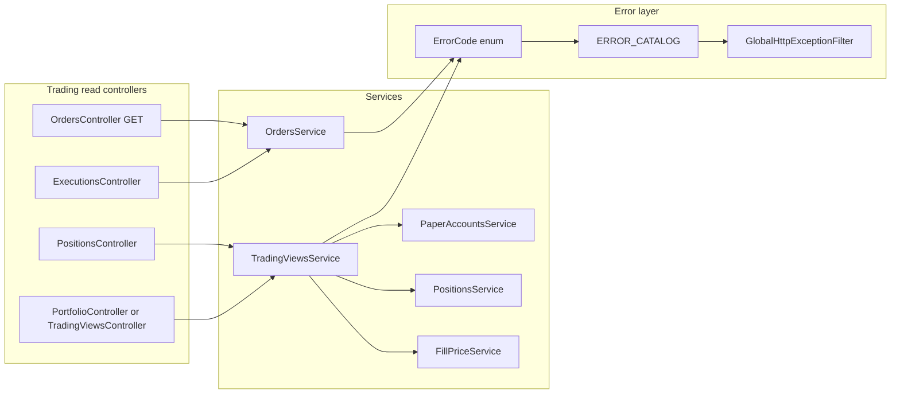

# Sprint 4.3 — Trading Views

**Status:** Completed (verified August 2, 2026)
**Roadmap marker:** Milestone 4 exit — “Users can simulate trades with correct P&amp;L”  
**Branch:** `codex/sprint-4-paper-trading` (combined Milestone 4 delivery)
**PR base:** `main`

**Overview:** Ship read APIs for positions, portfolio summary, recent orders, and trade history. Consolidate domain `ErrorCode` values for trading (and stubs for strategies/backtests) per #8.3.2. No new tables — reads only over 4.1/4.2 data with seed/DB parity and mark-to-market using JC-1 close prices.

---

## Sprint scope and exit criteria

**Stories**

| ID | Title | Source |
|----|-------|--------|
| #3.4.1 | Current positions API | [MVP_03](../product/stories/BitStockerz_MVP_03_Paper_Trading_Stories.md) + [API_Inventory §3.2](../database/API_Inventory.md) |
| #3.4.2 | Portfolio summary | same §3.3 |
| #3.5.1 | Recent orders | same §3.1 GET |
| #3.5.2 | Trade history | same §3.2 GET executions |
| #8.3.2 | Domain error types for trading, strategies, backtests | [MVP_08](../product/stories/BitStockerz_MVP_08_Backend_Infrastructure_Stories.md) |

**Exit (ROADMAP):** Users can simulate trades with correct P&amp;L — place orders (4.2) and view positions, equity, orders, and executions with consistent unrealized P&amp;L.

**Explicitly out of scope**

| Item | Why deferred |
|------|----------------|
| New DDL / migrations | Migrations_Plan §4.3: APIs only |
| Order cancel / amend | Not in MVP |
| Realized P&amp;L ledger/analytics | Explicit post-MVP follow-up; canonical inventory/story scope is unrealized summary |
| Strategy/backtest feature APIs | Codes only; implementation in Milestones 2–3 |
| Angular portfolio widgets | Milestone 5 |
| Account reset | JC-5 still deferred |

---

## Prerequisites

| Capability | Location | Relevance |
|------------|----------|-----------|
| Paper account, positions, cash | Sprint 4.1 | Portfolio inputs |
| Orders + executions + fills | Sprint 4.2 | History lists |
| `getLatestClose` / fill-price helper | 4.2 `FillPriceService` | MTM for position value + unrealized P&amp;L |
| AuthGuard | `auth.guard.ts` | All endpoints authenticated |
| `ErrorCode` + catalog + filter | `common/errors/*` | #8.3.2 expansion |
| Snake_case JSON convention | market-data / trading POST | Keep consistent |
| Coverage 90% | package.json | Controllers thin; service tests heavy |

---

## Acceptance criteria (implementation contract)

### #3.4.1 – Current positions API

- `GET /api/trading/positions` (AuthGuard).
- Returns **non-zero** positions for the caller’s paper account.
- Each row: `symbol`, `quantity`, `avg_cost` (strings for DECIMAL).
- Omit `market_price`, `market_value`, and `unrealized_pnl` from this response; MTM lives in portfolio summary (JC-13). Adding them later requires an explicit additive API-contract change.
- Empty book → `{ "positions": [] }`.
- Deterministic order: `symbol ASC, position.id ASC`; the dashboard’s first five positions therefore have stable semantics.
- Seed + MySQL parity.

### #3.4.2 – Portfolio summary

- `GET /api/trading/portfolio-summary` (AuthGuard).
- Response fields (inventory):
  - `cash_balance`
  - `total_position_value` — sum of `qty * latest_close` for open positions
  - `total_equity` — `cash_balance + total_position_value`
  - `unrealized_pnl_total` — sum of `(latest_close - avg_cost) * qty`
- If a held symbol has **no** market price: **fail closed** with `TRADING_NO_MARKET_PRICE` (JC-14) — do not silently treat as 0.
- DECIMAL string encoding consistent with the repository contract: all aggregate currency values use exactly 2 decimal places.
- Unit tests: flat book, mixed winners/losers, missing price, empty positions (equity = cash).

### #3.5.1 – Recent orders

- `GET /api/trading/orders` (AuthGuard).
- Query: `status?`, `symbol?`, `limit?` (default **50**, max **200**), `offset?` (default 0, max 10,000).
- Newest first (`requested_at DESC, id ASC`).
- Response `{ orders, limit, offset, has_more }`; same item shape as POST response `order` object (JC-15).
- Includes `REJECTED` / `FILLED` (and any `CANCELLED` if introduced later).

### #3.5.2 – Trade history

- `GET /api/trading/executions` (AuthGuard).
- Query: `symbol?`, `limit?` (default **100**, max **500**), `offset?` (default 0, max 10,000).
- Newest first (`executed_at DESC, id ASC`).
- Response `{ executions, limit, offset, has_more }`.
- Each item: `executed_at`, `symbol`, `side`, `quantity`, `price`, `notional` (`qty * price`).
- `notional` uses the same 2dp `ROUND_HALF_UP` cash-notional rule as the fill ledger.
- Only real fills (no reject rows).

### #8.3.2 – Domain error types

Verify and complete `ErrorCode` + `ERROR_CATALOG` entries introduced by 2.3, 3.1–3.3, and 4.1–4.2; add an exhaustive catalog unit test and update any stale generic throw sites to the canonical code. Keep the RFC 7807 filter shape. **No** strategy/backtest controllers — codes only.

| Domain | Codes (HTTP) |
|--------|----------------|
| Trading (complete catalog coverage) | `TRADING_NO_MARKET_PRICE` (422), `TRADING_INSUFFICIENT_CASH` (422), `TRADING_INSUFFICIENT_POSITION` (422), `TRADING_RISK_LIMIT` (422), `TRADING_ACCOUNT_INACTIVE` (403) |
| Strategies (already owned by 2.3) | `STRATEGY_NOT_FOUND` (404), `STRATEGY_VERSION_NOT_FOUND` (404), `STRATEGY_VALIDATION_ERROR` (400) |
| Backtests (already owned by 3.1–3.3) | `BACKTEST_INVALID_DEFINITION` (400), `BACKTEST_INSUFFICIENT_BARS` (400), `BACKTEST_BAR_LIMIT_EXCEEDED` (400), `BACKTEST_RESOURCE_LIMIT_EXCEEDED` (400), `BACKTEST_TIMEOUT` (504), `BACKTEST_NOT_FOUND` (404), `BACKTEST_INVALID_STATE` (409) |

Do not introduce unused near-duplicates (`TRADING_DUPLICATE_ORDER`, `STRATEGY_FORBIDDEN`, `BACKTEST_VALIDATION_ERROR`, `BACKTEST_LIMIT_EXCEEDED`, `BACKTEST_FAILED`). Generic `CONFLICT`, 404 ownership behavior, and `INTERNAL_ERROR` cover those cases.

---

## API contract

All routes: Auth required, snake_case, global prefix `/api`.

### `GET /api/trading/positions`

```json
{
  "positions": [
    {
      "symbol": "AAPL",
      "quantity": "10.50000000",
      "avg_cost": "198.45000000"
    }
  ]
}
```

### `GET /api/trading/portfolio-summary`

```json
{
  "cash_balance": "97916.28",
  "total_position_value": "2083.73",
  "total_equity": "100000.01",
  "unrealized_pnl_total": "0.00"
}
```

All four fields are base-currency aggregates and serialize with exactly 2 decimal places (JC-16). Unit prices and quantities remain 8dp.

### `GET /api/trading/orders?status=FILLED&limit=50`

```json
{
  "orders": [
    {
      "id": "a1b2c3d4-e5f6-7890-abcd-ef1234567890",
      "symbol": "AAPL",
      "side": "BUY",
      "quantity": "10.50000000",
      "status": "FILLED",
      "avg_fill_price": "198.45000000",
      "requested_at": "2026-07-25T15:10:00.000Z",
      "filled_at": "2026-07-25T15:10:00.000Z",
      "client_order_id": "ui-2026-07-25-001"
    }
  ],
  "limit": 50,
  "offset": 0,
  "has_more": false
}
```

### `GET /api/trading/executions?limit=100`

```json
{
  "executions": [
    {
      "executed_at": "2026-07-25T15:10:00.000Z",
      "symbol": "AAPL",
      "side": "BUY",
      "quantity": "10.50000000",
      "price": "198.45000000",
      "notional": "2083.73"
    }
  ],
  "limit": 100,
  "offset": 0,
  "has_more": false
}
```

**Errors:** RFC 7807 via filter — e.g. `422` + `code: TRADING_NO_MARKET_PRICE` when MTM lacks a close.

**Seed mode:** in-memory maps + seed closes for MTM; MySQL uses indexed `orders`/`executions` queries. Empty new user → empty lists / equity = cash.

---

## Architecture



**Concrete files**

| Path | Action |
|------|--------|
| `apps/api/src/trading/trading-views.service.ts` | Positions list + portfolio MTM |
| `apps/api/src/trading/trading-views.controller.ts` | GET positions + portfolio-summary |
| `apps/api/src/trading/orders.controller.ts` | Add GET list |
| `apps/api/src/trading/orders.service.ts` | `listOrders`, `listExecutions` |
| `apps/api/src/trading/dto/orders-query.dto.ts` | status/symbol/limit |
| `apps/api/src/trading/dto/executions-query.dto.ts` | symbol/limit |
| `apps/api/src/common/errors/error-codes.enum.ts` | Add TRADING_/STRATEGY_/BACKTEST_ |
| `apps/api/src/common/errors/error-catalog.ts` | Catalog entries + typeSuffixes |
| `apps/api/src/common/errors/*.spec.ts` | Exhaustive catalog test |
| `apps/api/src/trading/*.spec.ts` | MTM / list filters |
| `apps/api/test/app.e2e-spec.ts` | Full paper loop: register → buy → views |
| `scripts/smoke-test-api.sh` | Authenticated portfolio smoke |
| `docs/manual-testing/manual_testing.md` | Milestone 4 section |

No Prisma migrations.

---

## Implementation plan (ordered)

### 1. Error catalog (#8.3.2)

1. Add enum members + catalog entries + `typeSuffix` URIs.
2. Spec: `Object.values(ErrorCode)` every key present in catalog; sample DomainError → filter status.
3. Refactor 4.2 throw sites to final trading codes (keep JC-12 REJECTED body behavior — those paths may not throw).

### 2. List queries (#3.5.1 / #3.5.2)

1. `listOrders` / `listExecutions` with validated filters, limit/offset bounds, stable tie-breaker order, and `limit + 1` `has_more`.
2. Join/lookup symbol ticker for response.
3. Unit + e2e.

### 3. Positions + portfolio (#3.4.1 / #3.4.2)

1. Non-zero positions query.
2. Portfolio MTM using FillPriceService (JC-1); fail closed (JC-14).
3. Formatting helper for DECIMAL strings (JC-16).
4. Unit tests with mocked prices.

### 4. Controllers + module wiring

1. Thin controllers; AuthGuard; ValidationPipe query DTOs.
2. Metrics interceptor route group: add `trading` label if not present.

### 5. E2E paper loop + docs + gates

E2E (seed): register → buy → positions/summary/orders/executions → idempotent replay. MySQL: `KEEP_DATABASE_URL=1 ./scripts/sprint-delivery-verify.sh verify`.

Docs: inventory §3 GETs implemented; ROADMAP Milestone 4 complete + `START HERE` → 5.1; MVP_03/MVP_08 AC; manual testing section; CHANGELOG/README/reference branch map.

Gates: `build` / `lint` / `test` / `test:cov` / `test:e2e` / `sprint-delivery-verify.sh verify`.

---

## Best-practice checklist

- [x] Read APIs are side-effect free (except documented lazy paper-account heal from 4.1)
- [x] Indexed order/execution queries — use existing DDL indexes
- [x] MTM uses same close source as fills (JC-1) — no divergent price logic
- [x] Fail closed on missing MTM price (JC-14)
- [x] Exhaustive `ErrorCode` ↔ catalog test
- [x] RFC 7807 unchanged shape ([Sprint 8.3.1 filter](../../apps/api/src/common/errors/http-exception.filter.ts))
- [x] Snake_case list wrappers consistent (`positions` / `orders` / `executions`)
- [x] AuthGuard on all trading GETs
- [x] Coverage ≥90%; e2e covers full paper loop
- [x] ROADMAP Milestone 4 exit criteria satisfied
- [x] Conventional Commits; combined Milestone 4 PR onto `main`

---

## Risks and mitigations

| Risk | Mitigation |
|------|------------|
| MTM N+1 price lookups | Batch latest closes by symbol ids |
| Unrealized P&amp;L confusion vs realized | Document inventory fields only; no realized field yet |
| Error code drift breaks earlier clients | Reuse names first introduced in 2.3–4.2; exhaustive catalog test prevents omissions |
| Strategy/backtest codes appear unused locally | Exhaustive catalog test references the enum; callers already exist in prior sprint branches |
| Decimal formatting inconsistency | One `formatDecimal(value, scale)` helper |
| Portfolio endpoint slow with many positions | MVP single account + tiny universe; still batch |

---

## Adopted defaults and override triggers

| # | Blocker | Why | Default | Status |
|---|---------|-----|---------|--------|
| 1 | Per-position MTM fields on GET positions | Inventory omits them | Omit; summary only | Adopted |
| 2 | Missing price → 422 vs zero value | Honesty vs demo resilience | 422 fail closed | Adopted |
| 3 | List response wrapper keys | Bare array vs wrapped metadata | Wrapped objects with pagination metadata where applicable | Adopted |
| 4 | Aggregate decimal places | Client consistency | Base-currency aggregates 2dp; qty/unit price 8dp | Adopted |
| 5 | Duplicate order code | 4.2 chose same-payload replay and generic conflict on mismatch | Do not add `TRADING_DUPLICATE_ORDER` | Adopted |

---

## Judgement calls

### JC-1 — Fill / MTM price (reaffirm)
- **Decision:** Portfolio MTM uses the **same** `getLatestClose` rules as order fills (equity daily / crypto daily / hourly fallback).
- **Why:** P&amp;L must match trade economics; one price authority.
- **Discuss before implement if:** UI wants “last trade price” distinct from daily close.

### JC-13 — Positions payload richness
- **Decision:** Stick to inventory `{ symbol, quantity, avg_cost }` only.
- **Why:** Avoid scope creep; summary carries aggregate MTM.
- **Discuss before implement if:** Dashboard (Milestone 5) needs per-line P&amp;L without a second call.

### JC-14 — Missing MTM price
- **Decision:** `GET /portfolio-summary` returns **422** `TRADING_NO_MARKET_PRICE` if any open position lacks a close.
- **Why:** Better than lying with zeros; seed fixtures always have closes for traded symbols.
- **Discuss before implement if:** Prefer partial valuation with `degraded` flag (would expand contract).

### JC-15 — List wrappers
- **Decision:** Wrap arrays: `{ positions: [...] }`; paginated lists return `{ orders|executions, limit, offset, has_more }`.
- **Why:** Extensible for `next_cursor` later; consistent with other APIs that use objects.
- **Discuss before implement if:** Inventory’s “list of orders” must be a raw JSON array.

### JC-16 — Decimal formatting
- **Decision:** Base-currency cash, notional, portfolio values, and P&L → exactly 2 decimal places. Quantity, unit price, and average cost → exactly 8 decimal places.
- **Why:** Currency ledger is `DECIMAL(18,2)` while crypto quantities/unit prices require finer scale; fixed output scale keeps snapshots and clients stable.
- **Discuss before implement if:** The database currency scale changes.

### JC-17 — #8.3.2 stub breadth
- **Decision:** Add any still-missing canonical catalog entries and an exhaustive enum↔catalog test; do not rename or duplicate strategy/backtest codes first introduced by Sprints 2.3–3.3.
- **Why:** #8.3.2 is a consolidation/coverage gate, not a late breaking rename.
- **Discuss before implement if:** A previously shipped code must change; treat that as a versioned API change and update every plan/client together.

---

## Suggested ticket breakdown

| Ticket | Estimate |
|--------|----------|
| ErrorCode + catalog + migrate 4.2 sites + tests | 0.75d |
| GET orders + executions + DTOs + tests | 0.75d |
| GET positions + portfolio MTM + tests | 1.0d |
| E2E full paper loop + smoke | 0.5d |
| Docs / ROADMAP Milestone 4 exit / manual section | 0.5d |

**Total:** ~3.5 engineering days.

---

## Definition of done

- [x] Combined Milestone 4 branch; **no** Sprint 4.3 migration
- [x] #3.4.1–3.4.2, #3.5.1–3.5.2, #8.3.2 meet AC
- [x] Portfolio MTM = positions × JC-1 closes + cash; fail closed on missing price
- [x] Exhaustive error catalog; e2e paper loop green; cov ≥90%
- [x] Inventory §3 + ROADMAP Milestone 4 done; `START HERE` → 5.1; manual section updated
- [x] Adopted defaults followed; combined-delivery branch override recorded above

---

## References

- API inventory §3: [API_Inventory.md](../database/API_Inventory.md)
- Migrations §4.3 (no DDL): [Migrations_Plan.md](../database/Migrations_Plan.md)
- Prior plans: [sprint-4-1-accounts-positions.md](./sprint-4-1-accounts-positions.md), [sprint-4-2-orders-executions.md](./sprint-4-2-orders-executions.md)
- Stories: [MVP_03](../product/stories/BitStockerz_MVP_03_Paper_Trading_Stories.md), [MVP_08](../product/stories/BitStockerz_MVP_08_Backend_Infrastructure_Stories.md)
- Roadmap Milestone 4 exit: [ROADMAP.md](../product/ROADMAP.md)
- RFC 7807 filter: `apps/api/src/common/errors/http-exception.filter.ts`
- NestJS pipes (query DTOs): https://docs.nestjs.com/techniques/validation
- Delivery: `.cursor/skills/sprint-delivery/SKILL.md`
