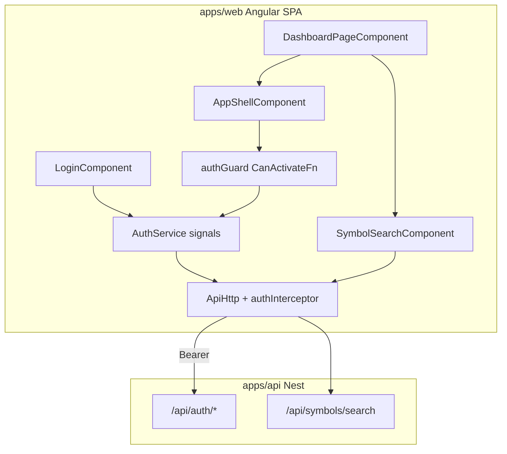

# Sprint 5.1 — Shell & Navigation (Angular)

**Status:** Completed (Milestone 5 PR)
**Roadmap marker:** Milestone 5 — Dashboard (Angular Frontend)  
**Branch (when implementing):** `feat/sprint-5-1-shell-navigation`  
**PR base:** `main` (Sprint 4 merged in PR #10)

**Overview:** Extend the minimal `apps/web` scaffold owned by Sprint 3.4 into the full authenticated Angular shell + routing, land users on `/dashboard` with skeleton placeholders, ship a reusable symbol-search component wrapping `GET /api/symbols/search`, and ship the primary **passkey (WebAuthn) register/login UI** over the existing auth APIs. Do not re-scaffold. No dashboard widgets yet (Sprint 5.2). Backend aggregation is intentionally skipped.

---

## Sprint scope and exit criteria

**Stories**

| ID | Title | Source |
|----|-------|--------|
| #7.1.1 | Authenticated app shell | [MVP_07](../product/stories/BitStockerz_MVP_07_Dashboard_UI_Stories.md) |
| #7.1.2 | Dashboard landing route | same |
| #2.4.2 | Reusable symbol search UI component | [MVP_02](../product/stories/BitStockerz_MVP_02_Market_Data_Stories.md) |
| #1.1.1 | Create account with a passkey | [MVP_01](../product/stories/BitStockerz_MVP_01_User_Account_Stories.md) |
| #1.1.2 | Sign in with a passkey | same |

**Exit (from [ROADMAP.md](../product/ROADMAP.md)):** Angular app exists with auth-gated shell, dashboard route, symbol search reusable in later screens, and passkey register/login as the primary browser auth path.

**Explicitly out of scope**

| Item | Why deferred |
|------|----------------|
| Widget data (portfolio, strategies, backtests, trades) | Sprint 5.2 |
| `GET /dashboard/summary` aggregator | Client-side parallel calls (JC-3); inventory recommends skip |
| Strategy Lab / Trade full pages | Sprint 5.3; this sprint owns functional route placeholders only |
| Design system / component library (Material as product UI) | Prefer CSS variables + light shared styles (JC-2) |
| SSR / Angular Universal | Static SPA for MVP (Sprint 7.2) |
| Google/Apple OAuth browser polish + deployed redirect hosting | Keep email as unsupported-browser fallback; production OAuth callbacks in 7.2 |
| Account recovery “add another passkey” polish | Optional MVP+ in #1.1.6; OAuth recovery remains available via API |

---

## Prerequisites (what must already exist)

| Capability | Location | Relevance |
|------------|----------|-----------|
| Bearer sessions (`access_token`, `token_type: Bearer`) | `apps/api` auth controllers | Angular interceptor attaches `Authorization` |
| `GET /api/auth/me` | `me.controller.ts` | Shell user menu / session check |
| `POST /api/auth/login` / logout | `auth.controller.ts` | Email fallback + logout |
| WebAuthn register/login options + verify | `auth.controller.ts` | Passkey create-account and sign-in |
| `GET /api/symbols/search` | `symbols.controller.ts` | Symbol search component |
| CORS / WebAuthn origins for browser origin | `main.ts` / config | Must allow `apps/web` origin (`localhost:4200`) in dev |
| Milestone 4 trading + Milestone 2–3 APIs | implemented | Available for shell integration; widgets consume them in 5.2 |
| Monorepo root | `package.json` | Add workspace scripts for `apps/web` |

**Implemented predecessor state (Sprint 3.4):** `apps/web` now pins Angular
CLI/build 21.2.19 with Angular 21.2.x, standalone routing, global shell/nav
styling, `sessionStorage` token handling, a bearer interceptor, token-presence
route protection, login/register demo flow, `/strategies` placeholder, and
functional `/backtests`, `/backtests/new`, and `/backtests/:id` screens.
Sprint 5.1 must preserve those backtest routes. Its auth work hardens the
existing guard by validating `/auth/me` and centralizing 401/logout handling,
promotes **passkey register/login** to the primary `/login` UX (email remains
the unsupported-browser / automation fallback), and its UI work adds
dashboard/trade destinations, the full user menu, dark brand shell, and symbol
search.

---

## Acceptance criteria (implementation contract)

### #7.1.1 – Authenticated app shell

- Extend the exact Angular major and npm lockfile committed by Sprint 3.4. If the scaffold is unexpectedly absent, select the current stable Angular version compatible with the repository’s pinned Node version, pin it exactly in the lockfile, and record it in `apps/web/README.md` (JC-1).
- Standalone components by default (no NgModules for feature UI).
- Global layout after login includes:
  - Top nav: logo + app name “BitStockerz”
  - Primary nav links: Dashboard, Trade, Strategies, Backtests
  - User menu: profile entry + logout
- All app routes under the shell require authentication via functional `CanActivateFn`.
- Unauthenticated users hitting protected routes redirect to `/login`.
- A stored token is not sufficient proof: initial app bootstrap/guard resolves `GET /api/auth/me` once before activating protected routes. Invalid/expired tokens are cleared and redirected with an internal-only `returnUrl`.
- Logout clears stored token and returns to `/login`.
- Mobile: usable (nav collapses or wraps); perfection not required.
- Brand tokens via CSS variables in a thin global stylesheet (no heavy design system).

### #7.1.2 – Dashboard landing route

- Authenticated default route: `/dashboard`.
- Post-login navigation lands on `/dashboard`.
- Page renders shell + page title immediately; widget slots show skeleton loaders (no blocking “wait for all APIs”).
- Does not fetch widget APIs in this sprint (skeletons only, or empty placeholders labeled for 5.2).

### #2.4.2 – Reusable symbol search UI component

- Standalone component (e.g. `SymbolSearchComponent`) usable from any route.
- Calls `GET /api/symbols/search?q=&asset_type?&limit?` with a 250ms debounce, `distinctUntilChanged`, and `switchMap` cancellation. Empty trimmed input clears results without a request.
- Shows results list (symbol, name/display if present, asset type); keyboard and click select emit selected symbol.
- Handles empty query, empty results, and HTTP errors with inline messaging.
- Implements combobox/listbox semantics: labelled input, arrow-key highlight, Enter select, Escape close, visible focus, and `aria-activedescendant`.
- Unit tests with mocked `HttpClient`.
- Demonstrated on dashboard (or a small Trade stub page) so QA can exercise it.

### #1.1.1 / #1.1.2 – Passkey register and sign-in (primary auth UI)

- `/login` presents **Create account** and **Sign in** with email + **Use passkey** as the primary actions.
- Create account: collect email (+ optional display name), call `POST /api/auth/webauthn/register/options`, run `navigator.credentials.create`, then `POST /api/auth/webauthn/register/verify`; on success store `access_token` and navigate to `returnUrl` or `/dashboard`.
- Sign in: collect email, call `POST /api/auth/webauthn/login/options`, run `navigator.credentials.get`, then `POST /api/auth/webauthn/login/verify`; same session handoff as register.
- Map RFC 7807 / WebAuthn failures to inline messages (cancel, timeout, invalid challenge, rate limit); never leave a half-stored token.
- Unsupported browser/device: show clear messaging and keep the existing **email register/login** path as an explicit fallback (dev/automation and non-WebAuthn environments).
- Unit tests cover options→verify happy path and at least one failure path with mocked WebAuthn + HttpClient.
- Manual testing docs cover a real browser passkey ceremony against the local API (platform authenticator or virtual authenticator).

---

## API contract (client-only sprint)

No new Nest endpoints. Angular consumes existing APIs:

| Method | Path | Auth | Use |
|--------|------|------|-----|
| POST | `/api/auth/webauthn/register/options` | Public | Start passkey registration |
| POST | `/api/auth/webauthn/register/verify` | Public | Finish passkey registration + session |
| POST | `/api/auth/webauthn/login/options` | Public | Start passkey authentication |
| POST | `/api/auth/webauthn/login/verify` | Public | Finish passkey authentication + session |
| POST | `/api/auth/register` / `/api/auth/login` | Public | Email fallback (unsupported browser / automation) |
| POST | `/api/auth/logout` | Bearer | Clear server session |
| GET | `/api/auth/me` | Bearer | User menu / guard session probe |
| GET | `/api/symbols/search` | Public | Symbol search typeahead |

**Token storage (JC-4):** `sessionStorage` key `bs.access_token` (MVP). Interceptor reads it and sets `Authorization: Bearer <token>`.

**CORS / WebAuthn:** Local `ng serve` uses the 3.4 `/api` proxy. Direct browser/e2e and deployed SPA origins use an explicit comma-separated allowlist config (final env name chosen once in API config, documented in `.env.example`); never use wildcard origins in production. Ensure `WEBAUTHN_ALLOWED_ORIGINS` includes `http://localhost:4200` for local passkey ceremonies.

**Skipped:** `GET /api/dashboard/summary` — widgets in 5.2 call domain APIs independently ([API_Inventory §7](../database/API_Inventory.md)).

---

## Architecture



### Proposed file layout

```text
apps/web/
  angular.json
  package.json
  src/
    main.ts
    index.html
    styles.css                 # CSS variables + minimal reset
    app/
      app.config.ts            # provideRouter, provideHttpClient(withInterceptors)
      app.routes.ts            # lazy loadChildren / loadComponent
      core/
        auth/
          auth.service.ts      # signals: token, user
          auth.guard.ts        # CanActivateFn
          auth.interceptor.ts  # functional interceptor
          token-storage.ts     # sessionStorage adapter
        api/
          api-base.ts          # environment API_BASE_URL
      layout/
        app-shell.component.ts
        user-menu.component.ts
      features/
        auth/login.component.ts
        dashboard/dashboard.page.ts
        symbols/symbol-search.component.ts
      shared/
        skeleton.component.ts
        formatters.ts          # currency/date stubs for 5.2
```

**Design principles**

1. Standalone + lazy routes (`loadComponent` / `loadChildren`) — [Angular routing](https://angular.dev/guide/routing).
2. Signals for local UI/auth state — [Angular signals](https://angular.dev/guide/signals).
3. Functional guards & interceptors — [functional guards](https://angular.dev/guide/routing/common-router-tasks#preventing-unauthorized-access), [HTTP interceptors](https://angular.dev/guide/http/interceptors).
4. Thin styling: CSS variables for brand color, spacing, type; avoid inventing a full design system.
5. No React, no Next.js — ROADMAP frontend target is Angular only.

---

## Implementation plan (ordered)

### 1. Ensure `apps/web` exists (scaffold or extend)

1. Normally `apps/web` exists from 3.4: reuse auth/API client and add shell/nav/dashboard routes without rewriting backtest feature modules.
2. If unexpectedly missing, generate with npm/Angular CLI (standalone, routing, CSS + variables) and follow the fallback version rule above.
3. Preserve the Node 24.11.1 engine and Angular 21.2.x toolchain committed by
   Sprint 3.4; upgrades belong in a separate explicit change.
4. Reuse the relative `/api` client base and `apps/web/proxy.conf.json` from
   Sprint 3.4 rather than introducing an absolute local URL.
5. Preserve the root web scripts and `.gitignore` coverage already in place.

### 2. Auth client foundation + passkey UI

1. `TokenStorage` → `sessionStorage` (JC-4).
2. `AuthService` signals: `accessToken`, `user`, `isAuthenticated`.
3. Functional `authInterceptor` attaches Bearer token.
4. Functional async `authGuard`: no token → `/login`; unknown session state → await one deduplicated `GET /auth/me`; invalid token → clear + redirect.
5. A 401 response interceptor clears auth state and redirects only from protected requests (never loops on login/register endpoints). Preserve only same-origin internal `returnUrl` values.
6. Passkey client helpers wrap `navigator.credentials.create` / `get` and the four WebAuthn HTTP endpoints; encode ArrayBuffer fields per the API contract.
7. Login page: primary Create account / Sign in with passkey; email register/login remains the explicit fallback.
8. Successful auth returns to a valid `returnUrl` or `/dashboard`. Logout awaits the API call when possible but clears local state even if the network call fails.

### 3. App shell + routes

1. `AppShellComponent` with top nav + router-outlet.
2. Routes: `/login` (public), shell children `/dashboard`, `/trade`, `/strategies`, `/backtests` (stubs OK).
3. Default authenticated redirect → `/dashboard`.
4. User menu shows display name/email from `/auth/me`.

### 4. Dashboard landing + skeletons

1. `DashboardPageComponent` with title + 4–6 skeleton slots (account, positions, strategies, backtests, trades, search).
2. No domain fetches yet; document “wired in 5.2”.

### 5. Symbol search (#2.4.2)

1. Debounced typeahead → `HttpClient.get(`${api}/symbols/search`, { params })`.
2. Emit `selected` output; clearable input.
3. Unit tests with `HttpTestingController`.

### 6. CORS + docs + gates

1. Confirm API CORS allows web origin; document env if missing.
2. Sync docs (table below).
3. `ng test` / `ng build` green; smoke: passkey register → dashboard → search AAPL; email fallback still works.

**Docs touch list**

| File | Update |
|------|--------|
| `docs/product/ROADMAP.md` | Mark 5.1 in progress/done; note passkey UI in scope |
| `docs/product/stories/BitStockerz_MVP_07_*.md` | Confirm AC status |
| `docs/product/stories/BitStockerz_MVP_01_*.md` | Mark #1.1.1–#1.1.2 Angular UI shipped with 5.1 |
| `docs/product/stories/BitStockerz_MVP_02_*.md` | Confirm #2.4.2 AC status |
| `docs/database/API_Inventory.md` | Note client-side dashboard; no `/dashboard/summary` |
| `docs/manual-testing/manual_testing.md` | Angular shell + passkey ceremony + symbol search section |
| `README.md`, `CHANGELOG.md` | Web app scripts |
| `.cursor/skills/sprint-delivery/reference.md` | Branch map row |

---

## Best-practice checklist

- [ ] Standalone components (default) — https://angular.dev/guide/components
- [ ] Functional `CanActivateFn` — https://angular.dev/guide/routing/common-router-tasks
- [ ] Functional HTTP interceptor for Bearer — https://angular.dev/guide/http/interceptors
- [ ] Lazy routes via `loadComponent` / `loadChildren` — https://angular.dev/guide/routing
- [ ] Signals for local UI/auth state — https://angular.dev/guide/signals
- [ ] No `forkJoin` “dashboard mega-call” in this sprint (skeletons only)
- [ ] CSS variables for brand; minimal global CSS
- [ ] Conventional Commits: `feat: add angular shell, passkeys, and symbol search`

---

## Risks and mitigations

| Risk | Mitigation |
|------|------------|
| CORS blocks browser calls | Document + set CORS for `localhost:4200` before QA |
| Auth token shape mismatch | Mirror API `access_token` / `Bearer` exactly from auth specs |
| Angular version churn | Pin latest stable at scaffold time; record in plan JC-1 |
| Over-building design system | Hard stop: CSS vars + a few shared components |
| Stub Trade/Strategies confuse QA | Label Trade/Strategies “UI stub — data in later sprints”; keep functional Backtests routes from 3.4 |
| Branching from stale Sprint 4 tip | Branch from `main` after PR #10 |

---

## Adopted defaults and external prerequisites

| # | Blocker | Why it blocks | Default if unanswered | Status |
|---|---------|---------------|----------------------|--------|
| 1 | Angular major version | Peer/toolchain compatibility | Reuse 3.4 exact version; fallback pins current compatible stable | Adopted |
| 2 | Login UX (passkey-first vs email-only) | Affects first screen | **Passkey register/login required for DoD**; email remains unsupported-browser / automation fallback; OAuth polish in 7.2 | Adopted |
| 3 | Brand colors / logo asset | Visual polish | Full dark shell (black/navy + neon/forest green) using `docs/assets/images/logo.png` in nav; CSS variables from logo/ad palette | Adopted |
| 4 | Production CORS allowlist config | Browser deployment | Add one validated comma-separated allowlist env; local proxy remains default | Implementation prerequisite |
| 5 | Base branch | Correct merge base | Branch from `main` (Sprint 4 already merged) | Adopted |

---

## Judgement calls

| ID | Decision | Why | Discuss before implement if |
|----|----------|-----|-----------------------------|
| **JC-1** | Reuse the **exact Angular version from 3.4**; only choose current compatible stable if the scaffold is missing | Prevents an upgrade from being hidden inside shell work while keeping a deterministic fallback | A separate upgrade/security ticket is approved |
| **JC-2** | **CSS variables + minimal global styles**; no Material/CDK-as-product-UI | Avoid inventing a heavy design system for MVP | Design wants a specific component library |
| **JC-3** | **Skip `GET /dashboard/summary`**; client-side independent calls in 5.2 | Matches API inventory recommendation and #7.5.1 resilience | Latency forces a BFF aggregator later |
| **JC-4** | Store bearer token in **`sessionStorage`** (not `localStorage`) | Safer MVP default (clears with tab session); API already bearer-based | Product requires “stay logged in” across browser restarts |
| **JC-5** | **Extend** `apps/web` if Sprint 3.4 already created it; only greenfield-scaffold when missing | Avoid duplicate scaffolds and lost backtest UI work ([3.4 JC-1](./sprint-3-4-backtest-ui.md)) | 3.4 deferred UI and never created `apps/web` |

---

## Suggested ticket breakdown

| Ticket | Estimate |
|--------|----------|
| Extend existing `apps/web` shell/routes (do not re-scaffold) | 0.5d |
| Harden auth service, interceptor, `/auth/me` guard, logout | 1.0d |
| Passkey register/login UI + WebAuthn client + tests | 1.25d |
| App shell nav + lazy routes + user menu + dark brand tokens/logo | 1.0d |
| Dashboard landing + skeletons | 0.5d |
| Symbol search component + tests + demo placement | 0.75d |
| CORS/WebAuthn origins/docs/manual testing/CHANGELOG | 0.5d |

**Total:** ~5.5 engineering days.

---

## Definition of done

- [ ] `apps/web` builds and serves locally
- [ ] Passkey create-account and sign-in work against local API; email fallback remains
- [ ] Auth guard protects shell routes; logout works
- [ ] `/dashboard` shows shell + skeletons with dark brand + logo
- [ ] Symbol search hits `/api/symbols/search` with debounce + tests
- [ ] JCs recorded; docs synced; ROADMAP updated
- [ ] PR: `feat: add angular shell, passkeys, and symbol search`

---

## References

- Angular docs: https://angular.dev  
- Standalone components: https://angular.dev/guide/components  
- Signals: https://angular.dev/guide/signals  
- HTTP interceptors: https://angular.dev/guide/http/interceptors  
- Routing / lazy loading: https://angular.dev/guide/routing  
- API inventory §2.4 / §7: `docs/database/API_Inventory.md`  
- ROADMAP Milestone 5: `docs/product/ROADMAP.md`  
- Sprint delivery: `.cursor/skills/sprint-delivery/SKILL.md`
