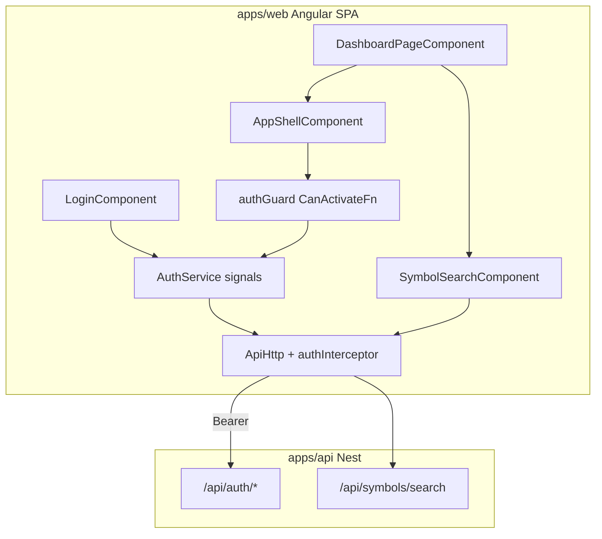

# Sprint 5.1 — Shell & Navigation (Angular)

**Status:** Plan ready (not started)  
**Roadmap marker:** Milestone 5 — Dashboard (Angular Frontend)  
**Branch (when implementing):** `feat/sprint-5-1-shell-navigation`  
**PR base:** `feat/sprint-4-3-trading-views` (stacked) → retarget `main` after 4.3 merges

**Overview:** Establish the full authenticated Angular app shell + routing, land users on `/dashboard` with skeleton placeholders, and ship a reusable symbol-search component wrapping `GET /api/symbols/search`. If Sprint 3.4 already pulled forward a minimal `apps/web` scaffold (recommended), **extend** that app — do not re-scaffold. No dashboard widgets yet (Sprint 5.2). Backend aggregation endpoint is intentionally skipped.

---

## Sprint scope and exit criteria

**Stories**

| ID | Title | Source |
|----|-------|--------|
| #7.1.1 | Authenticated app shell | [MVP_07](../product/stories/BitStockerz_MVP_07_Dashboard_UI_Stories.md) |
| #7.1.2 | Dashboard landing route | same |
| #2.4.2 | Reusable symbol search UI component | [MVP_02](../product/stories/BitStockerz_MVP_02_Market_Data_Stories.md) (title only today) |

**Exit (from [ROADMAP.md](../product/ROADMAP.md)):** Angular app exists with auth-gated shell, dashboard route, and symbol search reusable in later screens.

**Explicitly out of scope**

| Item | Why deferred |
|------|----------------|
| Widget data (portfolio, strategies, backtests, trades) | Sprint 5.2 |
| `GET /dashboard/summary` aggregator | Client-side parallel calls (JC-3); inventory recommends skip |
| Strategy Lab / Backtest / Trade full pages | Stub routes with “coming soon” or empty outlets only |
| Design system / component library (Material as product UI) | Prefer CSS variables + light shared styles (JC-2) |
| SSR / Angular Universal | Static SPA for MVP (Sprint 7.2) |
| OAuth redirect UX polish | Wire login path that already returns `access_token`; deep OAuth redirect hosting in 7.2 |

---

## Prerequisites (what must already exist)

| Capability | Location | Relevance |
|------------|----------|-----------|
| Bearer sessions (`access_token`, `token_type: Bearer`) | `apps/api` auth controllers | Angular interceptor attaches `Authorization` |
| `GET /api/auth/me` | `me.controller.ts` | Shell user menu / session check |
| `POST /api/auth/login` / logout | `auth.controller.ts` | Login + logout flows |
| `GET /api/symbols/search` | `symbols.controller.ts` | Symbol search component |
| CORS for browser origin | `main.ts` / config | Must allow `apps/web` origin in dev |
| Milestone 4 trading + Milestone 2–3 APIs | planned | Not required for 5.1 shell; widgets need them in 5.2 |
| Monorepo root | `package.json` | Add workspace scripts for `apps/web` |

---

## Draft acceptance criteria (lock before coding)

### #7.1.1 – Authenticated app shell

- Ensure Angular app exists at `apps/web` on latest stable Angular **19+** at implement time (JC-1). If 3.4 already created it, upgrade/align versions only as needed — do not `ng new` over existing work.
- Standalone components by default (no NgModules for feature UI).
- Global layout after login includes:
  - Top nav: logo + app name “BitStockerz”
  - Primary nav links: Dashboard, Trade, Strategies, Backtests
  - User menu: profile entry + logout
- All app routes under the shell require authentication via functional `CanActivateFn`.
- Unauthenticated users hitting protected routes redirect to `/login`.
- Logout clears stored token and returns to `/login`.
- Mobile: usable (nav collapses or wraps); perfection not required.
- Brand tokens via CSS variables in a thin global stylesheet (no heavy design system).

### #7.1.2 – Dashboard landing route

- Authenticated default route: `/dashboard`.
- Post-login navigation lands on `/dashboard`.
- Page renders shell + page title immediately; widget slots show skeleton loaders (no blocking “wait for all APIs”).
- Does not fetch widget APIs in this sprint (skeletons only, or empty placeholders labeled for 5.2).

### #2.4.2 – Reusable symbol search UI component

- Standalone component (e.g. `SymbolSearchComponent`) usable from any route.
- Calls `GET /api/symbols/search?q=&asset_type?&limit?` with debounce (≥200ms).
- Shows results list (symbol, name/display if present, asset type); keyboard and click select emit selected symbol.
- Handles empty query, empty results, and HTTP errors with inline messaging.
- Unit tests with mocked `HttpClient`.
- Demonstrated on dashboard (or a small Trade stub page) so QA can exercise it.

---

## API contract (client-only sprint)

No new Nest endpoints. Angular consumes existing APIs:

| Method | Path | Auth | Use |
|--------|------|------|-----|
| POST | `/api/auth/login` (and/or WebAuthn verify) | Public | Obtain `access_token` |
| POST | `/api/auth/logout` | Bearer | Clear server session |
| GET | `/api/auth/me` | Bearer | User menu / guard session probe |
| GET | `/api/symbols/search` | Public | Symbol search typeahead |

**Token storage (JC-4):** `sessionStorage` key `bs.access_token` (MVP). Interceptor reads it and sets `Authorization: Bearer <token>`.

**CORS:** Document `CORS_ORIGIN` (or existing equivalent) must include `http://localhost:4200` for `ng serve`.

**Skipped:** `GET /api/dashboard/summary` — widgets in 5.2 call domain APIs independently ([API_Inventory §7](../database/API_Inventory.md)).

---

## Architecture



### Proposed file layout

```text
apps/web/
  angular.json
  package.json
  src/
    main.ts
    index.html
    styles.css                 # CSS variables + minimal reset
    app/
      app.config.ts            # provideRouter, provideHttpClient(withInterceptors)
      app.routes.ts            # lazy loadChildren / loadComponent
      core/
        auth/
          auth.service.ts      # signals: token, user
          auth.guard.ts        # CanActivateFn
          auth.interceptor.ts  # functional interceptor
          token-storage.ts     # sessionStorage adapter
        api/
          api-base.ts          # environment API_BASE_URL
      layout/
        app-shell.component.ts
        user-menu.component.ts
      features/
        auth/login.component.ts
        dashboard/dashboard.page.ts
        symbols/symbol-search.component.ts
      shared/
        skeleton.component.ts
        formatters.ts          # currency/date stubs for 5.2
```

**Design principles**

1. Standalone + lazy routes (`loadComponent` / `loadChildren`) — [Angular routing](https://angular.dev/guide/routing).
2. Signals for local UI/auth state — [Angular signals](https://angular.dev/guide/signals).
3. Functional guards & interceptors — [functional guards](https://angular.dev/guide/routing/common-router-tasks#preventing-unauthorized-access), [HTTP interceptors](https://angular.dev/guide/http/interceptors).
4. Thin styling: CSS variables for brand color, spacing, type; avoid inventing a full design system.
5. No React, no Next.js — ROADMAP frontend target is Angular only.

---

## Implementation plan (ordered)

### 1. Ensure `apps/web` exists (scaffold or extend)

1. If `apps/web` missing: generate with Angular CLI (standalone, routing, CSS + variables).
2. If Sprint 3.4 already scaffolded it: reuse auth/API client; add shell/nav/dashboard routes without rewriting backtest feature modules.
3. Pin Node/Angular versions in `apps/web/package.json`; add root scripts: `web:start`, `web:build`, `web:test`.
4. `environment.ts` / `environment.development.ts` with `apiBaseUrl: 'http://localhost:4000/api'`.
5. Ensure `.gitignore` covers `apps/web/node_modules`, `.angular`.

### 2. Auth client foundation

1. `TokenStorage` → `sessionStorage` (JC-4).
2. `AuthService` signals: `accessToken`, `user`, `isAuthenticated`.
3. Functional `authInterceptor` attaches Bearer token.
4. Functional `authGuard`: if no token → `/login`; optional `GET /auth/me` to validate stale tokens.
5. Login page (email/password or existing API login shape); logout clears storage.

### 3. App shell + routes

1. `AppShellComponent` with top nav + router-outlet.
2. Routes: `/login` (public), shell children `/dashboard`, `/trade`, `/strategies`, `/backtests` (stubs OK).
3. Default authenticated redirect → `/dashboard`.
4. User menu shows display name/email from `/auth/me`.

### 4. Dashboard landing + skeletons

1. `DashboardPageComponent` with title + 4–6 skeleton slots (account, positions, strategies, backtests, trades, search).
2. No domain fetches yet; document “wired in 5.2”.

### 5. Symbol search (#2.4.2)

1. Debounced typeahead → `HttpClient.get(`${api}/symbols/search`, { params })`.
2. Emit `selected` output; clearable input.
3. Unit tests with `HttpTestingController`.

### 6. CORS + docs + gates

1. Confirm API CORS allows web origin; document env if missing.
2. Sync docs (table below).
3. `ng test` / `ng build` green; smoke: login → dashboard → search AAPL.

**Docs touch list**

| File | Update |
|------|--------|
| `docs/product/ROADMAP.md` | Mark 5.1 in progress/done; note `apps/web` scaffold |
| `docs/product/stories/BitStockerz_MVP_07_*.md` | Confirm AC status |
| `docs/product/stories/BitStockerz_MVP_02_*.md` | Add AC for #2.4.2 |
| `docs/database/API_Inventory.md` | Note client-side dashboard; no `/dashboard/summary` |
| `docs/manual-testing/manual_testing.md` | Angular shell + symbol search section |
| `README.md`, `CHANGELOG.md` | Web app scripts |
| `.cursor/skills/sprint-delivery/reference.md` | Branch map row |

---

## Best-practice checklist

- [ ] Standalone components (default) — https://angular.dev/guide/components
- [ ] Functional `CanActivateFn` — https://angular.dev/guide/routing/common-router-tasks
- [ ] Functional HTTP interceptor for Bearer — https://angular.dev/guide/http/interceptors
- [ ] Lazy routes via `loadComponent` / `loadChildren` — https://angular.dev/guide/routing
- [ ] Signals for local UI/auth state — https://angular.dev/guide/signals
- [ ] No `forkJoin` “dashboard mega-call” in this sprint (skeletons only)
- [ ] CSS variables for brand; minimal global CSS
- [ ] Conventional Commits: `feat: scaffold angular shell and symbol search`

---

## Risks and mitigations

| Risk | Mitigation |
|------|------------|
| CORS blocks browser calls | Document + set CORS for `localhost:4200` before QA |
| Auth token shape mismatch | Mirror API `access_token` / `Bearer` exactly from auth specs |
| Angular version churn | Pin latest stable at scaffold time; record in plan JC-1 |
| Over-building design system | Hard stop: CSS vars + a few shared components |
| Stub Trade/Strategies/Backtests confuse QA | Label “UI stub — data in later sprints” |
| Milestone 4 not merged | Stack PR; shell still ships with login + search |

---

## Dev input required

| # | Blocker | Why it blocks | Default if unanswered | Status |
|---|---------|---------------|----------------------|--------|
| 1 | Angular major version | Scaffold command / peer deps | ⏭ Latest stable 19+ at implement time | ⏭ recommended |
| 2 | Login UX (password vs passkey-first) | Affects first screen | ⏭ Dev login + token storage; passkey UI stretch | ⏭ stubbed |
| 3 | Brand colors / logo asset | Visual polish | ⏭ CSS vars with placeholder palette; logo text | ⏭ stubbed |
| 4 | CORS env var name | API may need change | ⏭ Add/allow `http://localhost:4200` | ⏸ if CORS missing |
| 5 | Base branch (4.3) | Stacked PR | Wait / stack on 4.3 | ⏸ until available |

---

## Judgement calls

| ID | Decision | Why | Discuss before implement if |
|----|----------|-----|-----------------------------|
| **JC-1** | Use **latest stable Angular 19+** (or current stable at implement time) | ROADMAP mandates Angular; stay on supported standalone/signals defaults | Org policy pins an older LTS |
| **JC-2** | **CSS variables + minimal global styles**; no Material/CDK-as-product-UI | Avoid inventing a heavy design system for MVP | Design wants a specific component library |
| **JC-3** | **Skip `GET /dashboard/summary`**; client-side independent calls in 5.2 | Matches API inventory recommendation and #7.5.1 resilience | Latency forces a BFF aggregator later |
| **JC-4** | Store bearer token in **`sessionStorage`** (not `localStorage`) | Safer MVP default (clears with tab session); API already bearer-based | Product requires “stay logged in” across browser restarts |
| **JC-5** | **Extend** `apps/web` if Sprint 3.4 already created it; only greenfield-scaffold when missing | Avoid duplicate scaffolds and lost backtest UI work ([3.4 JC-1](./sprint-3-4-backtest-ui.md)) | 3.4 deferred UI and never created `apps/web` |

---

## Suggested ticket breakdown

| Ticket | Estimate |
|--------|----------|
| Scaffold `apps/web` + envs + root scripts | 0.5d |
| Auth service, interceptor, guard, login/logout | 1.0d |
| App shell nav + lazy routes + user menu | 0.75d |
| Dashboard landing + skeletons | 0.5d |
| Symbol search component + tests + demo placement | 0.75d |
| CORS/docs/manual testing/CHANGELOG | 0.5d |

**Total:** ~4 engineering days.

---

## Definition of done

- [ ] `apps/web` builds and serves locally
- [ ] Auth guard protects shell routes; login/logout work against local API
- [ ] `/dashboard` shows shell + skeletons
- [ ] Symbol search hits `/api/symbols/search` with debounce + tests
- [ ] JCs recorded; docs synced; ROADMAP updated
- [ ] PR: `feat: scaffold angular shell and symbol search`

---

## References

- Angular docs: https://angular.dev  
- Standalone components: https://angular.dev/guide/components  
- Signals: https://angular.dev/guide/signals  
- HTTP interceptors: https://angular.dev/guide/http/interceptors  
- Routing / lazy loading: https://angular.dev/guide/routing  
- API inventory §2.4 / §7: `docs/database/API_Inventory.md`  
- ROADMAP Milestone 5: `docs/product/ROADMAP.md`  
- Sprint delivery: `.cursor/skills/sprint-delivery/SKILL.md`
