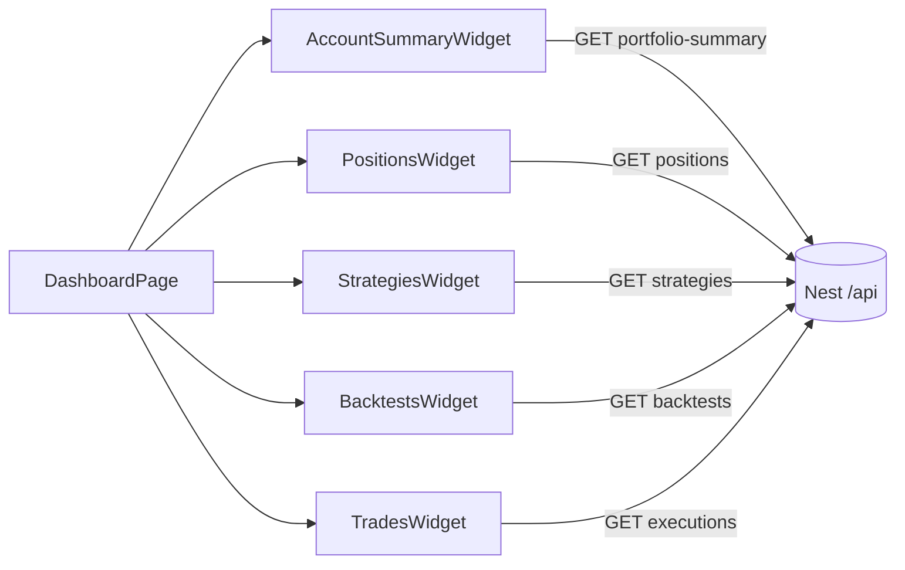

# Sprint 5.2 — Dashboard Widgets

**Status:** Completed (PR #11)  
**Roadmap marker:** Milestone 5 — Dashboard (Angular Frontend)  
**Branch:** `feat/sprint-5-dashboard-workflows`
**PR base:** `main`

**Overview:** Fill the authenticated dashboard with portfolio, positions, strategies, backtests, and trades widgets. Each widget fetches independently (no `forkJoin` mega-request, no `GET /dashboard/summary`). Ship empty states, inline errors, shared formatting, and MVP performance basics (limits, no polling).

---

## Sprint scope and exit criteria

**Stories**

| ID | Title | Source |
|----|-------|--------|
| #7.2.1 | Account summary card | [MVP_07](../product/stories/BitStockerz_MVP_07_Dashboard_UI_Stories.md) |
| #7.2.2 | Positions preview | same |
| #7.3.1 | Active strategies list | same |
| #7.3.2 | Strategy quick actions | same |
| #7.4.1 | Recent backtests widget | same |
| #7.4.2 | Recent trades widget | same |
| #7.5.1 | Independent widget loading | same |
| #7.5.2 | Empty and first-run states | same |
| #7.6.1 | Consistent formatting & components | same |
| #7.6.2 | Minimal performance optimization | same |

**Exit:** Dashboard surfaces all core system data (portfolio, strategies, backtests, trades) with resilient partial loading.

**Explicitly out of scope**

| Item | Why deferred |
|------|----------------|
| `GET /dashboard/summary` | JC-1 — client-side parallel calls |
| Drag-and-drop / custom layouts | MVP_07 out of scope |
| Real-time streaming / polling | #7.6.2 forbids polling |
| Full Strategy Lab / Trade workflows | Sprint 5.3; this sprint owns links and dashboard context |
| Server-side widget aggregation | Keep Nest thin |

---

## Prerequisites

| Capability | Location | Relevance |
|------------|----------|-----------|
| Angular shell, auth, skeletons | Sprint 5.1 `apps/web` | Host page |
| `GET /trading/portfolio-summary` | Milestone 4 | #7.2.1 |
| `GET /trading/positions` | Milestone 4 | #7.2.2 |
| `GET /trading/executions` | Milestone 4 | #7.4.2 |
| `GET /strategies` | Milestone 2 | #7.3.1–7.3.2 |
| `GET /backtests` | Milestone 3 | #7.4.1 |
| Bearer interceptor | 5.1 | All authenticated widget calls |
| Symbol search | 5.1 | Optional dashboard placement |

If a domain API is delayed, widget shows error/empty with stub fixture behind a `useMockWidgets` flag for UI development only — do not merge mocks as production default.

---

## Acceptance criteria (implementation contract)

### #7.2.1 – Account summary card

- Displays cash balance, total equity, unrealized P&L from `GET /api/trading/portfolio-summary`.
- Parses validated decimal strings at the display boundary; currency formatting + sign/color/icon/text for P&L (color is not the only signal).
- Loading skeleton → content or error independently.

### #7.2.2 – Positions preview

- Table: symbol, quantity, avg cost; first **N=5** from the API’s deterministic symbol-ascending order.
- Link to the canonical `/trade` workspace.
- Empty state when no positions.

### #7.3.1 – Active strategies list

- Columns: name, asset type, timeframe, last updated.
- Deleted/inactive hidden (API contract).
- Row click → canonical Strategy Lab detail/editor route `/strategies/:id`.

### #7.3.2 – Strategy quick actions

- Per row: **Edit**, **Run backtest**.
- Run backtest navigates to backtest form with strategy pre-selected (query params OK).

### #7.4.1 – Recent backtests widget

- Last **N=5**: strategy name, symbol, timeframe, status, created date.
- Click → `/backtests/:id`.

### #7.4.2 – Recent trades widget

- Last **N=5** from `GET /api/trading/executions`: time, symbol, side, quantity, price.
- Empty state with CTA to Trade.

### #7.5.1 – Independent widget loading

- Each widget owns its fetch (service method / `resource` / signal + `HttpClient`).
- Failure in one widget → inline error + retry; others unaffected.
- Do **not** wrap all widget calls in a single `forkJoin` that fails the page.
- Cancel subscriptions on destroy (`takeUntilDestroyed` or equivalent) and suppress stale responses after a retry/navigation.

### #7.5.2 – Empty and first-run states

| Condition | Copy / CTA |
|-----------|------------|
| No trades | “No trades yet” → Trade |
| No strategies | “Create your first strategy” → Strategies |
| No backtests | “Run a backtest” → Backtests |

### #7.6.1 – Consistent formatting & components

- Shared: table shell, card shell, empty-state component.
- Shared formatters: currency, percent, datetime (timezone: local display, document UTC source).

### #7.6.2 – Minimal performance optimization

- Request `limit=5&offset=0` for strategies/backtests/executions; positions are a bounded client slice because that endpoint intentionally returns the full small book.
- No polling; refresh on navigation or explicit Retry.
- Acceptable feel with seed/mock production-sized payloads.

---

## API contract (client aggregation)

**No new Nest endpoints.** Dashboard page issues parallel authenticated GETs:

| Widget | Endpoint | Notes |
|--------|----------|-------|
| Account summary | `GET /api/trading/portfolio-summary` | Auth |
| Positions | `GET /api/trading/positions` | Client slice first 5; API is already active/non-zero only |
| Strategies | `GET /api/strategies?limit=5&offset=0` | Read `items`; API already filters inactive |
| Backtests | `GET /api/backtests?limit=5&offset=0` | Read `items`, including `strategy_name` |
| Trades | `GET /api/trading/executions?limit=5&offset=0` | Read `executions` |

**Skipped (JC-1):** `GET /api/dashboard/summary`.

Example independent load pattern (signals — illustrative):

```typescript
// each widget component
readonly state = signal<'loading' | 'ready' | 'error' | 'empty'>('loading');
readonly data = signal<PortfolioSummary | null>(null);

ngOnInit() {
  this.api.getPortfolioSummary().subscribe({
    next: (v) => { this.data.set(v); this.state.set('ready'); },
    error: () => this.state.set('error'),
  });
}
```

---

## Architecture



### Proposed file layout

```text
apps/web/src/app/features/dashboard/
  dashboard.page.ts
  widgets/
    account-summary.widget.ts
    positions-preview.widget.ts
    strategies-list.widget.ts
    recent-backtests.widget.ts
    recent-trades.widget.ts
  data/
    trading-api.service.ts
    strategies-api.service.ts
    backtests-api.service.ts
apps/web/src/app/shared/
  ui/
    bs-card.component.ts
    bs-table.component.ts
    empty-state.component.ts
    inline-error.component.ts
    skeleton.component.ts
  format/
    currency.pipe.ts
    percent.pipe.ts
    datetime.pipe.ts
```

**Design principles**

1. Widget = presentation + its own load lifecycle (Angular signals / local state).
2. Shared pipes/components for consistency (#7.6.1).
3. Navigation uses `RouterLink` / `Router.navigate` with query params for “Run backtest”.
4. Failure isolation > clever batching.

---

## Implementation plan (ordered)

### 1. Shared UI primitives

1. Card, table, empty-state, inline-error, skeleton.
2. Currency / percent / datetime pipes with unit tests.

### 2. API client services

1. Thin HttpClient wrappers returning typed models matching API inventory snake_case → map to camelCase in one place if preferred (be consistent with 5.1).
2. Encode the exact wrapper/decimal contracts above; reject malformed payloads into the widget’s error state rather than rendering `NaN`/`Invalid Date`.

### 3. Widgets (one PR-sized chunk each)

1. Account summary → Positions → Strategies (+ actions) → Backtests → Trades.
2. Each: loading / ready / empty / error states.

### 4. Dashboard composition

1. Replace 5.1 skeletons with widgets in a simple CSS grid.
2. Verify one failing widget (force 500 mock) does not blank others.

### 5. Performance pass

1. Cap lists at N=5; no interval timers.
2. Manual timing note in testing doc (NFR dashboard &lt;500ms cached is aspirational until 7.1 cache).

### 6. Docs + tests

| File | Update |
|------|--------|
| MVP_07 story statuses | Mark 7.2–7.6 done |
| `API_Inventory.md` §7 | Explicitly “client-side; summary skipped” |
| `manual_testing.md` | Dashboard widget matrix |
| `CHANGELOG.md` / ROADMAP | Milestone 5 exit |
| `apps/web` unit tests | Widgets + pipes |

---

## Best-practice checklist

- [x] Standalone widget components — https://angular.dev/guide/components
- [x] Signals for per-widget UI state — https://angular.dev/guide/signals
- [x] Independent fetches (no page-level `forkJoin`) — resilience #7.5.1
- [x] Lazy-loaded dashboard route retained from 5.1 — https://angular.dev/guide/routing
- [x] Auth interceptor still attaches Bearer — https://angular.dev/guide/http/interceptors
- [x] Empty states with clear CTAs
- [x] Conventional Commits: `feat: add dashboard widgets with independent loading`

---

## Risks and mitigations

| Risk | Mitigation |
|------|------------|
| Domain APIs incomplete | Feature-flag mock widgets for UI; fail closed in prod builds |
| Snake_case vs camelCase drift | Single mapper layer + typed interfaces |
| Large strategy/backtest payloads | Request canonical `limit=5&offset=0`; do not fetch full lists for previews |
| Navigation targets missing | Stub destination pages with “coming soon” + params preserved |
| Visual inconsistency | Shared card/table/empty only — no one-off styles per widget |

---

## Adopted defaults and override triggers

| # | Blocker | Why it blocks | Default if unanswered | Status |
|---|---------|---------------|----------------------|--------|
| 1 | Confirm skip `/dashboard/summary` | Backend work vs client | Skip (JC-1) | Adopted |
| 2 | N for previews (5) | UX density | N=5 | Adopted |
| 3 | Exact editor/backtest routes | Deep links | `/strategies/:id`, `/backtests/new?strategy_id=` | Adopted; Sprint 5.3 makes all targets functional |
| 4 | P&L tokens | Brand/accessibility | Positive/negative CSS vars plus sign/text, never color alone | Adopted |

---

## Judgement calls

| ID | Decision | Why | Discuss before implement if |
|----|----------|-----|-----------------------------|
| **JC-1** | **Client-side parallel widget calls**; do not implement `GET /dashboard/summary` | Inventory §7 recommends Angular independent calls; matches #7.5.1 | Measured latency requires BFF |
| **JC-2** | Prefer **per-widget `HttpClient` + signals** over RxJS `forkJoin` page loader | Failure isolation and simpler loading UX | Team standardizes on a global resource store |
| **JC-3** | **N=5** for positions/backtests/trades previews | Matches story “top N / last N” examples | Product wants different N |
| **JC-4** | Refresh **only on navigate/retry**, never polling | #7.6.2 AC | Live paper-trading ticker requested early |

---

## Suggested ticket breakdown

| Ticket | Estimate |
|--------|----------|
| Shared UI + formatters + tests | 0.75d |
| API client services | 0.5d |
| Account + positions widgets | 0.75d |
| Strategies list + quick actions | 0.75d |
| Backtests + trades widgets | 0.75d |
| Empty/error matrix + perf pass + docs | 0.5d |

**Total:** ~4 engineering days.

---

## Definition of done

- [x] All #7.2–#7.6 stories meet AC
- [x] Independent failure demo documented in manual testing
- [x] No `/dashboard/summary` endpoint added
- [x] Unit tests for formatters + at least one widget error path
- [x] ROADMAP Sprint 5.2 stories marked complete; Milestone 5 exit waits for 5.3
- [x] PR: `feat: add dashboard widgets with independent loading`

---

## References

- MVP_07 Dashboard stories: `docs/product/stories/BitStockerz_MVP_07_Dashboard_UI_Stories.md`
- API Inventory §3 / §4 / §5 / §7: `docs/database/API_Inventory.md`
- Angular signals: https://angular.dev/guide/signals
- NFR dashboard load: `docs/product/requirements/Non_Functional_Requirements.md`
- Sprint 5.1 plan: `docs/plans/sprint-5-1-shell-navigation.md`
