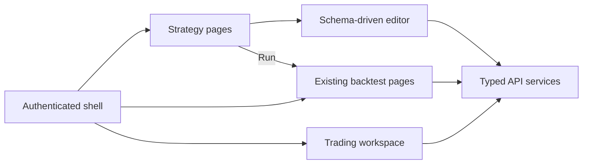

# Sprint 5.3 — Core Workflows UI

**Status:** Plan ready (not started)

**Roadmap marker:** Milestone 5 integration/coverage closure

**Branch (when implementing):** `feat/sprint-5-3-core-workflows-ui`
**PR base:** `feat/sprint-5-2-dashboard-widgets` (or `main` after 5.2 merges)

**Overview:** Replace the shell’s Strategy and Trade placeholders with the minimum complete Angular workflows promised by `MVP.md` and `UX_Flows.md`: create/edit/validate/soft-delete a rule-based strategy, launch its backtest, place a paper market order, and immediately inspect the updated portfolio/history. This is a UI integration slice over already planned APIs, not a new backend domain.

---

## Sprint scope and exit criteria

**Coverage traced to existing product commitments**

| Product commitment | Source | UI delivered here |
|--------------------|--------|-------------------|
| Rule-based Strategy Lab, parameter inputs, save/load | [MVP.md §4](../product/MVP.md), Strategy stories #4.2–#4.6 | Strategy list + schema-driven create/edit/detail |
| Strategy → Backtest flow | [UX_Flows §1](../product/UX_Flows.md), Backtest stories #5.3–#5.4 | Strategy quick action → `/backtests/new` → results |
| Paper Trading flow | [UX_Flows §2](../product/UX_Flows.md), Trading stories #3.2–#3.5 | Trade ticket + portfolio/position/history refresh |
| Dashboard quick-action destinations | Sprint 5.2 #7.3.2 | All links land on functional routes |

**Exit:** An authenticated user can complete both documented UX flows without curl, manually copying database ids, or landing on “coming soon” placeholders.

**Explicitly out of scope**

| Item | Why deferred |
|------|--------------|
| Drag-and-drop/nested strategy builder | MVP definition is ordered AND-only groups |
| Candlestick chart/indicator overlays | Backtest UI owns equity only; market chart is post-MVP |
| Limit/stop orders, cancel/amend, partial fills | Backend MVP is synchronous market-only |
| Account reset, deposits, withdrawals, realized-P&L analytics | No canonical MVP API |
| AI panels | Sprints 6.2–6.3 attach to the pages created here |
| New Nest endpoints or DB migrations | Existing Milestones 2–4 contracts are sufficient; contract defects are fixed in their owning sprint |

---

## Prerequisites

| Capability | From | Use |
|------------|------|-----|
| Angular shell/auth/shared UI | 3.4 / 5.1 / 5.2 | Routes, guards, API/error primitives |
| Indicator catalog + strategy CRUD/validate | 2.2 / 2.3 | Schema-driven Strategy Lab |
| Backtest create/list/detail | 3.3 / 3.4 | Launch and results navigation |
| Symbol search | 5.1 | Strategy/backtest/trade symbol selection |
| Paper account/order/position/portfolio/history APIs | 4.1–4.3 | Trading workspace |

The predecessor contract verification step must confirm the exact response wrappers, decimal strings, field-error shape, and pagination metadata before components are written.

---

## Acceptance criteria (implementation contract)

### Strategy list and detail

- `/strategies` loads `GET /api/strategies?limit=50&offset=0` and renders active strategies with stable loading/empty/error states.
- “Create strategy” routes to `/strategies/new`; row click/Edit routes to `/strategies/:id`.
- Detail loads the latest version, shows deterministic summary/version metadata, and offers Edit, Run backtest, and Delete.
- Delete requires confirmation, calls `DELETE`, handles 204, then returns to the list. A 404 after a concurrent delete is treated as already gone.
- Historical versions are viewable through a version selector using `GET /strategies/:id?version=N`; historical view is read-only and clearly labelled.

### Strategy editor

- Reactive form fields: name, description, asset type, timeframe, indicators, entry conditions, exit conditions, stop loss %, take profit %.
- Indicator rows are driven by `GET /api/strategies/indicators`; do not duplicate parameter min/max/default metadata in Angular.
- Each indicator gets a user-editable unique id; condition operand selectors reference current ids and prevent dangling selections after removal.
- Entry/exit groups are AND-only, 1–10 conditions. Indicators are capped at 20. UI applies the canonical source/period/percent bounds but the API remains authoritative.
- Asset/timeframe behavior: equity fixes timeframe to `1d`; crypto permits `1d|1h`.
- “Validate” calls `POST /api/strategies/validate` with the definition, maps returned paths to fields/rows, and shows the deterministic summary when valid.
- “Save” revalidates and calls POST for new or PUT for existing. Metadata-only edits omit `definition`; any editor change to the definition includes it and therefore creates a new version.
- Unsaved-change guard covers route changes/browser close. Successful save updates the local version and clears dirty state.
- Unknown/new catalog entries fail visibly as unsupported instead of being silently discarded.

### Backtest launch integration

- Strategy detail “Run backtest” routes to `/backtests/new?strategy_id=<id>`.
- The existing 3.4 form resolves the strategy name/version, locks timeframe to the strategy, and uses symbol search filtered to the strategy asset type.
- Date inputs are labelled UTC; date-only end values follow the API’s inclusive end-of-day contract.
- Submit disables duplicate requests, displays RFC 7807 field/domain errors, then navigates to `/backtests/:id` on success.

### Trading workspace

- `/trade` contains:
  - account/portfolio summary;
  - non-zero positions;
  - symbol search;
  - market BUY/SELL ticket with decimal-string quantity;
  - recent orders and executions with offset pagination/load-more.
- Generate one UUID `client_order_id` when a submit attempt begins and retain it across transport retries until a terminal response arrives. Editing symbol/side/quantity creates a new id.
- A `FILLED` response shows fill price/time; a `REJECTED` response shows user copy mapped from the stable reject-reason enum. DTO/404/409/5xx RFC 7807 failures remain distinct from business rejection.
- On terminal response, refresh account, positions, orders, and executions independently. A failed refresh does not erase the confirmed order result.
- SELL quantity cannot exceed the currently displayed position, but the server remains authoritative for races.
- All decimal strings are validated before display/math. Currency aggregates/notional render at 2dp; quantity/unit price/avg cost at 8dp.

### Cross-cutting UX, safety, and tests

- Auth guard and 401 handling reuse 5.1; no feature stores bearer tokens separately.
- API model mapping is centralized per domain; components do not hand-map snake_case payloads repeatedly.
- Every page has loading, empty, validation, domain-error, retry, and success states.
- Forms are keyboard usable with associated labels, error summaries, focus moved to the first invalid control, and no color-only status.
- Model/API text renders through escaped Angular interpolation; never bind server/model strings to `innerHTML`.
- Component tests cover definition serialization, server error-path mapping, metadata-only PUT behavior, retained order id on retry, rejected-order UX, and post-fill refresh isolation.
- One browser e2e covers each complete flow using seed mode.

---

## API contract (consumption only)

No new endpoints.

| Area | Endpoints |
|------|-----------|
| Strategy | `GET /strategies/indicators`, `POST/GET/PUT/DELETE /strategies`, `POST /strategies/validate` |
| Backtest | `POST /backtests`, `GET /backtests/:id` |
| Trading | `GET /paper-account`, `POST /trading/orders`, `GET /trading/positions`, `GET /trading/portfolio-summary`, `GET /trading/orders`, `GET /trading/executions` |
| Market data | `GET /symbols/search` |

All paths are under `/api`. The indicator catalog and symbol search are public; every other call uses the shared bearer interceptor.

**Client error mapping**

| HTTP/code | UX |
|-----------|----|
| 400 / strategy validation | Field/row errors + summary; retain form |
| 401 | Shared session clear + login redirect |
| 404 owned resource | “No longer available” + safe route back |
| 409 conflict | Duplicate strategy name or idempotency payload mismatch; retain user input |
| 422 trading valuation/ledger read | Inline domain message; do not fabricate values |
| 429 | Retry guidance; keep form/result state |
| 500/502/504 | Bounded generic message + request id where supplied |

---

## Architecture



### Proposed file layout

```text
apps/web/src/app/features/
  strategies/
    pages/strategy-list.page.ts
    pages/strategy-detail.page.ts
    pages/strategy-editor.page.ts
    components/indicator-editor.component.ts
    components/condition-group-editor.component.ts
    data/strategies-api.service.ts
    data/strategy-form.mapper.ts
    models/strategy.models.ts
  trading/
    pages/trading-workspace.page.ts
    components/order-ticket.component.ts
    components/order-result.component.ts
    data/trading-api.service.ts
    models/trading.models.ts
  backtests/
    pages/backtest-new.page.ts        # extend 3.4
apps/web/e2e/                         # use scaffold’s selected browser runner
```

**State boundaries**

1. Pages own orchestration and route params.
2. Editor components receive typed form groups/catalog metadata and emit user changes; they do not call HTTP.
3. API services map transport models once.
4. After writes, invalidate/refetch the smallest affected page data. Do not introduce a global state library in this sprint.

---

## Implementation plan (ordered)

### 1. Contract fixtures and routes

1. Check in/update frozen strategy and trading response fixtures from owning API plans.
2. Add real lazy routes for `/strategies`, `/strategies/new`, `/strategies/:id`, and `/trade`; preserve `/backtests/new`.
3. Replace dashboard/shell placeholder destinations.

### 2. Strategy read path

1. Typed service/mappers, list/detail/version selector.
2. Delete confirmation and route behavior.
3. Loading/empty/error component tests.

### 3. Strategy editor

1. Catalog-driven indicator form.
2. Condition/risk editors and definition serializer.
3. Validate/save/dirty guard + field-error mapping.
4. Create/update/version e2e.

### 4. Backtest launch

1. Resolve strategy query param and filter symbol search.
2. Lock timeframe/date normalization and submission states.
3. Verify navigation into existing detail chart/table.

### 5. Trading workspace

1. Summary/positions/history reads.
2. Order ticket, retained idempotency key, terminal result.
3. Independent post-order refresh and error handling.
4. BUY/SELL/reject/retry e2e.

### 6. Gates and docs

```bash
npm --prefix apps/web run lint
npm --prefix apps/web run test
npm --prefix apps/web run build
npm --prefix apps/web run e2e
npm --prefix apps/api run test:e2e
```

If the 3.4 scaffold has no browser-e2e runner, add pinned Playwright dependencies and the `e2e` script in this sprint. If it has one, reuse its committed script rather than introducing a second runner.

Update ROADMAP with Sprint 5.3, UX flow verification, manual testing click paths, README scripts, CHANGELOG, and the delivery branch map.

---

## Best-practice checklist

- [ ] Standalone, lazy-loaded feature routes; no duplicate Angular scaffold or global state library
- [ ] Strict typed reactive forms and one catalog-driven definition serializer
- [ ] Central transport-to-domain mappers; components do not repeat snake_case conversion
- [ ] Decimal strings remain strings outside bounded display formatting
- [ ] Order retries retain one idempotency key for the unchanged attempt
- [ ] Server/model text uses escaped interpolation; no `innerHTML`
- [ ] Keyboard, focus, label, error-summary, and non-color-only status coverage
- [ ] Component contract tests plus two complete seed-mode browser flows
- [ ] Conventional Commit: `feat: add core strategy and paper-trading workflows`

---

## Adopted defaults and override triggers

| # | Decision | Default | Status |
|---|----------|---------|--------|
| 1 | Builder style | Ordered reactive-form rows; no drag-and-drop | Adopted |
| 2 | State management | Feature services + signals/RxJS; no global store | Adopted |
| 3 | Historical versions | Read-only selector on detail | Adopted |
| 4 | Trading layout | One workspace page; no separate portfolio route required | Adopted |
| 5 | Browser e2e runner | Reuse the 3.4 runner; if absent, add pinned Playwright with an `e2e` script | Adopted |

---

## Judgement calls

| ID | Decision | Why | Discuss before implement if |
|----|----------|-----|-----------------------------|
| **JC-1** | Use ordered reactive-form rows, not drag-and-drop | Matches the AND-only MVP schema and keeps keyboard behavior predictable | Product approves nested/OR visual composition |
| **JC-2** | Use feature services plus signals/RxJS; no global store | The workflows have bounded page-local orchestration | Cross-feature state duplication is demonstrated in profiling/implementation |
| **JC-3** | Historical strategy versions are read-only on detail | Preserves immutable-version semantics and avoids editing the wrong base | Product requests “clone this version” as a separate action |
| **JC-4** | One `/trade` workspace owns ticket, result, portfolio, and history | Keeps the documented paper-trading flow in one navigable surface | UX research requires separate portfolio/order routes |
| **JC-5** | Reuse the browser runner from 3.4, otherwise add pinned Playwright | Avoids two e2e stacks while guaranteeing a runnable fallback | The repository standardizes on another runner before this sprint |

---

## Risks and mitigations

| Risk | Mitigation |
|------|------------|
| Definition form drifts from backend schema | Catalog-driven controls + fixture/serializer contract tests |
| Dynamic condition refs break after indicator removal | Block removal or require remap; validator remains authoritative |
| Decimal precision loss | Keep transport strings; parse only for bounded display, never ledger calculations |
| Duplicate orders on network retry | Retain one `client_order_id` for the unchanged attempt |
| Page becomes a monolith | Split editor/trading presentational components; page owns orchestration |
| Scope expands into a design system | Reuse 5.2 primitives; functional workflows are the exit criterion |

---

## Suggested ticket breakdown

| Ticket | Estimate |
|--------|----------|
| Routes + contract fixtures + client mappers | 0.75d |
| Strategy list/detail/history/delete | 1.0d |
| Strategy editor/validate/save | 2.0d |
| Backtest launch integration | 0.5d |
| Trading workspace/order flow | 1.5d |
| Browser e2e + accessibility/error pass + docs | 1.0d |

**Total:** ~6.75 engineering days.

---

## Definition of done

- [ ] Strategy and paper-trading routes contain no placeholders
- [ ] Both `UX_Flows.md` happy paths complete in the Angular app
- [ ] Strategy definition serializer matches 2.2 and validates against 2.3
- [ ] Unchanged order retries reuse one client id and cannot double-fill
- [ ] Browser e2e covers Strategy → Backtest → Results and BUY/SELL/reject flows
- [ ] Web lint/test/build/e2e and API e2e are green
- [ ] ROADMAP/UX/manual testing/README/CHANGELOG are synced

---

## References

- [MVP feature list](../product/MVP.md)
- [UX flows](../product/UX_Flows.md)
- [Sprint 2.2 schema](./sprint-2-2-indicators-rule-schema.md)
- [Sprint 2.3 CRUD](./sprint-2-3-strategy-crud-validation.md)
- [Sprint 3.4 backtest UI](./sprint-3-4-backtest-ui.md)
- [Sprint 4.2 orders](./sprint-4-2-orders-executions.md)
- [Sprint 4.3 trading views](./sprint-4-3-trading-views.md)
- [Sprint 5.2 dashboard](./sprint-5-2-dashboard-widgets.md)
