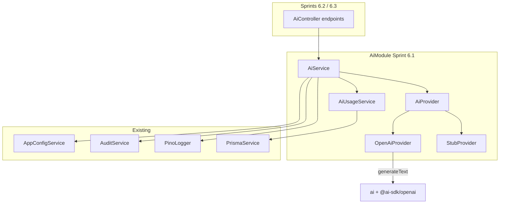

# Sprint 6.1 — AI Infrastructure

**Status:** Shipped on `feat/milestone-6-ai-kernel` (combined with Milestone 7 in PR #12)  
**Roadmap marker:** Milestone 6 — AI Assistant / Kernel  
**Branch (when implementing):** `feat/milestone-6-ai-kernel`  
**PR base:** `main` after Milestone 5 / PR #11 merges (or stack on
`feat/sprint-5-dashboard-workflows` until then)

**Overview:** Stand up the Kernel AI foundation: a typed provider abstraction using AI SDK v6 structured output, direct OpenAI adapter + explicit stub provider, atomic daily usage limits (`ai_usage` / migration V0600), feature flag `AI_ENABLED`, metadata-only AI observability, and user-facing “not financial advice” disclaimers. No public explain/validate routes yet (6.2/6.3); Sprint 6.1 exports the tested `AiService` contract used by later sprints.

---

## Sprint scope and exit criteria

**Stories**

| ID | Title | Source |
|----|-------|--------|
| #6.1.1 | AI service abstraction | [MVP_06](../product/stories/BitStockerz_MVP_06_Kernel_AI_Assistant_Stories.md) (title-only) |
| #6.1.2 | AI usage limits & guardrails | same |
| #6.5.2 | Prompt & response logging (internal) | same |
| #6.5.1 | AI disclaimer & confidence labeling | same |
| #8.5.2 | Feature flags for AI, limits, experimental paths | [MVP_08](../product/stories/BitStockerz_MVP_08_Backend_Infrastructure_Stories.md) |

**Exit:** AI can be enabled/disabled, rate-limited per user/day, logged safely, and invoked via a provider interface without mutating strategies/orders.

**Explicitly out of scope**

| Item | Why deferred |
|------|----------------|
| `POST /ai/explain-strategy` etc. product logic | Sprints 6.2 / 6.3 |
| Streaming LLM responses | JC-2 — MVP non-streaming JSON |
| Autonomous edits / trading | Hard product out of scope |
| Storing full prompts/responses in MySQL or normal logs | JC-4 — size, strategy data, and PII |
| Multi-provider routing / cost optimization | OpenAI default + stub |

---

## Prerequisites

| Capability | Location | Relevance |
|------------|----------|-----------|
| `AppConfigService` | `apps/api/src/config` | Flags + limits + API keys |
| `AuthGuard` / sessions | `auth/` | Per-user usage |
| `AuditService` | `observability/audit.service.ts` | `ai.invocation` events |
| Pino structured logs | `common/logging` | Full prompt/response at debug/info with redaction |
| Prisma + migrations | `apps/api/prisma` | `ai_usage` table |
| DDL skeleton | `docs/database/DDL/05_ai_kernel.sql` | Source of truth for V0600 |
| Strategies / backtests readable | Milestones 2–3 | Needed before 6.2/6.3; 6.1 can unit-test with stubs |

---

## Acceptance criteria (implementation contract)

### #6.1.1 – AI service abstraction

- Nest `AiModule` exports `AiService`.
- Interface `AiProvider` exposes a generic structured-generation method that accepts a runtime schema, `AbortSignal`, operation name, system instructions, and prompt; it returns the schema-validated object plus bounded usage/model metadata.
- Implementations:
  - `OpenAiProvider` using AI SDK v6 `generateText` + `Output.object({ schema })` + direct `@ai-sdk/openai` model selection (JC-1).
  - `StubProvider` deterministic structured responses for tests and explicitly configured local development.
- Selection is explicit through `AI_PROVIDER=stub|openai`: tests force `stub`; production with `AI_ENABLED=true` requires `openai`, `OPENAI_API_KEY`, and `AI_MODEL` at startup. Never silently fall back to stub because a production key is missing.
- AI **never** writes to strategies, orders, positions, or job executors; it returns advisory structured content only.
- Unit tests cover provider selection, runtime-schema success/failure, timeout mapping, and stub path without network.

### #6.1.2 – Usage limits & guardrails

- Table `ai_usage` (`user_id`, `date`, `calls`) via Prisma migration aligned to V0600 / DDL.
- Before each provider invocation, atomically consume a call for `userId` and UTC date. In Prisma mode, use one transaction with unique-key upsert/increment and throw to roll back if the returned count exceeds the limit; do not use check-then-increment.
- Exceeding `AI_DAILY_CALL_LIMIT` (default **20**, valid range 1–1000) → `429 AI_RATE_LIMIT`.
- When `AI_ENABLED=false` → `503 AI_DISABLED`.
- Seed/in-memory mode: in-memory `Map` usage counters when Prisma disabled.
- Disabled/invalid/over-quota requests do not consume quota. A provider attempt does consume one call even if the upstream fails; SDK retries within that attempt do not consume additional application quota.
- Guardrail: the service accepts operation-specific prompt builders only; callers cannot submit arbitrary user prompts or tools. No tools are registered.

### #6.5.1 – Disclaimers & confidence labeling

- Every later AI HTTP success response includes:
  - `disclaimer: "Not financial advice. Kernel suggestions are informational only."` (adopted placeholder; external legal approval is required before public enablement).
  - `confidence: "LOW" | "MEDIUM" | "HIGH"` (required).
  - `ai_request_id` for log/audit correlation.
- Angular consumers (later) must display the disclaimer; in 6.1, lock the shared envelope DTO and verify it through the `AiModule` + `StubProvider` integration test. No HTTP probe route is added.

### #6.5.2 – Prompt & response logging

- On each invocation log structured Pino fields: provider, model, user id, operation, latency, prompt/response character counts and SHA-256 hashes, token usage when available, finish reason, success/fail, `ai_request_id`, and request id.
- Default `AI_LOG_CONTENT=false`. Normal production logs never include prompt/response content. A non-production-only opt-in may emit sanitized content at debug level with a hard 2,000-character bound; the flag is rejected in production.
- Emit `AuditService.record({ eventType: 'ai.invocation', payload })` **without** prompt/response bodies (ids, operation, model, token counts, success/fail only) — JC-4.
- Never log passwords, session tokens, or raw Authorization headers.
- Unit test: audit payload excludes `prompt`/`response` full text.

### #8.5.2 – Feature flags

- Config domain `features` / `ai`:
  - `AI_ENABLED` (bool, default `false` in every environment; live use is explicit).
  - `AI_DAILY_CALL_LIMIT` (int, default `20`, valid range 1–1000).
  - `AI_PROVIDER` (`stub` | `openai`; test default `stub`, production-live must be `openai`).
  - `AI_MODEL` (required non-empty model id when the OpenAI provider is enabled; no stale compiled model default).
  - `AI_TIMEOUT_MS` (default `15000`, range 1000–60000), `AI_MAX_RETRIES` (default `1`, range 0–3), `AI_MAX_OUTPUT_TOKENS` (default `1200`, range 1–4000).
  - `AI_MAX_CONTEXT_CHARS` (default `12000`, range 1000–50000); operation context builders must fit this deterministic budget before provider invocation.
  - `AI_LOG_CONTENT` (default `false`; must remain false in production).
  - `OPENAI_API_KEY` (secret; may be absent only while AI is disabled or `AI_PROVIDER=stub`).
- All reads via `AppConfigService` (no raw `process.env` in services).
- `.env.example` documents names only.
- Unit tests: flag off short-circuits provider.

**Probe endpoint for 6.1 (internal / testable):**

Do not add `POST /api/ai/ping`. Cover the service through unit tests plus an integration test that boots `AiModule` with `StubProvider` (JC-5).

---

## API contract

Product routes land in 6.2/6.3. This sprint establishes the shared response intersection:

```ts
type AiResponse<T extends object> = T & {
  disclaimer: string;
  confidence: 'LOW' | 'MEDIUM' | 'HIGH';
  ai_request_id: string;
};
```

Errors (RFC 7807 via existing filter):

| Code | HTTP | When |
|------|------|------|
| `AI_DISABLED` | 503 | `AI_ENABLED=false` |
| `AI_RATE_LIMIT` | 429 | Daily calls exceeded |
| `AI_PROVIDER_ERROR` | 502 | Upstream failure |
| `AI_TIMEOUT` | 504 | Provider deadline/abort |
| `VALIDATION_ERROR` | 400 | Bad body (later) |

Migration: `apps/api/prisma/migrations/YYYYMMDDHHMMSS_sprint_6_1_ai_usage/` implementing V0600:

```sql
-- from DDL/05_ai_kernel.sql
CREATE TABLE ai_usage (
  id INT UNSIGNED NOT NULL AUTO_INCREMENT,
  user_id CHAR(36) NOT NULL,
  date DATE NOT NULL,
  calls INT NOT NULL,
  PRIMARY KEY (id),
  UNIQUE KEY uq_ai_usage_user_date (user_id, date),
  CONSTRAINT fk_ai_usage_user FOREIGN KEY (user_id) REFERENCES users(id)
    ON DELETE RESTRICT ON UPDATE CASCADE
) ENGINE=InnoDB DEFAULT CHARSET=utf8mb4 COLLATE=utf8mb4_unicode_ci;
```

---

## Architecture



### Proposed file layout

```text
apps/api/src/ai/
  ai.module.ts
  ai.service.ts
  ai.service.spec.ts
  ai.types.ts
  ai-usage.service.ts
  ai-usage.service.spec.ts
  providers/
    ai-provider.ts          # interface
    openai.provider.ts
    stub.provider.ts
  dto/
    ai-response.envelope.ts # disclaimer + confidence
apps/api/prisma/migrations/..._sprint_6_1_ai_usage/
apps/api/src/config/app-config.service.ts  # AI_* flags
```

**Dependencies:** pin compatible AI SDK v6 `ai`, `@ai-sdk/openai`, and `zod` versions in `apps/api/package-lock.json`. Current v6 contract uses `generateText({ output: Output.object(...) })` and reads the parsed value from `result.output`; malformed/schema-invalid output throws and maps to `AI_PROVIDER_ERROR` rather than falling back to raw text.

---

## Implementation plan (ordered)

### 1. Config + feature flags (#8.5.2)

1. Extend `loadAppConfig` with all AI config keys above.
2. Fail fast when `AI_ENABLED=true` with a missing/invalid provider, model, or key; allow an empty key only when AI is disabled or the provider is explicitly `stub`.
3. `.env.example` + unit tests.

### 2. Migration V0600 (`ai_usage`)

1. Prisma model `AiUsage` matching DDL (already sketched in `docs/database/schema.prisma` — port to `apps/api/prisma/schema.prisma` if missing).
2. Migration folder; `User.aiUsage` relation.
3. Update `Migrations_Plan.md` with Prisma folder name.

### 3. Providers (#6.1.1)

1. `AiProvider` interface.
2. `StubProvider` returns deterministic objects that are validated by the same runtime schema as live output.
3. `OpenAiProvider` wraps non-streaming AI SDK v6 `generateText` with `Output.object`, direct `openai(modelId)`, total timeout/abort, output-token cap, and bounded retries (JC-2).
4. Factory provider in Nest DI.

### 4. Usage + AiService (#6.1.2, #6.5.x)

1. `AiUsageService.consume(userId)` atomic transactional increment/limit check on `(user_id, date)`.
2. Generic `AiService.invoke({ userId, operation, schema, system, prompt, signal? })`:
   - validate operation → check flag/config → consume quota → call provider → metadata log → audit `ai.invocation` → add envelope fields.
3. System prompt always includes: advisory-only, never instruct user that AI can place trades; include disclaimer instruction.

### 5. Tests + docs

```bash
npm --prefix apps/api run build
npm --prefix apps/api run test
npm --prefix apps/api run test:cov
npm --prefix apps/api run test:e2e
```

| File | Update |
|------|--------|
| MVP_06 / MVP_08 | Write AC into story files |
| `API_Inventory.md` §6 | Note foundation; endpoints 6.2+ |
| `Migrations_Plan.md` | V0600 Prisma name |
| `Observability.md` | `ai.invocation` audit + Pino fields |
| `.env.example` | AI_* vars |
| `manual_testing.md` | Flag off/on + rate limit |
| ROADMAP / CHANGELOG | 6.1 status |

---

## Best-practice checklist

- [ ] Vercel AI SDK `generateText` — https://ai-sdk.dev/docs/ai-sdk-core/generating-text
- [ ] `@ai-sdk/openai` provider — https://ai-sdk.dev/providers/ai-sdk-providers/openai
- [ ] Config via DI only (Sprint 0.1 pattern)
- [ ] Feature flag kill switch `AI_ENABLED`
- [ ] Daily quota via `ai_usage`
- [ ] Never mutate trading/strategy state from AI module
- [ ] Metadata-only production logs; no prompt/response bodies in MySQL (JC-4)
- [ ] Conventional Commits: `feat: add ai kernel infrastructure and usage limits`

---

## Risks and mitigations

| Risk | Mitigation |
|------|------------|
| Key leakage in logs | Pino redact paths; never log `OPENAI_API_KEY` |
| Cost blowups | Low daily limit default; flag off by default in prod |
| Stub vs live confusion | Explicit `AI_PROVIDER`; startup validation; structured provider field in internal logs/metrics |
| Prisma disabled e2e | In-memory usage map |
| AI SDK API churn | Pin versions; thin adapter layer |

---

## Adopted defaults and external prerequisites

| # | Blocker | Why it blocks | Default if unanswered | Status |
|---|---------|---------------|----------------------|--------|
| 1 | OpenAI API key for staging | Live provider | StubProvider for tests/local; staging live remains disabled until provisioned | External prerequisite for live testing |
| 2 | Daily call limit number | Product/cost | 20/user/UTC day | Adopted |
| 3 | Disclaimer legal copy | Compliance tone | Placeholder “Not financial advice…” | External legal review before public enablement |
| 4 | Default `AI_ENABLED` per env | Safety | false; developers explicitly opt in with valid live config | Adopted |

---

## Judgement calls

| ID | Decision | Why | Discuss before implement if |
|----|----------|-----|-----------------------------|
| **JC-1** | **OpenAI live provider** via direct `@ai-sdk/openai`; **StubProvider only when explicitly selected** for test/local | API is hosted outside Vercel by default; explicit selection prevents fake production AI | Prefer AI Gateway/another provider and update deployment/config together |
| **JC-2** | **Non-streaming** JSON responses for MVP | Simpler Angular + Nest error handling; inventory is request/response | Product wants typed chat UX |
| **JC-3** | Hard **read-only** boundary: AI module has no imports of order/strategy write services | Prevent accidental mutation | — |
| **JC-4** | **Metadata-only Pino/audit by default**; content logging is bounded, non-production-only, and explicitly enabled | Redaction cannot reliably make arbitrary strategy/user text safe | Compliance requires a separately designed encrypted prompt archive |
| **JC-5** | **No public AI HTTP routes in 6.1** — service + usage only | Avoid half-baked explain APIs; 6.2 owns contracts | An authenticated ops probe is formally added to inventory |

---

## Suggested ticket breakdown

| Ticket | Estimate |
|--------|----------|
| Config flags + .env.example + tests | 0.5d |
| Prisma `ai_usage` migration + AiUsageService | 0.75d |
| Providers (stub + OpenAI) + AiService | 1.0d |
| Logging + audit wiring + redaction tests | 0.75d |
| Docs + manual testing + story AC | 0.5d |

**Total:** ~3.5 engineering days.

---

## Definition of done

- [ ] `ai_usage` migration applies; model in Prisma schema
- [ ] `AiService` + Stub/OpenAI providers; flag + rate limit enforced
- [ ] Pino + `ai.invocation` audit per JC-4
- [ ] Disclaimer fields defined on shared envelope
- [ ] build/lint/test/cov/e2e green; docs synced
- [ ] PR: `feat: add ai kernel infrastructure and usage limits`

---

## References

- Vercel AI SDK: https://ai-sdk.dev  
- `generateText`: https://ai-sdk.dev/docs/ai-sdk-core/generating-text  
- OpenAI provider: https://ai-sdk.dev/providers/ai-sdk-providers/openai  
- DDL: `docs/database/DDL/05_ai_kernel.sql`  
- Migrations plan V0600: `docs/database/Migrations_Plan.md`  
- API Inventory §6: `docs/database/API_Inventory.md`  
- MVP_06 / MVP_08 stories
