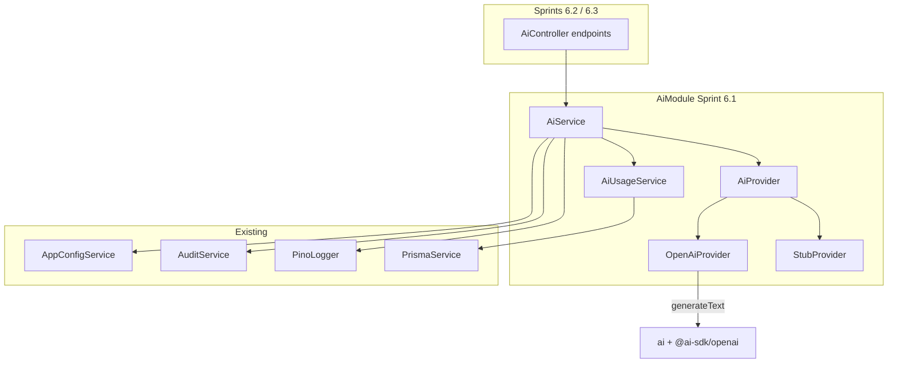

# Sprint 6.1 — AI Infrastructure

**Status:** Plan ready (not started)  
**Roadmap marker:** Milestone 6 — AI Assistant / Kernel  
**Branch (when implementing):** `feat/sprint-6-1-ai-infrastructure`  
**PR base:** `feat/sprint-5-2-dashboard-widgets` (or `main` if Milestone 5 merged) — stack on latest completed prior sprint

**Overview:** Stand up the Kernel AI foundation: provider abstraction (Vercel AI SDK `generateText`), OpenAI adapter + stub provider, daily usage limits (`ai_usage` / migration V0600), feature flag `AI_ENABLED`, prompt/response logging (Pino + audit event without full prompt in MySQL), and user-facing “not financial advice” disclaimers. No explain/validate product endpoints yet (6.2/6.3) — ship a thin internal/health path and shared `AiService` used by later sprints.

---

## Sprint scope and exit criteria

**Stories**

| ID | Title | Source |
|----|-------|--------|
| #6.1.1 | AI service abstraction | [MVP_06](../product/stories/BitStockerz_MVP_06_Kernel_AI_Assistant_Stories.md) (title-only) |
| #6.1.2 | AI usage limits & guardrails | same |
| #6.5.2 | Prompt & response logging (internal) | same |
| #6.5.1 | AI disclaimer & confidence labeling | same |
| #8.5.2 | Feature flags for AI, limits, experimental paths | [MVP_08](../product/stories/BitStockerz_MVP_08_Backend_Infrastructure_Stories.md) |

**Exit:** AI can be enabled/disabled, rate-limited per user/day, logged safely, and invoked via a provider interface without mutating strategies/orders.

**Explicitly out of scope**

| Item | Why deferred |
|------|----------------|
| `POST /ai/explain-strategy` etc. product logic | Sprints 6.2 / 6.3 |
| Streaming LLM responses | JC-2 — MVP non-streaming JSON |
| Autonomous edits / trading | Hard product out of scope |
| Storing full prompts in MySQL | JC-4 — size + PII; logs only |
| Multi-provider routing / cost optimization | OpenAI default + stub |

---

## Prerequisites

| Capability | Location | Relevance |
|------------|----------|-----------|
| `AppConfigService` | `apps/api/src/config` | Flags + limits + API keys |
| `AuthGuard` / sessions | `auth/` | Per-user usage |
| `AuditService` | `observability/audit.service.ts` | `ai.invocation` events |
| Pino structured logs | `common/logging` | Full prompt/response at debug/info with redaction |
| Prisma + migrations | `apps/api/prisma` | `ai_usage` table |
| DDL skeleton | `docs/database/DDL/05_ai_kernel.sql` | Source of truth for V0600 |
| Strategies / backtests readable | Milestones 2–3 | Needed before 6.2/6.3; 6.1 can unit-test with stubs |

---

## Draft acceptance criteria (per story)

### #6.1.1 – AI service abstraction

- Nest `AiModule` exports `AiService`.
- Interface `AiProvider` with `generate(input: AiGenerateRequest): Promise<AiGenerateResult>`.
- Implementations:
  - `OpenAiProvider` using Vercel AI SDK `generateText` + `@ai-sdk/openai` (JC-1).
  - `StubProvider` deterministic responses for tests / missing API key.
- Selection: if `AI_ENABLED` and `OPENAI_API_KEY` present → OpenAI; else Stub (or hard-disable — see JC-1).
- AI **never** writes to strategies, orders, positions, or job executors — generate text only.
- Unit tests cover provider selection and stub path without network.

### #6.1.2 – Usage limits & guardrails

- Table `ai_usage` (`user_id`, `date`, `calls`) via Prisma migration aligned to V0600 / DDL.
- Before each invocation: increment/check daily calls for `userId` (UTC date).
- Exceeding `AI_DAILY_CALL_LIMIT` (config, default e.g. **20**) → `429` domain error (`AI_RATE_LIMIT` or existing pattern).
- When `AI_ENABLED=false` → `403` / `503` domain error (`AI_DISABLED`) — pick one code and document.
- Seed/in-memory mode: in-memory `Map` usage counters when Prisma disabled.
- Guardrail: reject requests that ask the model to place orders / mutate strategies in system prompt; still advisory only.

### #6.5.1 – Disclaimers & confidence labeling

- Every AI HTTP response envelope includes:
  - `disclaimer: "Not financial advice. Kernel suggestions are informational only."` (exact product copy TBD — Dev input).
  - `confidence?: "LOW" | "MEDIUM" | "HIGH"` optional label from provider/heuristic.
- Angular consumers (later) must display disclaimer; for 6.1 document contract + e2e on a probe endpoint or shared DTO used by 6.2.

### #6.5.2 – Prompt & response logging

- On each invocation log structured Pino fields: `ai.provider`, `ai.model`, `ai.userId`, `ai.operation`, `ai.latencyMs`, `ai.prompt` (redacted), `ai.response` (truncated), `requestId`.
- Emit `AuditService.record({ eventType: 'ai.invocation', payload })` **without** full prompt/response bodies (ids, operation, token estimates, success/fail only) — JC-4.
- Never log passwords, session tokens, or raw Authorization headers.
- Unit test: audit payload excludes `prompt`/`response` full text.

### #8.5.2 – Feature flags

- Config domain `features` / `ai`:
  - `AI_ENABLED` (bool, default `false` in production-like envs; `true` in development if key present — document).
  - `AI_DAILY_CALL_LIMIT` (int).
  - `AI_MODEL` (string, default e.g. `gpt-4o-mini`).
  - `OPENAI_API_KEY` (secret, optional).
- All reads via `AppConfigService` (no raw `process.env` in services).
- `.env.example` documents names only.
- Unit tests: flag off short-circuits provider.

**Probe endpoint for 6.1 (internal / testable):**

Optional thin `POST /api/ai/ping` (auth required) returns stub/live echo + disclaimer — **or** defer public HTTP until 6.2 and test `AiService` via unit/e2e module only. **Recommend:** no public product routes in 6.1; cover via unit + one e2e that boots module with StubProvider. (JC-5)

---

## API contract

Product routes land in 6.2/6.3. This sprint establishes shared response envelope:

```json
{
  "disclaimer": "Not financial advice. Kernel suggestions are informational only.",
  "confidence": "MEDIUM",
  "data": {}
}
```

Errors (RFC 7807 via existing filter):

| Code | HTTP | When |
|------|------|------|
| `AI_DISABLED` | 403 | `AI_ENABLED=false` |
| `AI_RATE_LIMIT` | 429 | Daily calls exceeded |
| `AI_PROVIDER_ERROR` | 502 | Upstream failure |
| `VALIDATION_ERROR` | 400 | Bad body (later) |

Migration: `apps/api/prisma/migrations/YYYYMMDDHHMMSS_sprint_6_1_ai_usage/` implementing V0600:

```sql
-- from DDL/05_ai_kernel.sql
CREATE TABLE ai_usage (
  id INT UNSIGNED NOT NULL AUTO_INCREMENT,
  user_id CHAR(36) NOT NULL,
  date DATE NOT NULL,
  calls INT NOT NULL,
  PRIMARY KEY (id),
  UNIQUE KEY uq_ai_usage_user_date (user_id, date),
  CONSTRAINT fk_ai_usage_user FOREIGN KEY (user_id) REFERENCES users(id)
    ON DELETE RESTRICT ON UPDATE CASCADE
) ENGINE=InnoDB DEFAULT CHARSET=utf8mb4 COLLATE=utf8mb4_unicode_ci;
```

---

## Architecture



### Proposed file layout

```text
apps/api/src/ai/
  ai.module.ts
  ai.service.ts
  ai.service.spec.ts
  ai.types.ts
  ai-usage.service.ts
  ai-usage.service.spec.ts
  providers/
    ai-provider.ts          # interface
    openai.provider.ts
    stub.provider.ts
  dto/
    ai-response.envelope.ts # disclaimer + confidence
apps/api/prisma/migrations/..._sprint_6_1_ai_usage/
apps/api/src/config/app-config.service.ts  # AI_* flags
```

**Dependencies:** `ai`, `@ai-sdk/openai` (https://ai-sdk.dev).

---

## Implementation plan (ordered)

### 1. Config + feature flags (#8.5.2)

1. Extend `loadAppConfig` with `ai.enabled`, `ai.dailyCallLimit`, `ai.model`, `ai.openaiApiKey`.
2. Fail-fast on invalid integers; empty key allowed.
3. `.env.example` + unit tests.

### 2. Migration V0600 (`ai_usage`)

1. Prisma model `AiUsage` matching DDL (already sketched in `docs/database/schema.prisma` — port to `apps/api/prisma/schema.prisma` if missing).
2. Migration folder; `User.aiUsage` relation.
3. Update `Migrations_Plan.md` with Prisma folder name.

### 3. Providers (#6.1.1)

1. `AiProvider` interface.
2. `StubProvider` returns fixed JSON text.
3. `OpenAiProvider` wraps `generateText({ model, system, prompt })` — **non-streaming** (JC-2).
4. Factory provider in Nest DI.

### 4. Usage + AiService (#6.1.2, #6.5.x)

1. `AiUsageService.consume(userId)` atomic increment (Prisma upsert on `(user_id, date)`).
2. `AiService.invoke({ userId, operation, system, prompt })`:
   - check flag → check limit → call provider → log Pino → audit `ai.invocation` → return envelope fields.
3. System prompt always includes: advisory-only, never instruct user that AI can place trades; include disclaimer instruction.

### 5. Tests + docs

```bash
npm --prefix apps/api run build
npm --prefix apps/api run test
npm --prefix apps/api run test:cov
npm --prefix apps/api run test:e2e
```

| File | Update |
|------|--------|
| MVP_06 / MVP_08 | Write AC into story files |
| `API_Inventory.md` §6 | Note foundation; endpoints 6.2+ |
| `Migrations_Plan.md` | V0600 Prisma name |
| `Observability.md` | `ai.invocation` audit + Pino fields |
| `.env.example` | AI_* vars |
| `manual_testing.md` | Flag off/on + rate limit |
| ROADMAP / CHANGELOG | 6.1 status |

---

## Best-practice checklist

- [ ] Vercel AI SDK `generateText` — https://ai-sdk.dev/docs/ai-sdk-core/generating-text
- [ ] `@ai-sdk/openai` provider — https://ai-sdk.dev/providers/ai-sdk-providers/openai
- [ ] Config via DI only (Sprint 0.1 pattern)
- [ ] Feature flag kill switch `AI_ENABLED`
- [ ] Daily quota via `ai_usage`
- [ ] Never mutate trading/strategy state from AI module
- [ ] Redact secrets in logs; no full prompts in MySQL (JC-4)
- [ ] Conventional Commits: `feat: add ai kernel infrastructure and usage limits`

---

## Risks and mitigations

| Risk | Mitigation |
|------|------------|
| Key leakage in logs | Pino redact paths; never log `OPENAI_API_KEY` |
| Cost blowups | Low daily limit default; flag off by default in prod |
| Stub vs live confusion | Response header or `provider: "stub" \| "openai"` in debug field (omit in prod if needed) |
| Prisma disabled e2e | In-memory usage map |
| AI SDK API churn | Pin versions; thin adapter layer |

---

## Dev input required

| # | Blocker | Why it blocks | Default if unanswered | Status |
|---|---------|---------------|----------------------|--------|
| 1 | OpenAI API key for staging | Live provider | ⏭ StubProvider when missing | ⏭ stubbed |
| 2 | Daily call limit number | Product/cost | ⏭ 20/user/day | ⏭ stubbed |
| 3 | Disclaimer legal copy | Compliance tone | ⏭ Placeholder “Not financial advice…” | ⏸ product review before public launch |
| 4 | Default `AI_ENABLED` per env | Safety | ⏭ false unless key + development | ⏭ recommended |

---

## Judgement calls

| ID | Decision | Why | Discuss before implement if |
|----|----------|-----|-----------------------------|
| **JC-1** | **OpenAI default** via `@ai-sdk/openai`; **StubProvider** when no key / tests | Fastest path; AI SDK abstraction keeps swap cheap | Prefer Anthropic/Gateway first |
| **JC-2** | **Non-streaming** JSON responses for MVP | Simpler Angular + Nest error handling; inventory is request/response | Product wants typed chat UX |
| **JC-3** | Hard **read-only** boundary: AI module has no imports of order/strategy write services | Prevent accidental mutation | — |
| **JC-4** | **Pino logs full prompt/response (redacted/truncated)**; **audit_events `ai.invocation` without full prompt** in MySQL | Prompt size + PII; still traceable via `requestId` | Compliance requires durable prompt archive |
| **JC-5** | **No public AI HTTP routes in 6.1** — service + usage only | Avoid half-baked explain APIs; 6.2 owns contracts | Need a `/ai/ping` for ops smoke |

---

## Suggested ticket breakdown

| Ticket | Estimate |
|--------|----------|
| Config flags + .env.example + tests | 0.5d |
| Prisma `ai_usage` migration + AiUsageService | 0.75d |
| Providers (stub + OpenAI) + AiService | 1.0d |
| Logging + audit wiring + redaction tests | 0.75d |
| Docs + manual testing + story AC | 0.5d |

**Total:** ~3.5 engineering days.

---

## Definition of done

- [ ] `ai_usage` migration applies; model in Prisma schema
- [ ] `AiService` + Stub/OpenAI providers; flag + rate limit enforced
- [ ] Pino + `ai.invocation` audit per JC-4
- [ ] Disclaimer fields defined on shared envelope
- [ ] build/lint/test/cov/e2e green; docs synced
- [ ] PR: `feat: add ai kernel infrastructure and usage limits`

---

## References

- Vercel AI SDK: https://ai-sdk.dev  
- `generateText`: https://ai-sdk.dev/docs/ai-sdk-core/generating-text  
- OpenAI provider: https://ai-sdk.dev/providers/ai-sdk-providers/openai  
- DDL: `docs/database/DDL/05_ai_kernel.sql`  
- Migrations plan V0600: `docs/database/Migrations_Plan.md`  
- API Inventory §6: `docs/database/API_Inventory.md`  
- MVP_06 / MVP_08 stories
