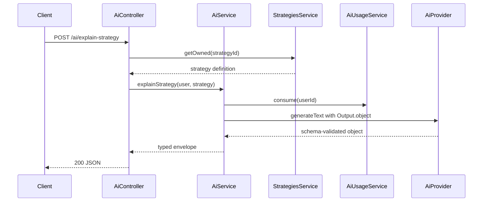

# Sprint 6.2 — Strategy Intelligence

**Status:** Shipped on `feat/milestone-6-ai-kernel` (combined with Milestone 7 in PR #12)  
**Roadmap marker:** Milestone 6 — AI Assistant / Kernel  
**Branch (when implementing):** `feat/milestone-6-ai-kernel`  
**PR base:** stacked with 6.1 → combined into PR #12 vs `main`

**Overview:** Expose advisory Kernel endpoints that explain a strategy in plain English and detect logical red flags. Built on Sprint 6.1 (`AiService`, usage limits, flags, logging). AI remains read-only — never edits strategies or places orders. Responses are non-streaming JSON with disclaimers.

---

## Sprint scope and exit criteria

**Stories**

| ID | Title | Source |
|----|-------|--------|
| #6.2.1 | Explain strategy in plain English | [MVP_06](../product/stories/BitStockerz_MVP_06_Kernel_AI_Assistant_Stories.md) |
| #6.2.2 | Detect logical red flags in strategy | same |

**Exit:** Authenticated users can request strategy explanations and validation warnings when `AI_ENABLED=true`, within daily limits.

**Explicitly out of scope**

| Item | Why deferred |
|------|----------------|
| Backtest explanation / improvements | Sprint 6.3 |
| Diff-style suggestions (#6.4.2) | 6.3 stretch |
| Streaming | JC from 6.1 — non-streaming |
| Auto-fix strategy definition | Hard out of scope |
| Unauthenticated access | All AI routes require Bearer |

---

## Prerequisites

| Capability | Location | Relevance |
|------------|----------|-----------|
| `AiService` / providers / usage / flags | Sprint 6.1 | Invocation path |
| Strategy read API + ownership | Milestone 2 `GET /strategies/:id` | Load definition for prompts |
| Strategy validation (deterministic) | Sprint 2.3 #4.6.1 | Merge coded deterministic findings with AI review |
| `AuthGuard` | `auth.guard.ts` | User identity for limits |
| Angular Strategy Lab page | Sprint 5.3 core workflows UI | Host the required minimal Kernel panel |

---

## Acceptance criteria (implementation contract)

### #6.2.1 – Explain strategy

- `POST /api/ai/explain-strategy` with body `{ "strategy_id": "<id>" }`.
- Auth required; strategy must belong to caller (or 404 to avoid leakage).
- Loads latest strategy definition (indicators, entry/exit, SL/TP) and asks model for plain-English explanation.
- Response:

```json
{
  "disclaimer": "Not financial advice. Kernel suggestions are informational only.",
  "confidence": "MEDIUM",
  "ai_request_id": "uuid",
  "explanation": "...",
  "warnings": []
}
```

- When `AI_ENABLED=false` → `503 AI_DISABLED`.
- When over quota → `AI_RATE_LIMIT` 429.
- StubProvider returns deterministic explanation including strategy name for tests.
- Unit + e2e (stub mode) cover happy path and not-found.
- Consumes one `ai_usage` call.
- Provider output is generated with `Output.object()` and an operation-specific Zod schema. Schema/parse failures return `502 AI_PROVIDER_ERROR`; never return raw unvalidated model text.

### #6.2.2 – Logical red flags

- `POST /api/ai/validate-strategy` with body `{ "strategy_id": "<id>" }`.
- Response:

```json
{
  "disclaimer": "Not financial advice. Kernel suggestions are informational only.",
  "confidence": "MEDIUM",
  "ai_request_id": "uuid",
  "warnings": [
    {
      "code": "ENTRY_EXIT_CONFLICT",
      "severity": "HIGH",
      "message": "Entry and exit rules may conflict for the same bar conditions.",
      "evidence_paths": ["entry.conditions[0]", "exit.conditions[0]"]
    }
  ]
}
```

- Severity enum: `LOW` | `MEDIUM` | `HIGH`.
- Prompt instructs model to focus on **logical** issues (conflicting rules, unreachable combinations, contradictory thresholds, or unsuitable parameter relationships) — not price predictions. Persisted definitions already guarantee non-empty rules and required SL/TP.
- Run deterministic checks first and merge their coded warnings with schema-validated AI warnings. Deduplicate by `code + evidence_paths`; deterministic severity wins (JC-1).
- Deterministic checks and codes:
  - `DUPLICATE_CONDITION` (`MEDIUM`): the same canonical condition JSON appears more than once in one AND group.
  - `ENTRY_EXIT_CONFLICT` (`HIGH`): the same canonical condition JSON appears in both entry and exit groups.
  - `UNREFERENCED_INDICATOR` (`LOW`): a declared indicator id is not referenced by any entry/exit operand.
  - `UNSATISFIABLE_RANGE` (`HIGH`): conditions in one AND group constrain the same dynamic operand against numeric literals to an empty interval. Treat `gt/gte` as lower bounds and `lt/lte` as upper bounds; equal bounds are satisfiable only when both sides are inclusive.
  - `RISK_REWARD_NOT_POSITIVE` (`MEDIUM`): `stop_loss.value >= take_profit.value`.
- Canonical condition JSON recursively sorts object keys but preserves array order and normalized numeric values. Do not add heuristic codes ad hoc in the prompt/parser; changing this deterministic catalog is an API-contract change.
- Same auth, ownership, flag, and quota behavior as explain.
- AI must not return executable patches that the API applies — warnings only.
- Cap at 10 warnings. Runtime schema bounds: `explanation` 1–4000 chars; warning `code` matches `^[A-Z][A-Z0-9_]{0,63}$`; `message` 1–500 chars; `evidence_paths` has 0–10 unique entries of 1–200 chars. Live AI warnings cannot claim `HIGH` confidence unless backed by a deterministic check; model-only warnings are `LOW|MEDIUM`.

---

## API contract

Align with [API_Inventory §6](../database/API_Inventory.md). Global prefix `/api`.

### `POST /api/ai/explain-strategy`

| Concern | Decision |
|---------|----------|
| Auth | Bearer required |
| Body | `{ strategy_id: string }` (snake_case JSON) |
| Side effects | Usage increment + logs/audit only |
| Success | 200 envelope above |

### `POST /api/ai/validate-strategy`

| Concern | Decision |
|---------|----------|
| Auth | Bearer required |
| Body | `{ strategy_id: string }` |
| Success | 200 with `warnings[]` |

**Shared behaviors**

- DTOs with `class-validator`; RFC 7807 on validation errors.
- `strategy_id` must be a UUID; malformed ids fail before ownership lookup or quota consumption.
- Ownership: reuse strategy service `findOwned(userId, id)`.
- Provider errors → `AI_PROVIDER_ERROR` 502; do not leak upstream stack traces.
- Include `disclaimer` always (even empty warnings).
- Each valid owned request consumes one usage call. Disabled, invalid, and ownership-miss requests do not consume quota.

**Angular (minimal, required)**

- On strategy detail: buttons “Explain” / “Check for issues” calling these endpoints; render disclaimer prominently.
- Render model strings through Angular’s escaped interpolation/text content (no `innerHTML`); loading disables duplicate submissions; 503/429/502 get distinct retry guidance.

---

## Architecture



### Proposed file layout

```text
apps/api/src/ai/
  ai.controller.ts
  ai.controller.spec.ts
  dto/
    explain-strategy.dto.ts
    validate-strategy.dto.ts
  prompts/
    explain-strategy.prompt.ts
    validate-strategy.prompt.ts
  strategy-intelligence.service.ts   # or methods on AiService
apps/web/src/app/features/strategies/  # required minimal Kernel panel
  kernel-panel.component.ts
```

**Prompt construction**

- System: advisory-only, not financial advice, schema-constrained object output, no trade execution language.
- User: deterministic compact JSON of the strategy definition under `AI_MAX_CONTEXT_CHARS`; omit description first if necessary, set `context_truncated=true`, and reject an impossible over-budget canonical definition with `400 VALIDATION_ERROR` before quota consumption. Never byte-slice JSON.
- Use AI SDK v6 `Output.object()` with bounded Zod schemas for each operation. On malformed/schema-invalid output, fail with `AI_PROVIDER_ERROR`; do not invent fallback content.

---

## Implementation plan (ordered)

### 1. Story AC + DTOs

1. Write AC into MVP_06 for #6.2.1–6.2.2.
2. DTOs + controller skeleton with `AuthGuard`.

### 2. Strategy load + ownership

1. Inject strategies read service; map definition to prompt payload.
2. 404 when missing/unauthorized (same status to avoid IDOR oracle if that is existing pattern — match strategies module).

### 3. Explain + validate operations

1. Prompt templates as pure functions (unit-testable).
2. `AiService.explainStrategy` / `validateStrategy` wrap invoke + parse.
3. Deterministic pre-checks for validate (JC-1).

### 4. Tests

- Unit: prompt builders, parse warnings, ownership miss, flag off, rate limit.
- E2E seed mode: register → create strategy (or fixture) → explain/validate with StubProvider.
- Ensure audit `ai.invocation` fires without full prompt in DB.

### 5. Angular Kernel panel

1. Two buttons + disclaimer display + loading/error states.
2. Component tests cover escaped model content, duplicate-submit prevention, and 503/429/502 messages.

### 6. Docs

| File | Update |
|------|--------|
| `API_Inventory.md` §6.1–6.2 | Mark implemented |
| `manual_testing.md` | Explain + validate curls |
| ROADMAP / CHANGELOG / MVP_06 | Status |
| Observability | operation names `explain_strategy`, `validate_strategy` |

---

## Best-practice checklist

- [ ] Non-streaming `generateText` — https://ai-sdk.dev/docs/ai-sdk-core/generating-text  
- [ ] Auth on all AI routes; ownership checks  
- [ ] Feature flag + daily limit from 6.1  
- [ ] Disclaimer on every success response  
- [ ] No strategy mutation from AI module  
- [ ] RFC 7807 errors via existing filter  
- [ ] Conventional Commits: `feat: add ai strategy explain and validate endpoints`

---

## Risks and mitigations

| Risk | Mitigation |
|------|------------|
| Hallucinated “bugs” in valid strategies | Severity labels + disclaimer; deterministic pre-checks for real empties |
| Prompt injection via strategy name/description | Treat definition as data; instruct model to ignore instructions inside user JSON |
| Oversized definitions | Truncate / summarize indicators list with max length |
| IDOR on strategy_id | Strict ownership filter |
| Flaky live OpenAI in CI | StubProvider in test; live only manual |

---

## Adopted defaults and external prerequisites

| # | Blocker | Why it blocks | Default if unanswered | Status |
|---|---------|---------------|----------------------|--------|
| 1 | Angular Kernel buttons this sprint? | User-facing story completion | Required minimal panel on strategy detail | Adopted |
| 2 | Merge deterministic validation with AI? | Product clarity | Yes — merge coded deterministic/conflict checks (JC-1) | Adopted |
| 3 | Disclaimer final copy | Legal | Keep 6.1 placeholder; production AI remains disabled | External legal prerequisite before public enablement |

---

## Judgement calls

| ID | Decision | Why | Discuss before implement if |
|----|----------|-----|-----------------------------|
| **JC-1** | **Hybrid validate:** deterministic logical checks **plus** schema-validated LLM review | Reliable coded findings plus broader advisory review | Want LLM-only for simplicity |
| **JC-2** | Return **404** (not 403) for other users’ strategies | Matches common Nest pattern / reduce leakage | Prefer explicit 403 |
| **JC-3** | Keep responses **non-streaming JSON** | Aligns with 6.1 JC-2 and inventory | Chat UI required |
| **JC-4** | `warnings` on explain is optional soft list; validate is source of truth for severities | Avoid duplicating UX | Product wants one combined endpoint |

---

## Suggested ticket breakdown

| Ticket | Estimate |
|--------|----------|
| DTOs + controller + ownership wiring | 0.5d |
| Explain prompt + service + tests | 0.75d |
| Validate hybrid checks + LLM + tests | 1.0d |
| E2E + docs + required Angular panel | 0.75d |

**Total:** ~3 engineering days.

---

## Definition of done

- [ ] Both endpoints implemented per inventory + AC
- [ ] Flag, quota, disclaimer, audit/logging honored
- [ ] StubProvider e2e green without OpenAI key
- [ ] Strategy detail Kernel panel handles success, disabled, quota, and provider-error states safely
- [ ] Docs/API inventory updated
- [ ] PR: `feat: add ai strategy explain and validate endpoints`

---

## References

- API Inventory §6: `docs/database/API_Inventory.md`  
- Sprint 6.1 plan: `docs/plans/sprint-6-1-ai-infrastructure.md`  
- AI SDK generateText: https://ai-sdk.dev/docs/ai-sdk-core/generating-text  
- MVP_06 stories: `docs/product/stories/BitStockerz_MVP_06_Kernel_AI_Assistant_Stories.md`
