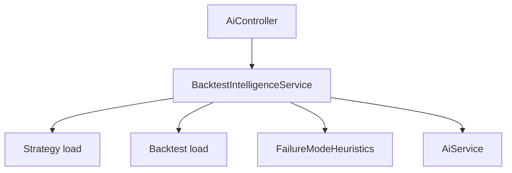

# Sprint 6.3 — Backtest Intelligence

**Status:** Plan ready (not started)  
**Roadmap marker:** Milestone 6 — AI Assistant / Kernel  
**Branch (when implementing):** `feat/sprint-6-3-backtest-intelligence`  
**PR base:** `feat/sprint-6-2-strategy-intelligence` (stacked) → retarget `main` after 6.2 merges

**Overview:** Complete the Kernel advisory surface: explain backtest results, identify failure modes, and suggest strategy improvements. Optional diff-style explanation (#6.4.2) is stretch/deferrable. Same infrastructure as 6.1–6.2 (flags, limits, non-streaming, disclaimers, no mutations).

---

## Sprint scope and exit criteria

**Stories**

| ID | Title | Source |
|----|-------|--------|
| #6.3.1 | Explain backtest performance | [MVP_06](../product/stories/BitStockerz_MVP_06_Kernel_AI_Assistant_Stories.md) |
| #6.3.2 | Identify failure modes | same |
| #6.4.1 | Suggest strategy improvements | same |
| #6.4.2 | Diff-style explanation (optional MVP+) | same — **stretch** (JC-1) |

**Exit (ROADMAP):** AI adds insight without touching execution.

**Explicitly out of scope**

| Item | Why deferred |
|------|----------------|
| Auto-apply suggestions to strategy versions | Out of scope MVP_06 |
| Live trading recommendations | Out of scope |
| Ranking / leaderboards | Out of scope |
| Streaming chat | Non-streaming MVP |
| Guaranteed #6.4.2 | Marked deferrable stretch |

---

## Prerequisites

| Capability | Location | Relevance |
|------------|----------|-----------|
| AiModule 6.1–6.2 | `apps/api/src/ai` | Invoke + explain/validate patterns |
| Backtest run + results APIs | Milestone 3 | Metrics, equity summary, trade stats |
| Strategy ownership | Milestone 2 | Suggestions tied to owned strategy |
| Angular backtest detail | 3.4 / 5.3 | Required “Explain results” and suggestions integration surface |

---

## Acceptance criteria (implementation contract)

### #6.3.1 – Explain backtest

- `POST /api/ai/explain-backtest` body `{ "backtest_run_id": "<id>" }`.
- Auth + ownership of the run (via user_id on backtest).
- Run must be `completed` with results; other states return `409 BACKTEST_INVALID_STATE` without consuming AI quota.
- Prompt includes: strategy summary, key metrics (return, max drawdown, win rate, trade count), date range, symbol/timeframe — **not** full trade blotter if huge (summarize; JC-2).
- Response:

```json
{
  "disclaimer": "Not financial advice. Kernel suggestions are informational only.",
  "confidence": "MEDIUM",
  "ai_request_id": "uuid",
  "explanation": "...",
  "issues": []
}
```

- Flag/quota/logging same as 6.2.
- StubProvider returns a deterministic schema-valid object referencing the run id and one metric.
- Use AI SDK v6 `Output.object()` with an operation-specific bounded Zod schema. Schema/parse failure returns `502 AI_PROVIDER_ERROR`; never return raw provider text.

### #6.3.2 – Failure modes

- A single `explain-backtest` endpoint returns `issues[]`; an internal `identifyFailureModes` helper is reused by suggestions (JC-3).
- Each issue is `{ code, severity, message, evidence }`, where `severity` is `LOW|MEDIUM|HIGH`, `code` matches `^[A-Z][A-Z0-9_]{0,63}$`, `message` is 1–500 chars, and `evidence` contains 0–10 unique 1–200-char strings.
- Deterministic issue codes/defaults:
  - `SHORT_SAMPLE` when `bars_processed < 100`
  - `TOO_FEW_TRADES` when `num_trades < 5`
  - `HIGH_DRAWDOWN` when `max_drawdown_pct >= 25`
  - `NEGATIVE_RETURN` when `total_return_pct < 0`
  - `CONCENTRATED_PNL` when total positive P&L is greater than zero and one winning trade contributes more than 50% of it
- Merge deterministic issues with schema-validated model issues, dedupe by `code`, and cap at 10. Model-only issues are never severity/confidence `HIGH`.

### #6.4.1 – Suggest improvements

- `POST /api/ai/suggest-improvements` body:

```json
{ "strategy_id": "...", "backtest_run_id": "..." }
```

- `backtest_run_id` is optional; if present it must be owned by the user and satisfy the exact strategy/state rules below.
- If present, the run must be completed and `run.strategy_id` must exactly equal `strategy_id`; mismatch → `400 VALIDATION_ERROR`, non-completed → `409 BACKTEST_INVALID_STATE`.
- Response:

```json
{
  "disclaimer": "Not financial advice. Kernel suggestions are informational only.",
  "confidence": "LOW",
  "ai_request_id": "uuid",
  "suggestions": [
    {
      "code": "REVIEW_STOP_DISTANCE",
      "title": "Review stop distance",
      "description": "...",
      "evidence": ["max_drawdown_pct=28.4"]
    }
  ]
}
```

- Suggestions are advisory text only — API does **not** PATCH strategy.
- Cap suggestions at 5 and dedupe by `code`. Runtime schema bounds: `code` matches `^[A-Z][A-Z0-9_]{0,63}$`; `title` is 1–120 chars; `description` is 1–1000 chars; `evidence` has 0–10 unique 1–200-char strings. Explanation text is 1–4000 chars.

### #6.4.2 – Diff-style explanation (stretch)

- Optional response field:

```json
{
  "diff": {
    "summary": "Proposed parameter tweaks",
    "changes": [
      { "path": "risk.stop_loss.value", "from": 1, "to": 2, "rationale": "..." }
    ]
  }
}
```

- Behind feature flag `AI_DIFF_SUGGESTIONS_ENABLED` (default **false**).
- If deferred: document in ROADMAP as MVP+; DoD does not block on it (JC-1).

---

## API contract

From [API_Inventory §6.3–6.4](../database/API_Inventory.md):

| Method | Path | Body | Response highlights |
|--------|------|------|---------------------|
| POST | `/api/ai/explain-backtest` | `backtest_run_id` | `explanation`, `issues` |
| POST | `/api/ai/suggest-improvements` | `strategy_id`, `backtest_run_id?` | `suggestions[]`, optional flag-gated `diff` |

All: Bearer auth, disclaimer envelope, usage +1 per valid call, `AI_DISABLED` / `AI_RATE_LIMIT` / `AI_PROVIDER_ERROR` / `AI_TIMEOUT`. DTO, ownership, strategy/run relationship, and run-state validation happens before quota consumption; a provider failure after consumption still counts as one call.

**Angular (required)**

- Backtest detail: Explain + Suggest improvements panels.
- Render disclaimer; never one-click “Apply”; use escaped Angular text rendering, disable duplicate submits, and distinguish 503/429/502 errors.

---

## Architecture



### Proposed file layout

```text
apps/api/src/ai/
  dto/explain-backtest.dto.ts
  dto/suggest-improvements.dto.ts
  prompts/explain-backtest.prompt.ts
  prompts/suggest-improvements.prompt.ts
  failure-mode.heuristics.ts
  failure-mode.heuristics.spec.ts
  backtest-intelligence.service.ts
apps/web/.../backtests/kernel-insights.component.ts  # required minimal panel
```

---

## Implementation plan (ordered)

### 1. AC + DTOs + inventory sync

1. Flesh MVP_06 AC for 6.3–6.4.
2. Controller methods; reuse envelope helpers from 6.1/6.2.

### 2. Backtest context loader

1. Fetch run + aggregate metrics + strategy pin.
2. Build a deterministic compact context object under `AI_MAX_CONTEXT_CHARS=12000`: run/strategy identifiers and metadata, metrics, diagnostics, aggregate trade statistics, and at most three best/three worst trade summaries. Omit lowest-priority samples until within budget and set `context_truncated=true`; never byte-slice JSON or send the full blotter/equity curve.

### 3. Explain + failure modes

1. Heuristics module (unit-tested).
2. LLM explanation merges heuristic `issues` with model narrative (dedupe).

### 4. Suggest improvements

1. Prompt with strategy + optional backtest context.
2. Generate `suggestions[]` with `Output.object()`; validate and clamp to 5.
3. Refuse to return SQL/code that mutates DB — text only.

### 5. Stretch #6.4.2

1. Only if time: flag-gated `diff` parser + tests.
2. Else: ticket “MVP+” and skip.

### 6. Angular panel + tests + docs + Milestone 6 exit

1. Add the two actions to backtest detail with success/loading/error/disclaimer states.
2. Component tests prove output is escaped, duplicate submissions are blocked, and no Apply action exists.

| File | Update |
|------|--------|
| API_Inventory §6 | All four operations status |
| manual_testing | Explain backtest + suggestions |
| ROADMAP | Milestone 6 exit |
| CHANGELOG / MVP_06 | Complete |

---

## Best-practice checklist

- [ ] AI SDK `generateText` non-streaming — https://ai-sdk.dev  
- [ ] Advisory-only; no strategy/order writes  
- [ ] Compact prompts (no full blotter)  
- [ ] Disclaimer + confidence on every response  
- [ ] Feature flags for experimental diff  
- [ ] Usage accounting per call  
- [ ] Conventional Commits: `feat: add ai backtest explain and suggestions`

---

## Risks and mitigations

| Risk | Mitigation |
|------|------------|
| Context too large for model | Summarize trades (count, avg, top winners/losers) |
| Overfitting false positives | Label confidence LOW; heuristics documented |
| Users treat suggestions as orders | UI + API disclaimer; no Apply button |
| #6.4.2 scope creep | Explicit stretch; flag default off |
| Double-charging usage for explain+suggest | Each HTTP call = 1 use (document) |

---

## Adopted defaults and override triggers

| # | Blocker | Why it blocks | Default if unanswered | Status |
|---|---------|---------------|----------------------|--------|
| 1 | Ship #6.4.2 in MVP? | Effort | Defer; keep documented flag/schema for follow-up (JC-1) | Adopted |
| 2 | Metrics field names from backtest API | Prompt mapping | Use the canonical Sprint 3.3 names/decimal strings | Adopted; verify predecessor contract |
| 3 | Angular panels required? | User-facing story completion | Required minimal panels | Adopted |

---

## Judgement calls

| ID | Decision | Why | Discuss before implement if |
|----|----------|-----|-----------------------------|
| **JC-1** | **#6.4.2 is stretch / deferrable**; flag `AI_DIFF_SUGGESTIONS_ENABLED` default false | ROADMAP marks optional MVP+; keep Milestone 6 exit unblocked | Product wants diffs in launch demo |
| **JC-2** | **Summarize trades** in prompts; never send full blotter by default | Token cost + latency | Power users need trade-level critique |
| **JC-3** | **Single** `explain-backtest` returns `explanation` + `issues` (no separate failure-modes route) | Inventory lists one explain endpoint; simpler client | Want explicit `/ai/failure-modes` |
| **JC-4** | Suggestions never auto-apply; confidence default **LOW** when backtest absent | Safety | — |

---

## Suggested ticket breakdown

| Ticket | Estimate |
|--------|----------|
| Context loader + explain endpoint + tests | 1.0d |
| Failure-mode heuristics + issues merge | 0.75d |
| Suggest-improvements endpoint + tests | 0.75d |
| Optional diff flag path **or** defer note | 0.5d |
| Docs + manual + ROADMAP Milestone 6 exit | 0.5d |

**Total:** ~3.5 days (+0.5–1.0 if shipping #6.4.2).

---

## Definition of done

- [ ] `#6.3.1`, `#6.3.2`, `#6.4.1` meet AC
- [ ] `#6.4.2` either shipped behind flag **or** explicitly deferred in ROADMAP/CHANGELOG
- [ ] No AI path mutates strategies/orders
- [ ] E2E stub coverage for explain-backtest + suggest-improvements
- [ ] Backtest detail Kernel panel covers success/disabled/quota/provider-error states
- [ ] Milestone 6 exit criteria documented complete
- [ ] PR: `feat: add ai backtest explain and suggestions`

---

## References

- API Inventory §6: `docs/database/API_Inventory.md`  
- MVP_06: `docs/product/stories/BitStockerz_MVP_06_Kernel_AI_Assistant_Stories.md`  
- Plans 6.1 / 6.2  
- AI SDK: https://ai-sdk.dev  
- ROADMAP Milestone 6 exit
