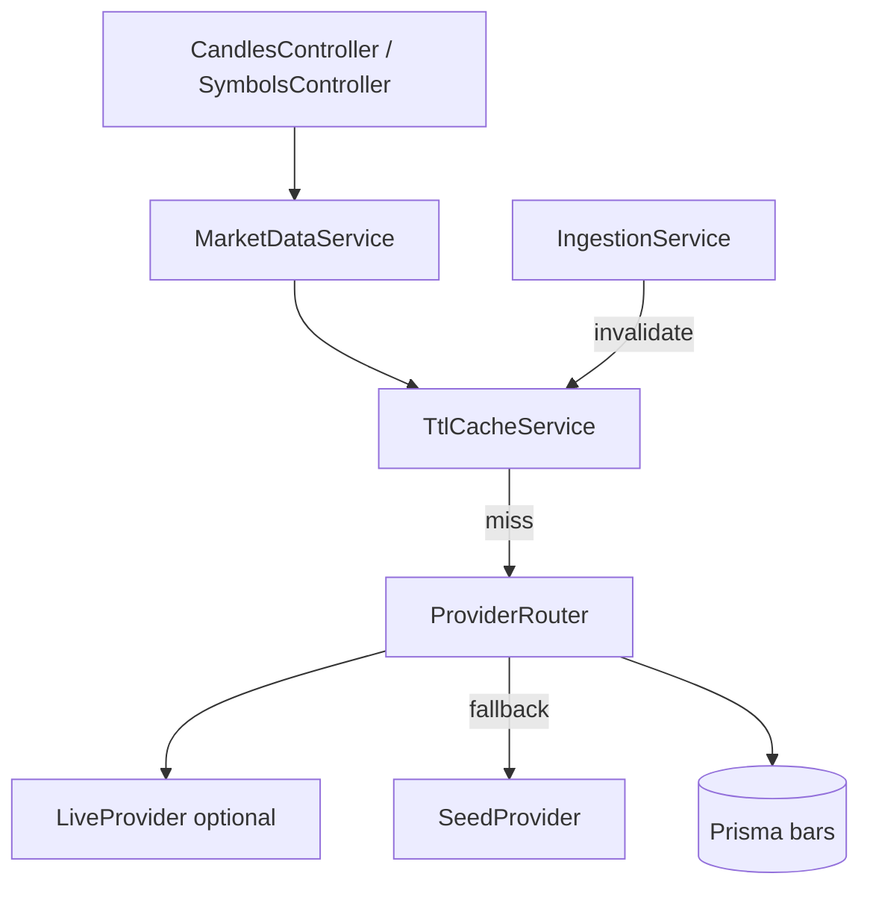

# Sprint 7.1 — Polish & Caching

**Status:** Plan ready (not started)  
**Roadmap marker:** Milestone 7 — Polish & Resilience  
**Branch (when implementing):** `feat/sprint-7-1-polish-caching`  
**PR base:** `feat/sprint-6-3-backtest-intelligence` (or `main` if Milestone 6 merged)

**Overview:** Add in-process TTL caching for hot candle/symbol reads, define provider-fallback guardrails (circuit-breaker style interface) even if live vendor is still seed-backed, and apply UX/perf refinements across API + Angular. Prefer a simple custom TTL cache service over introducing `@nestjs/cache-manager` unless complexity demands it (JC-1).

---

## Sprint scope and exit criteria

**Stories**

| ID | Title | Source |
|----|-------|--------|
| #2.5.1 | In-memory cache for recent candles | [MVP_02](../product/stories/BitStockerz_MVP_02_Market_Data_Stories.md) (title-only) |
| #2.5.2 | Guardrails for provider fallbacks | same |
| UX/perf | Dashboard/API refinements | ROADMAP Milestone 7.1 |

**Exit:** System runs efficiently with caching and provider fallbacks (or documented fallback interface + seed behavior).

**Explicitly out of scope**

| Item | Why deferred |
|------|----------------|
| Redis / distributed cache | Single-region MVP; in-process enough |
| Full live vendor integration (Polygon etc.) | May still be seed; guardrails interface is the deliverable if vendor not chosen |
| Prometheus cache metrics exporters | Keep MetricsService hooks light |
| Multi-region invalidation | Single process assumption (aligns with 7.2 Option A) |

---

## Prerequisites

| Capability | Location | Relevance |
|------------|----------|-----------|
| Candle + symbol read services | `market-data.service.ts` | Cache wrap points |
| Ingestion upsert | `MarketDataIngestionService` | Cache invalidation on write |
| Market-data health / sanity | Sprint 1.4 | Fallback status signals |
| Config service | `AppConfigService` | TTLs, cache enabled flag |
| Angular dashboard | Milestone 5 | Client perf refinements |
| NFR freshness / latency | `Non_Functional_Requirements.md` | Targets |

---

## Draft acceptance criteria (per story)

### #2.5.1 – In-memory cache

- Introduce `TtlCacheService` (Map + expiry) **or** thin wrapper around `node-cache` — JC-1 recommends custom Map+TTL to avoid Nest cache-manager complexity.
- Cache keys for:
  - Symbol search / lookup responses (short TTL, e.g. 60s).
  - Equity/crypto candle range queries (TTL e.g. 30–120s; include symbol, interval, start, end, order, limit in key).
- Config: `CACHE_ENABLED` (default true), `CACHE_CANDLES_TTL_MS`, `CACHE_SYMBOLS_TTL_MS`, `CACHE_MAX_ENTRIES` (evict LRU or clear oldest).
- On ingestion success for a symbol: invalidate candle keys for that symbol (prefix delete).
- Unit tests: hit/miss, expiry, invalidation, max-entry eviction.
- Metrics (optional): increment `cache_hit` / `cache_miss` on `MetricsService` if easy.
- Seed mode and DB mode both benefit (cache sits above data source).

### #2.5.2 – Provider fallback guardrails

- Define `MarketDataProvider` interface:

```typescript
interface MarketDataProvider {
  readonly name: string;
  fetchEquityDaily(...): Promise<Bars>;
  fetchCrypto(...): Promise<Bars>;
}
```

- Implementations: `SeedMarketDataProvider` (existing seed path), future `LiveMarketDataProvider`.
- `ProviderRouter` / guardrails:
  - Prefer live when configured + healthy.
  - On live failure (timeout, 5xx, circuit open): fall back to seed/DB last-known; record audit/metric `market_data.provider_fallback`.
  - Circuit breaker: after **N** consecutive failures (default 3), open for **cooldown** (e.g. 60s); half-open single probe.
- If live vendor **not** wired this sprint: ship interface + Seed provider + breaker unit tests with a fake failing live adapter; document “live adapter plugs in here”.
- Never return 500 solely because live is down if seed/DB can serve (#2.5.2 spirit).
- Health endpoint may expose `provider: { active, circuit: "closed"|"open" }` (non-breaking additive field).

### UX / performance refinements

- API: ensure candle handlers use cache; confirm `limit` defaults respected.
- Angular: avoid duplicate widget fetches on trivial re-renders; keep no-polling rule from 5.2.
- Manual testing notes for cache hit behavior (second identical request faster / same data).
- Fix any known dashboard jank filed during Milestone 5–6 (small list; don’t boil ocean).

---

## API contract

**No new required public endpoints.** Optional additive fields:

### `GET /api/market-data/health` (extend)

```json
{
  "provider": {
    "active": "seed",
    "circuit": "closed",
    "last_error": null
  }
}
```

Cache is transparent to clients — response bodies unchanged for candles/symbols.

Config env (via AppConfig):

| Env | Default | Purpose |
|-----|---------|---------|
| `CACHE_ENABLED` | `true` | Master switch |
| `CACHE_CANDLES_TTL_MS` | `60000` | Candle TTL |
| `CACHE_SYMBOLS_TTL_MS` | `60000` | Symbol TTL |
| `CACHE_MAX_ENTRIES` | `500` | Bound memory |
| `MARKET_DATA_LIVE_ENABLED` | `false` | Live provider switch |
| `MARKET_DATA_CIRCUIT_FAILURES` | `3` | Open threshold |
| `MARKET_DATA_CIRCUIT_COOLDOWN_MS` | `60000` | Open duration |

---

## Architecture



### Proposed file layout

```text
apps/api/src/common/cache/
  ttl-cache.service.ts
  ttl-cache.service.spec.ts
apps/api/src/market-data/providers/
  market-data-provider.ts
  seed.provider.ts
  live.provider.ts          # stub/skeleton if no vendor
  provider-router.service.ts
  circuit-breaker.ts
  circuit-breaker.spec.ts
apps/api/src/market-data/market-data.service.ts  # wire cache
apps/api/src/config/app-config.service.ts
```

---

## Implementation plan (ordered)

### 1. AC in stories + config

1. Write #2.5.1–2.5.2 AC into MVP_02.
2. Config keys + unit tests.

### 2. TtlCacheService (#2.5.1)

1. `get/set/delete/deleteByPrefix/clear` with Date.now() expiry.
2. Bound size; deterministic tests with fake clock.

### 3. Wire cache into reads

1. Symbol search/lookup + candle queries.
2. Invalidation hooks on ingestion upsert paths.
3. E2E: two identical candle GETs succeed; unit proves second is cache hit via spy.

### 4. Provider guardrails (#2.5.2)

1. Extract provider interface from ingestion/read paths carefully (minimize churn).
2. Circuit breaker pure module + tests.
3. Fake live provider fails → fallback seed/DB.
4. Document plugging real vendor (keys, rate limits) for post-MVP or late 7.1 if key available.

### 5. Polish pass

1. Angular: OnPush or signal inputs where cheap wins exist; dedupe double-fetch.
2. Docs + manual Section for cache/fallback.

| File | Update |
|------|--------|
| MVP_02 | AC + status |
| API_Inventory | Health provider field; caching note |
| NFR | Note cache contribution to latency |
| manual_testing | Cache + fallback scenarios |
| ROADMAP / CHANGELOG | 7.1 |
| `.env.example` | CACHE_* / MARKET_DATA_LIVE_* |

---

## Best-practice checklist

- [ ] Bound in-process cache (max entries + TTL) — avoid unbounded Map growth  
- [ ] Invalidate on write (ingestion)  
- [ ] Circuit breaker for flaky live dependencies  
- [ ] Config via `AppConfigService` only  
- [ ] Prefer simple TTL service over premature Redis  
- [ ] Optional Nest caching docs (if choosing cache-manager): https://docs.nestjs.com/techniques/caching — **default: skip** (JC-1)  
- [ ] Conventional Commits: `feat: add market data ttl cache and provider guardrails`

---

## Risks and mitigations

| Risk | Mitigation |
|------|------------|
| Stale candles after ingest | Prefix invalidation; short TTL |
| Memory pressure | `CACHE_MAX_ENTRIES` + small TTLs |
| Serverless multi-instance cache miss | Document in-process limitation; 7.2 Option A always-on |
| Over-refactor providers | Adapter around existing seed path; don’t rewrite Milestone 1 |
| Live vendor still unknown | Interface + fake live for tests; ROADMAP honesty |

---

## Dev input required

| # | Blocker | Why it blocks | Default if unanswered | Status |
|---|---------|---------------|----------------------|--------|
| 1 | Live market data vendor + API key | Real fallback path | ⏭ Seed + fake live breaker tests | ⏭ stubbed |
| 2 | Cache TTL defaults | Freshness vs load | ⏭ 60s candles/symbols | ⏭ stubbed |
| 3 | `@nestjs/cache-manager` vs custom | Dep surface | ⏭ Custom Map+TTL (JC-1) | ⏭ recommended |
| 4 | UX polish list | Scope | ⏭ Only dashboard double-fetch + obvious bugs | ⏭ stubbed |

---

## Judgement calls

| ID | Decision | Why | Discuss before implement if |
|----|----------|-----|-----------------------------|
| **JC-1** | **Simple in-process `TtlCacheService`** (Map+TTL), not `@nestjs/cache-manager` | Fewer deps; sufficient for single Node process; easy invalidation by prefix | Team already standardized on cache-manager |
| **JC-2** | Live vendor **optional** this sprint; **guardrails interface required** | ROADMAP historically deferred vendor; stories still need fallback design | Vendor chosen and key ready — then wire thin adapter |
| **JC-3** | Default TTLs **60s**; invalidate on ingestion | Balances NFR freshness with read amplification | Need longer cache for heavy backtests |
| **JC-4** | Circuit breaker in-process (not Redis) | Matches single-region always-on API assumption | Moving to serverless multi-instance (7.2 Option B) |

---

## Suggested ticket breakdown

| Ticket | Estimate |
|--------|----------|
| Config + TtlCacheService + tests | 0.75d |
| Wire cache + invalidation + e2e/unit | 1.0d |
| Provider interface + circuit breaker + fake live | 1.0d |
| Health field + docs + Angular polish | 0.75d |

**Total:** ~3.5 engineering days.

---

## Definition of done

- [ ] Candle/symbol reads cached with TTL + invalidation
- [ ] Provider fallback/circuit interface tested (live optional)
- [ ] Config documented; metrics/audit optional hooks present
- [ ] Manual testing covers hit + fallback
- [ ] PR: `feat: add market data ttl cache and provider guardrails`

---

## References

- NestJS caching (alternative): https://docs.nestjs.com/techniques/caching  
- MVP_02 Epic 2.5: `docs/product/stories/BitStockerz_MVP_02_Market_Data_Stories.md`  
- NFR: `docs/product/requirements/Non_Functional_Requirements.md`  
- Market data health: Sprint 1.4 patterns in `apps/api/src/market-data`  
- ROADMAP Milestone 7.1
