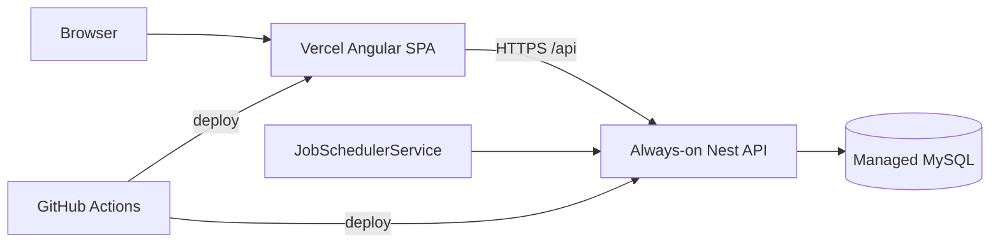
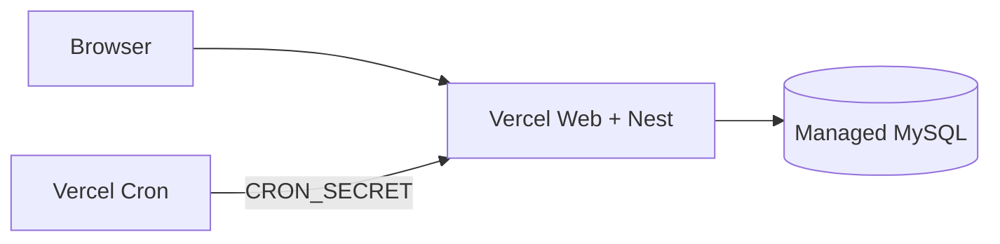

# Sprint 7.2 — Deployment & Hosting

**Status:** Done in-repo — combined PR #12 (external hosting accounts still required for first live URL)  
**Roadmap marker:** Milestone 7 — Polish & Resilience (final MVP sprint)  
**Branch (when implementing):** `feat/milestone-6-ai-kernel` (combined M6+M7)  
**PR base:** `main` via PR #12

**Overview:** Make BitStockerz deployable in a **single region** with CI build/test/deploy for the Nest API, managed MySQL, scheduled jobs, and the Angular SPA. Default hosting recommendation is **Option A**: always-on Node host for API+scheduler, Vercel for static Angular, managed MySQL. Option B (Vercel Nest + Cron) is documented as an alternative when always-on is unacceptable.

---

## Sprint scope and exit criteria

**Stories**

| ID | Title | Source |
|----|-------|--------|
| #8.7.1 | Deployment pipeline (CI build and deploy) | [MVP_08](../product/stories/BitStockerz_MVP_08_Backend_Infrastructure_Stories.md) |
| #8.7.2 | Hosting environment (API, DB, scheduled jobs, single region) | same |

**Exit (ROADMAP):**

- Application deployable to a single-region hosting environment
- CI builds and deploys the API and Angular frontend to the chosen target

**Explicitly out of scope**

| Item | Why deferred |
|------|----------------|
| Multi-region / active-active | MVP single region |
| Horizontal autoscaling policies | MVP_08 out of scope |
| Distributed job queues | In-process scheduler retained on Option A |
| Custom production domain (optional) | Can use platform default URLs first |
| Blue/green perfection | Simple promote-on-green CI is enough |

---

## Prerequisites

| Capability | Location | Relevance |
|------------|----------|-----------|
| Nest API boot + Prisma migrate | `apps/api` | Deploy artifact |
| `JobSchedulerService` `@Cron` | `jobs/job-scheduler.service.ts` | Needs long-lived process (Option A) |
| Backtests / worker patterns | Milestone 3 | May use `worker_threads` — poor fit for short serverless |
| Angular `apps/web` | Milestone 5 | Static build to Vercel |
| GitHub repo + Actions | `.github/workflows` (create) | CI/CD |
| Secrets: `DATABASE_URL`, session secrets, `OPENAI_API_KEY`, OAuth | Hosting dashboards | Env injection |
| Smoke / verify scripts | `scripts/sprint-delivery-verify.sh` | Gate before deploy |

---

## Acceptance criteria (implementation contract)

### #8.7.1 – Deployment pipeline

- GitHub Actions workflow(s) on `main` (and optionally PRs):
  1. Install / build `apps/api` + `apps/web`
  2. Lint + unit tests + coverage gate for API
  3. API e2e (seed mode)
  4. On `main` success: deploy web → Vercel; deploy API → chosen host (JC-1 Option A)
- Deployments use secrets from GitHub Environments or host dashboards — **no secrets in git**.
- Workflow fails closed on test failure (no deploy).
- Document required secrets in `docs/` or `apps/api/README.md` / `apps/web/README.md`.
- Conventional commit / existing hooks remain local; CI does not skip tests.

### #8.7.2 – Hosting environment (single region)

**Recommended topology — Option A (default, JC-1)**

| Tier | Platform | Notes |
|------|----------|-------|
| Frontend | **Vercel** | Static SPA (`ng build` output) served by Vercel’s global edge; no stateful region claim |
| API + jobs | **Railway, Render, or Fly.io** (selected during provisioning) | One always-on Node replica running Nest + scheduler |
| Database | **Managed MySQL-compatible service** | Same region as API; must support foreign keys, serializable transactions, Prisma 7 adapter, and `prisma migrate deploy` |
| Scheduler | In-process `JobSchedulerService` | `INGESTION_SCHEDULER_ENABLED=true` in prod |

**Alternative — Option B (document only unless chosen)**

| Tier | Platform | Notes |
|------|----------|-------|
| Frontend + API | **Vercel** | Nest on Vercel — https://vercel.com/docs/frameworks/backend/nestjs |
| Scheduler | **Vercel Cron** → HTTP route | Replace in-process `@Cron`; protect with `CRON_SECRET` — https://vercel.com/kb/guide/ship-a-nestjs-app-on-vercel |
| Backtests | Short `maxDuration`; avoid long `worker_threads` | May require redesign |

**Shared AC**

- API and database region recorded and colocated. The static SPA may remain globally cached; “single region” applies to stateful compute/data.
- Env vars set in host dashboards: `DATABASE_URL`, auth secrets, `CORS_ORIGIN` (Vercel web URL), `AI_ENABLED`, etc.
- API service is pinned to one replica while in-process cron is enabled; horizontal scale requires an external scheduler or distributed lock first.
- `prisma migrate deploy` runs once in a serialized release job before the new API revision receives traffic.
- `/api/health/live` and `/api/health/ready` used for host health checks.
- Production readiness performs a real Prisma `SELECT 1`/equivalent, returns 503 when `DATABASE_URL` is missing/unreachable in production, and does not treat “not configured” as ready. Seed/test behavior remains unchanged.
- Angular build-time public config points `apiBaseUrl` at deployed API; no secret is compiled into the SPA.
- Manual smoke against production URLs documented.

---

## API contract

No new product APIs for Option A.

**If Option B is selected**, add:

### `POST /api/internal/cron/market-data`

| Concern | Decision |
|---------|----------|
| Auth | Header `Authorization: Bearer ${CRON_SECRET}` |
| Behavior | Triggers same work as `market_data_scheduled` job |
| Exposure | Not for browsers; document as ops-only |

Disable in-process `@Cron` when `INGESTION_SCHEDULER_ENABLED=false` and Cron hits HTTP instead.

---

## Architecture

### Option A (recommended)



### Option B (alternative)



### Proposed repo layout additions

```text
.github/workflows/
  ci.yml                 # PR: build + test
  deploy.yml             # main: deploy web + api
apps/web/
  vercel.json            # SPA rewrites if needed
apps/api/
  Dockerfile             # Option A
  railway.toml / render.yaml / fly.toml   # one of
docs/ops/
  deployment.md          # regions, secrets, runbooks
```

---

## Implementation plan (ordered)

### 1. Lock hosting decision (JC-1)

1. Confirm Option A platform (Railway vs Render vs Fly) with dev.
2. Create projects in **one region**; provision MySQL.
3. If forcing Option B: spike Nest on Vercel + Cron route before deleting always-on plan.

### 2. Production config hardening

1. Ensure `AppConfigService` validates production-required settings at startup: DB, session/auth secrets, exact CORS allowlist, WebAuthn RP id/origins, enabled OAuth redirect credentials, scheduler system user, and live AI provider fields when AI is enabled.
2. CORS allowlist contains the exact production Vercel URL(s); Bearer auth remains header-based. Wildcard origins are rejected in production.
3. `INGESTION_SCHEDULER_ENABLED=true` on Option A prod and host replica count fixed at one.
4. `AI_ENABLED=false` until live provider credentials and disclaimer approval exist.
5. Add graceful shutdown hooks so the host stops accepting requests and disconnects Prisma before termination.

### 3. API deploy artifact (Option A)

1. Dockerfile: multi-stage build pinned to the repository’s exact Node engine, `npm ci`, Prisma generate, API build, production dependency stage, non-root runtime, `node dist/main`.
2. Release workflow: `prisma migrate status` → provider snapshot/backup checkpoint for any non-additive migration → `prisma migrate deploy` exactly once → deploy API → wait for readiness. Do not run migrations independently in every app replica.
3. Require backward-compatible expand/contract migrations so the prior API revision remains safe during rollout; destructive migrations need a separate reviewed release.
4. Health check: liveness for process restarts, readiness for traffic.

### 4. Angular static deploy

1. `ng build --configuration production` with public `apiBaseUrl` supplied at build time.
2. Vercel project rooted at `apps/web`; set the actual Angular browser output directory from `angular.json` rather than assuming `dist/`.
3. Commit a `vercel.json` SPA fallback rewrite for unmatched routes to `/index.html`; exclude real static assets from accidental fallback through a deploy smoke test.
4. Prefer **static SPA** over SSR (JC-2).

### 5. GitHub Actions (#8.7.1)

1. `ci.yml`: use pinned Node; `npm ci` at root, `apps/api`, and `apps/web`; run API build/lint/unit/coverage/e2e plus web lint/test/build. Cache npm directories keyed by each lockfile, not `node_modules`.
2. `deploy.yml`: on `main`, reuse required CI, serialize with a production concurrency group, migrate/deploy/verify API first, then deploy the web artifact that targets the verified API.
3. Protect `main` with required checks and a protected `production` GitHub Environment for deploy secrets/approval.
4. Store `VERCEL_ORG_ID`, `VERCEL_PROJECT_ID`, deployment credential, and host credentials only in GitHub/host settings. Scope `DATABASE_URL` to the migration/API jobs; never expose it to the web build.

### 6. Smoke + docs

1. Post-deploy smoke: live/ready, auth session, symbols search, authenticated paper-account read, SPA deep-link refresh, CORS preflight from the deployed web origin, and `AI_DISABLED` while AI remains off.
2. Trigger the scheduled-import handler through an authenticated internal/manual path or observe one scheduler run; verify exactly one job/audit event (no duplicate replica cron).
3. Write `docs/ops/deployment.md` with deploy, rollback, DB restore/contact, secret rotation, scheduler-disable, and incident checks.
4. Update ROADMAP final notes; CHANGELOG MVP deploy.

| File | Update |
|------|--------|
| MVP_08 #8.7.x | AC + completed |
| `README.md` | Deploy links + env |
| `apps/api/.env.example` | Prod-oriented comments |
| `docs/ops/deployment.md` | New runbook |
| ROADMAP | Milestone 7 exit |
| `.cursor/skills/sprint-delivery/reference.md` | Final branch |

---

## Best-practice checklist

- [ ] Secrets only in CI/host dashboards — never committed  
- [ ] `prisma migrate deploy` on release — https://www.prisma.io/docs/orm/prisma-migrate/workflows/development-and-production  
- [ ] Health checks for always-on process  
- [ ] Single region colocation API↔DB  
- [ ] Vercel Angular static hosting  
- [ ] Nest on Vercel guide (if Option B): https://vercel.com/docs/frameworks/backend/nestjs  
- [ ] Cron secret pattern (if Option B): https://vercel.com/kb/guide/ship-a-nestjs-app-on-vercel  
- [ ] Conventional Commits: `ci: add deploy pipeline and hosting config`

---

## Risks and mitigations

| Risk | Mitigation |
|------|------------|
| Serverless breaks `@Cron` + long backtests | Default Option A always-on |
| Cold starts / maxDuration kill jobs | Option A; or redesign jobs for B |
| CORS misconfig blocks SPA | Explicit prod CORS test in smoke |
| Migrate fails mid-deploy | Serialized release job; fail before traffic; snapshot/recovery note for non-additive changes |
| Cost surprises (MySQL + always-on) | Choose free/hobby tiers for MVP; document |
| OAuth redirect URLs | Register prod callbacks when enabling OAuth in prod |
| Duplicate scheduled jobs | One API replica while in-process cron is enabled; verify singleton behavior in smoke |

---

## Adopted defaults and external prerequisites

| # | Blocker | Why it blocks | Default if unanswered | Status |
|---|---------|---------------|----------------------|--------|
| 1 | Hosting Option A vs B | Architecture | **Option A** (JC-1) | Adopted |
| 2 | Always-on provider brand | Account + billing | Choose Railway/Render/Fly only after verifying one-replica, release command, region, logs, and health-check support | External account/procurement prerequisite |
| 3 | Managed MySQL provider | `DATABASE_URL` | Colocated service meeting the capability checklist above | External provisioning prerequisite |
| 4 | Vercel project + GitHub linkage | Web deploy | Create under BitStockerz owner and record opaque ids only in secrets/settings | External account prerequisite |
| 5 | Production domain | CORS/OAuth | Platform default URLs first | Adopted |
| 6 | Prod `AI_ENABLED` | Cost/safety | false until key + disclaimer approved | Adopted |

---

## Judgement calls

| ID | Decision | Why | Discuss before implement if |
|----|----------|-----|-----------------------------|
| **JC-1** | **Option A default:** always-on Node (Railway/Fly/Render) for API+`JobSchedulerService`; **Vercel** for Angular; managed MySQL | In-process `@Cron` + potential `worker_threads` backtests conflict with serverless timeouts; preserves MVP fidelity | Team mandates all-on-Vercel |
| **JC-2** | Angular as **static SPA** (no SSR) for MVP | Simpler deploy; auth is Bearer token; matches 5.1 scaffold | SEO/SSR required |
| **JC-3** | Option B uses **Vercel Cron + `CRON_SECRET`** HTTP trigger and disables in-process cron | Documented Nest-on-Vercel path | — |
| **JC-4** | **Single stateful region**: colocate API + DB; static web remains globally delivered | ROADMAP #8.7.2 without misrepresenting CDN behavior | Multi-region stateful services requested |
| **JC-5** | CI deploys only from **`main`** after tests; PRs build/test only | Safer MVP | Preview API deploys per PR desired |

---

## Suggested ticket breakdown

| Ticket | Estimate |
|--------|----------|
| Hosting accounts + MySQL + env matrix | 0.5d (calendar may dominate) |
| Dockerfile + host config + migrate release | 1.0d |
| Vercel Angular production build + SPA rewrites | 0.75d |
| GitHub Actions CI + deploy workflows | 1.0d |
| Prod smoke + ops docs + story AC | 0.75d |
| Option B spike (only if chosen) | +1.5d |

**Total:** ~4 engineering days for Option A (plus account provisioning time).

---

## Definition of done

- [ ] JC-1 platform choice recorded in `docs/ops/deployment.md`
- [ ] CI green on PR; deploy on `main` publishes web + API
- [ ] Prod `/api/health/live` + `/api/health/ready` OK with DB
- [ ] Scheduler runs on Option A (or Cron route on Option B)
- [ ] Angular production build calls prod API successfully (login + one data path)
- [ ] Production deployment concurrency is serialized; rollback/runbook and DB migration safety are documented
- [ ] Secrets not in repo; MVP_08 / ROADMAP Milestone 7 marked complete
- [ ] PR: `ci: add deploy pipeline and hosting config`

---

## References

- NestJS on Vercel: https://vercel.com/docs/frameworks/backend/nestjs  
- Ship Nest on Vercel (Cron): https://vercel.com/kb/guide/ship-a-nestjs-app-on-vercel  
- Prisma migrate production: https://www.prisma.io/docs/orm/prisma-migrate/workflows/development-and-production  
- Vercel Angular static hosting: https://vercel.com/docs  
- MVP_08 Epic 8.7: `docs/product/stories/BitStockerz_MVP_08_Backend_Infrastructure_Stories.md`  
- ROADMAP Milestone 7  
- Existing scheduler: `apps/api/src/jobs/job-scheduler.service.ts`
